Czat (wersja podstawowa)
###########################

.. highlight:: python

Zastosowanie Pythona i frameworka Django do stworzenia aplikacji internetowej
Czat; prostego czata, w którym zarejestrowani użytkownicy będą mogli wymieniać się krótkimi wiadomościami.

.. contents::
    :depth: 1
    :local:

Projekt i aplikacja
**********************

Tworzymy nowy projekt Django, a następnie uruchamiamy lokalny serwer,
który pozwoli śledzić postęp pracy. W katalogu domowym wydajemy polecenia w terminalu:

.. raw:: html

    
Terminal nr 

.. code-block:: bash

    ~$ django-admin.py startproject czat
    ~$ cd czat
    ~/czat$ python manage.py runserver

Powstanie katalog projektu :file:`czat` i podkatalog aplikacji o takiej samej nazwie :file:`chatter`.
Po wpisaniu w przeglądarce adresu *127.0.0.1:8000* zobaczymy stronę powitalną.

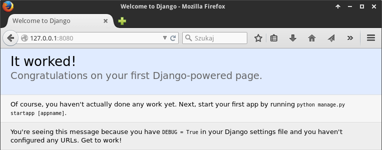

.. note::

    Domyślnie serwer nasłuchuje na porcie ``8000``, można go jednak uruchomić
    na innyn, jeżeli domyślny byłby zajęty. Wystarczy, że do polecenia dodamy
    np.: ``127.0.0.1:8080``.

    W systemach Linux możemy kliknąć w terminalu prawym klawiszem adres ``http://127.0.0.1:8000/``
    i wybrać polecenie "Otwórz link", aby szybko otworzyć domyślną przeglądarkę.
    Lokalny serwer deweloperski zatrzymujemy za pomocą skrótu :kbd:`Ctrl+C`.

    Jeden projekt może zawierać wiele aplikacji zapisywanych w osobnych podkatalogach katalogu projektu.

Rozpoczynamy od modyfikacji ustawień projektu, tak aby korzystał z polskiej wersji językowej
oraz lokalnych ustawień daty i czasu. Musimy również zarejestrować naszą aplikację w projekcie.
W pliku :file:`setting.py` zmieniamy następujące linie:

.. raw:: html

    
Kod nr 

.. code-block:: python

    # czat/czat/settings.py

    # rejestrujemy aplikacje
    INSTALLED_APPS = (
        'django.contrib.admin',
        'django.contrib.auth',
        'django.contrib.contenttypes',
        'django.contrib.sessions',
        'django.contrib.messages',
        'django.contrib.staticfiles',

        'czat', # rejestrujemy aplikację
    )

    LANGUAGE_CODE = 'pl' # ustawienie języka

    TIME_ZONE = 'Europe/Warsaw' # ustawienie strefy czasowej

.. caution::

    Uwaga: jeżeli w plikach Pythona chcemy stosować polskie znaki, m.in.
    w komentarzach, na początku każdego pliku powinna znaleźć się linia
    definiująca kodowanie: ``# -*- coding: utf-8 -*-``.

Model – Widok – Kontroler
**************************

W projektowaniu aplikacji internetowych za pomocą Django odwołujemy się do wzorca M(odel)V(iew)C(ontroller),
czyli Model–Widok–Kontroler [#]_, co pozwala na oddzielenie danych od ich prezentacji oraz logiki aplikacji.
Funkcje kolejnych elementów są następujące:

* Modele – :term:`model` w Django reprezentuje źródło informacji;
  są to klasy Pythona odwzorowujące pojedyncze tabele w bazie danych [#]_;
  każda klasa zawiera właściwości odpowiadające polom tabeli,
  może też zawierać funkcje wykonujące operacje na danych.
  Instancja takiej klasy odpowiada rekordowi danych.
  Modele definiujemy w pliku :file:`models.py`.
* Widoki – :term:`widok` w Django to funkcja czy klasa Pythona, która na podstawie żądań www
  (dla danych adresów URL) zwraca odpowiedź, najczęściej w postaci kodu HTML
  generowanego w szablonach (templates); odpowiedzią może być również
  przekierowanie na inny adres, jakiś dokument lub obrazek.
  Django zawiera wiele widoków wbudowanych. Widoki modyfikujemy
  lub definiujemy w pliku :file:`views.py`.
* Kontroler – :term:`kontroler` to mechanizm kierujący kolejne żądania
  do odpowiednich widoków na podstawie wzorców adresów URL zawartych w pliku :file:`urls.py`.

.. [#] Twórcy Django traktują jednak ten wzorzec elastycznie, mówiąc że ich
   framework wykorzystuje wzorzec MTV, czyli model (model), szablon (template), widok (view).
.. [#] Takie odwzorowanie nosi nazwę mapowania obiektowo-relacyjnego (ORM).
   ORM odwzorowuje strukturę bazy na obiekty Pythona.

Model danych i baza
**********************

Pisanie aplikacji zaczynamy od zdefiniowania modelu, czyli klasy opisującej
tabelę zawierającą wiadomości. Instancje tej klasy będą konkretnymi wiadomościami
utworzonymi przez użytkowników systemu.
Każda wiadomość będzie zwierała treść, datę dodania oraz autora wiadomości (użytkownika).

W pliku :file:`~/czat/czat/models.py`, który musimy utworzyć, wpisujemy:

.. raw:: html

    
Kod nr 

.. highlight:: python
.. literalinclude:: models_z1.py
    :linenos:

Jak widać, podczas opisywania klasy ``Wiadomosc`` podajemy nazwy poszczególnych
właściwości (pól) oraz typy przechowywanych w nich danych.
Po zdefiniowaniu przynajmniej jednego modelu możemy utworzyć bazę danych
dla naszej aplikacji, czyli wszystkie potrzebne tabele.
Podczas tworzenia bazy Django pyta o nazwę, email i hasło administratora.
Podajemy te dane po wydaniu w katalogu projektu w terminalu polecenia:

.. raw:: html

    
Terminal nr 

.. code-block:: bash

    ~/czat $ python manage.py syncdb

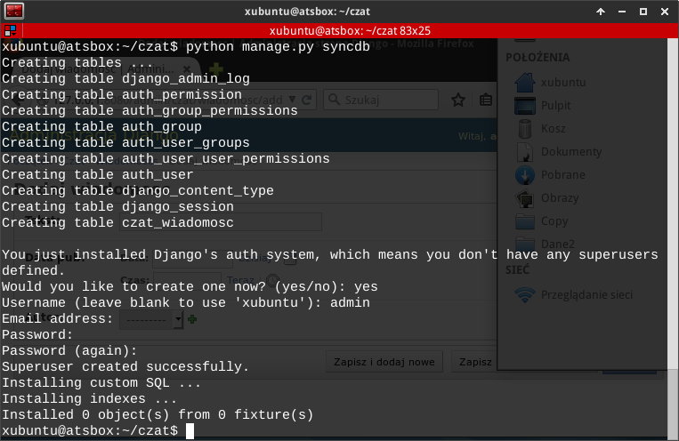

.. note::

    Domyślnie Django korzysta z bazy SQLite, która przechowywana jest w jednym pliku :file:`db.sqlite3` w katalogu aplikacji.
    Warto zobaczyć, jak wygląda. Potrzebny będzie jednak interpreter, który w razie
    potrzeby doinstalujemy poleceniem ``apt-get install sqlite3``. Następnie
    W terminalu wydajemy polecenie ``python manage.py dbshell``,
    które uruchamia interpreter bazy. Następnie możemy wylistować utworzone tabele
    poleceniem ``.tables``. Możemy również zobaczyć jakie instrukcje SQL-a
    zostały użyte do utworzenia naszej tabeli: ``.schema czat_wiadomosc``.
    Z interpretera wychodzimy poleceniem ``.quit``.

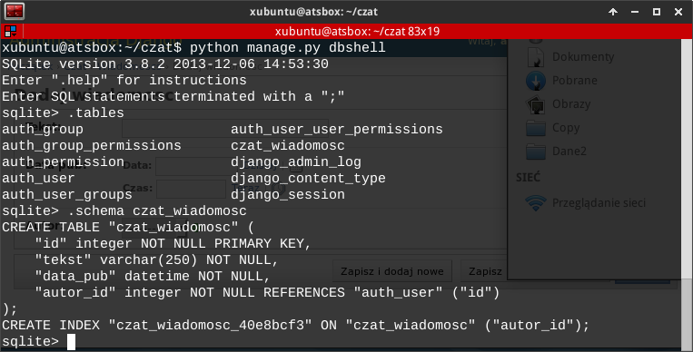

Panel administracyjny
**********************

Django pozwala szybko utworzyć panel administratora dla projektu, dzięki czemu będziemy mogli zacząć
dodawać użytkowików i wprowadzać dane. Tworzymy więc plik :file:`~/czat/czat/admin.py`
i rejestrujemy w nim nasz model jako element panelu administracyjnego:

.. raw:: html

    
Kod nr 

.. highlight:: python
.. literalinclude:: admin_z1.py
    :linenos:

.. caution::

    Jeżeli korzystamy z Django w wersji 1.6 przed skorzystaniem z panelu administratora
    jako superużytkownik, musimy dodać linię: ``admin.autodiscover()`` w pliku
    :file:`urls.py` przed deklaracją zmiennej ``urlpatterns``. (Zobacz kod nr 7
    poniżej.)

Po ewentualnym ponownym uruchomieniu serwera wchodzimy na adres *127.0.0.1:8080/admin/*.
Logujemy się podając dane wprowadzone podczas tworzenia bazy.
Otrzymamy dostęp do panelu administracyjnego, w którym możemy dodawać nowych użytkowników i wiadomości [#]_.

.. [#] Bezpieczna aplikacja powinna dysponować osobnym mechanizmem rejestracji
   użytkowników i dodawania wiadomości, tak by nie trzeba było udostępniać
   panelu administracyjnego osobom postronnym.

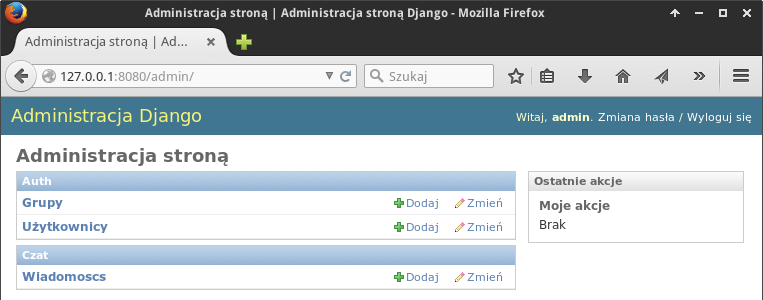

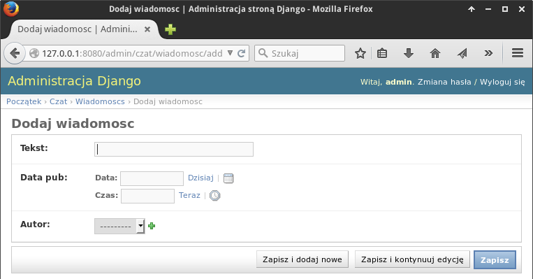

W panelu administratora widać, że etykiety oznaczające pojedynczą wiadomość
jak i wiele wiadomości nie są spolszczone, podobnie pole daty oznaczone
jest etykietą "Data pub". Aby w pełni spolszczyć nasz model, w pliku :file:`models.py`
dopisujemy:

.. raw:: html

    
Kod nr 

.. highlight:: python
.. literalinclude:: models_z2.py
    :linenos:

Jak widać, w definicjach każdego pola jako pierwszy argument możemy dopisać
spolszczoną etykietę, np. ``u'data publikacji'``. W podklasie ``Meta`` podajemy natomiast
nazwy modelu w liczbie pojedynczej i mnogiej. Po odświeżeniu panelu
adminitracyjnego (np. klawiszem :kbd:`F5`) nazwy zostaną spolszczone.

.. note::

    Prefix ``u`` przed łańcuchami znaków oznacza kodowanie unikod (ang. *unicode*)
    umożliwiające wyświetlanie m.in. znaków narodowych.

Ćwiczenie 1
============

Po zalogowaniu na konto administratora dodajemy użytkownika "adam".
Na stronie szczegółów, która wyświetli się po jego utworzeniu, zaznaczamy
opcję "W zespole", następnie w panelu "Dostępne uprawnienia" zaznaczmy opcje
dodawania (add), zmieniania (change) oraz usuwania (del) wiadomości
(wpisy typu: "czat | wiadomosc | Can add wiadomosc") i przypisujemy je
użytkownikowi naciskając strzałkę w prawo.

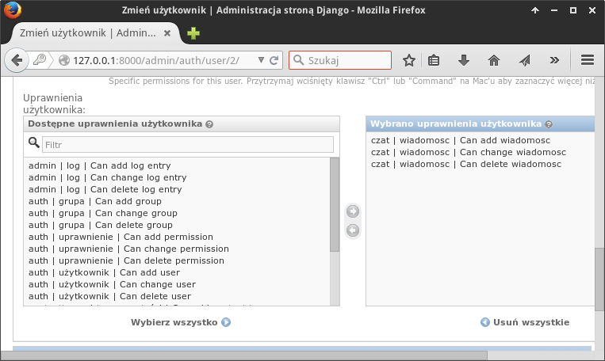

Przelogowujemy się na konto "adam" i dodajemy kilka przykładowych wiadomości.

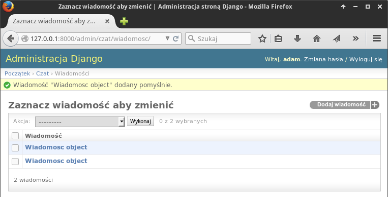

Jak można zauważyć, dodane wiadomości wyświetlają się na liście jako "Wiadomosc object".
Aby to poprawić, uzupełniamy definicję naszego modelu o funkcję,
której zadaniem jest "autoprezentacja", czyli wyświetlenie treści wiadomości.
W pliku :file:`models.py` dopisujemy zachowując wcięcia (!):

.. raw:: html

    
Kod nr 

.. highlight:: python
.. literalinclude:: models_z3.py
    :linenos:
    :lineno-start: 18
    :lines: 18-19

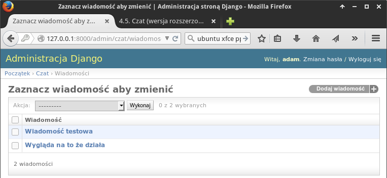

Widoki i szablony
**********************

Panel administracyjny już mamy, ale po wejściu na stronę główną zwykły użytkownik
niczego ciekawego poza standardowym powitaniem Django nie widzi. Zajmiemy się teraz
stronami po stronie (:-)) użytkownika.

Dodawanie stron w Django polega na wykorzystywaniu widoków wbudowanych lub
tworzeniu nowych. Są to klasy lub funkcje Pythona wykonujące jakieś operacje
po stronie serwera w odpowiedzi na żądania klienta. Widoki powiązane są
z określonymi adresami url. Widoki najczęściej zwracają kod HTML
wyrenderowany na podstawie szablonów, do których możemy przekazywać dodatkowe dane [#]_,
np. z bazy. Dla przejrzystości przyjęto, że w katalogu aplikacji (:file:`czat/czat`):

1. plik :file:`views.py` zawiera definicję widoków, w tym wywołania szablonów,
2. plik :file:`url.py` zawiera reguły łączące adresy url z widokami,
3. w katalogu :file:`czat/czat/templates/czat` zapisujemy szablony pod nazwami
   określonymi w wywołujących je widokach, np. :file:`index.html`.

.. [#] Dane z bazy przekazywane są do szablonów za pomocą Pythonowego słownika.
       Renderowanie polega na odszukaniu pliku szablonu, zastąpieniu przekazanych
       zmiennych danymi i odesłaniu całości (HTML + dane) do użytkownika.

Aby utworzyć stronę główną, stworzymy pierwszy widok, czyli funkcję ``index()`` [#]_,
którą powiążemy z adresem URL głównej strony (/). Najprostszy widok zwraca
podany tekst. W pliku :file:`views.py` umieszczamy:

.. [#] Nazwa ``index()`` jest przykładowa, funkcja mogłaby się nazywać inaczej.

.. raw:: html

    
Kod nr 

.. highlight:: python
.. literalinclude:: views_z1.py
    :linenos:

.. note::

    Warto zapamiętać, że każdą funkcję, formularz czy widok udostępniane
    przez Django, których chcemy użyć, musimy najpierw zaimportować za pomocą
    klauzuli typu ``from <skąd> import <co>``.

W pliku :file:`urls.py` przede wszystkim importujemy widoki naszej aplikacji:
``from czat import views``. Następnie widok `index()` łączymy z adresem
URL strony głównej (/):

.. raw:: html

    
Kod nr 

.. highlight:: python
.. literalinclude:: urls_z2.py
    :linenos:
    :emphasize-lines: 6, 11

Podstawową funkcją jest tu ``url()``, która jako pierwszy parametr przyjmuje wyrażenie
regularne oznaczane skrótem ``r`` przed łańcuchem. Symbol ``^`` oznacza początek
łańcucha, ``$`` – koniec. Zapis ``u'^$'`` to adres główny serwera.
Drugi parametr wskazuje widok (funkcję), która ma obsłużyć dany adres.
Trzeci parametr ``name`` pozwala zapamiętać skojarzenie url-a i widoku pod nazwą,
której będzie można użyć np. do wygenerowania adresu linku.

Skoro mamy widok i przypisaliśmy go do jakiegoś adresu URL, możemy przetestować
działanie aplikacji. Po wywołaniu strony głównej powinniśmy zobaczyć tekst
podany jako argument funkcji ``HttpResponse()`` w pliku :file:`views.py`:

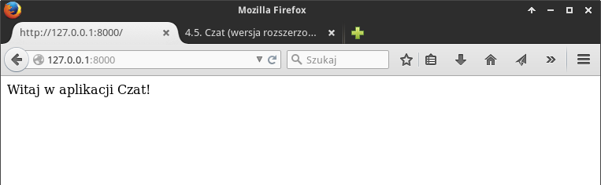

Zazwyczaj odpowiedzią na wywołanie jakiegoś adresu URL będzie jednak jakaś
strona zapisana w języku HTML. Szablony takich stron umieszczamy w podkatalogu
``templates/nazwa aplikacji``. Tworzymy więc katalog:

.. raw:: html

    
Terminal nr 

.. code-block:: bash

    ~/czat/czat$ mkdir -p templates/czat

Następnie tworzymy szablon, czyli plik :file:`~/czat/czat/templates/czat/index.html`, który zawiera:

.. raw:: html

    
Plik index.html nr 

.. highlight:: html
.. literalinclude:: index_z2.html
    :linenos:

W pliku :file:`views.py` zmieniamy instrukcje odpowiedzi:

.. raw:: html

    
Kod nr 

.. highlight:: python
.. literalinclude:: views_z2.py
    :linenos:
    :emphasize-lines: 5, 9-10

Po zaimportowaniu funkcji ``render()`` używamy jej do zwrócenia szablonu.
Jako pierwszy argument podajemy parametr ``request``, a jako drugi nazwę
szablonu uwzględniającą katalog nadrzędny.

Po wpisaniu adresu *127.0.0.1:8000/* zobaczymy tekst, który umieściliśmy w szablonie:

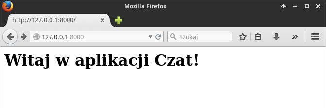

Rejestrowanie użytkowników
***************************

Zamiast zakładać konta użytkownikom w panelu administracyjnym udostępnimy
im możliwość samodzielnego rejestrowania. Zadanie to można zrealizować na
dwa sposoby. Pierwszy polega na "ręcznym" utworzeniu formularza i obsłużeniu
przesłanych danych w skojarzonym widoku (funkcji).
Przygotujemy więc widok ``rejestruj()``, który:

1. zwróci formularz przygotowany w szablonie :file:`rejestruj.html` w odpowiedzi
   na żądanie typu :term:`GET`, wysłane przez przeglądarkę po wejściu
   użytkownika na stronę rejestracji pod adres URL */rejestruj*;
2. obsłuży żądanie typu :term:`POST`, czyli wysłanie danych z formularza na serwer,
   sprawdzi poprawność przesłanych danych (nazwę użytkownika i hasło) i
   utworzy konto;
3. zaloguje nowego użytkownika i przekieruje go na stronę główną.

Zaczynamy od uzupełnienia pliku :file:`views.py`. Dodajemy widok ``rejestruj()``:

.. raw:: html

    
Kod nr 

.. highlight:: python
.. literalinclude:: views_z3.py
    :linenos:
    :lineno-start: 7
    :lines: 7-

Powyższy kod pokazuje m .in., w jaki sposób przekazać dowolne dane do szablonu.
Używamy słownika, w naszym przypadku nazwanego ``kontekst``, który zostaje
użyty jako trzeci argument funkcji ``render()``. W ten sposób przekazujemy
obiekt użytkownika w widoku strony głównej i formularz w widoku rejestracji.

Warto także zauważyć, jak tworzymy komunikaty zwrotne dla użytkownika.
Wykorzystujemy wbudowany w Django system komunikatów: ``messages.success(request, "Zostałeś zarejestrowany.")``.
Tak utworzone komunikaty możemy odczytać w każdym szablonie ze zmiennej
``messages`` (zob. niżej szablon :file:`index.html`).

Tworzymy nowy szablon :file:`~/czat/czat/templates/czat/rejestruj.html`:

.. raw:: html

    
Plik rejestruj.html nr 

.. highlight:: html
.. literalinclude:: rejestruj_z3.html
    :linenos:

Wiążemy adres URL *rejestruj/* z utworzonym widokiem. Do pliku :file:`urls.py`
dopisujemy:

.. raw:: html

    
Kod nr 

.. highlight:: python
.. literalinclude:: urls_z3.py
    :linenos:
    :emphasize-lines: 3
    :lineno-start: 10
    :lines: 10-

Gdybyśmy już teraz odwiedzili adres ``127.0.0.1:8000/rejestruj``, powinniśmy
zobaczyć poniższy formularz:

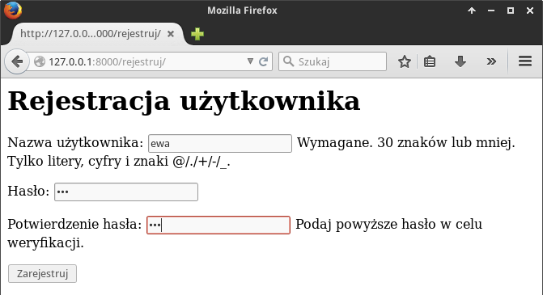

Modyfikujemy również szablon strony głównej:

.. raw:: html

    
Plik index.html nr 

.. highlight:: html
.. literalinclude:: index_z3.html
    :linenos:

W szablonach dostępne są podstawowe instrukcje sterujące, takie jak np.
```` czy ````. Tę pierwszą wykorzystamy do wyświetlenia
komunikatów użytkownikowi, drugą m. in. do sprawdzenia, czy stronę odwiedza
użytkownik uwierzytelniony. Dane przekazane do szablonu możemy wyświetlać
stosując odpowiednią notację, np.: ``{{ user.username }}``.
Dodatkowo wyświetlane dane można obrabiać za pomocą filtrów,
np. ``{{ komunikat|capfirst }}`` – w tym wypadku wszystkie komunikaty
zostaną wyświetlone z wielkiej litery.

W pliku :file:`index.html` umieszczamy również link do strony rejestracji,
który wyświetlany będzie tylko użytkownikom niezalogowanym. Aby wygenerować adres
strony w atrybucie ``href`` używamy funkcji ``url``, za którą podajemy
w cudzysłowach nazwę nadaną adresowi w pliku ``urls.py``, np.:
````.

Ćwiczenie 2
===============

Po ewentualnym ponownym uruchomieniu serwera, zarejestruj nowego użytkownika
o nazwie "ewa". Powinieneś zobaczyć poniższą stronę:

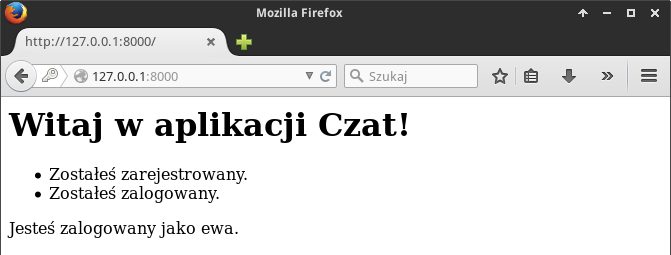

W przeglądarce wpisz adres *127.0.0.1:8000/rejestruj*, aby przejść do strony
rejestracji. Na stronie wyświetla się formularz, mimo że jesteś już zarejestrowany
i zalogowany.

Spróbuj zmienić szablon ``rejestruj.html``, tak aby zalogowanym
użytkownikom wyświetlał się tekst "Jesteś już zarejestrowany" oraz
link do strony głównej, a niezalogowanym formularz rejestracji.

.. tip::

    Wykorzystaj tag ```` i obiekt ``user``, tak jak zrobiliśmy to
    w widoku ``index()`` i dopisz odpowiedni kod w widoku ``rejestruj()``.

Przykładowy efekt poprawnego wykonania ćwiczenia:

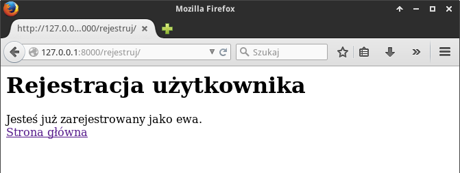

Logowanie i wylogowywanie
**************************

Skoro użytkownicy mogą się rejestrować, trzeba umożliwić im również logowanie
i wylogowywanie z serwisu. Również to zadanie można zrobić dwojako.
Pierwszy sposób to tak jak w przypadku rejestracji stworzenie widoków
w pliku :file:`views.py` i powiązanie ich z adresami w pliku :file:`urls.py`.

Na początku jak zawsze importujemy wymagane funkcje, później dopisujemy
widok ``loguj()`` i ``wyloguj()`` w pliku :file:`views.py`:

.. raw:: html

    
Kod nr 

.. highlight:: python
.. literalinclude:: views_z4.py
    :linenos:
    :lineno-start: 37
    :lines: 37-

Podobnie jak w przypadku rejestrowania użytkowników, korzystamy z wbudowanego w Django
formularza logowania ``AuthenticationForm``. Dzięki temu nie musimy
"ręcznie" sprawdzać poprawności podanych danych, robi to metoda ``is_valid()``
formularza. Jeżeli nie zwróci ona błędu, możemy zalogować użytkownika za
pomocą funkcji ``login()``, której przekazujemy obiekty ``HttpRequest``
(przesłane żadanie) i ``User`` – obiekt użytkownika zwrócony przez metodę
``get_user()`` formularza.

Wylogowanie polega na użyciu funkcji ``logout(request)`` – wyloguje ona
użytkownika, którego dane zapisane są w przesłanym żądaniu.

Jak widać, do logowania potrzebujemy szablonu. Najprościej utworzyć go
na podstawie szablonu :file:`rejestruj.html`. Otwórzmy go i zapiszmy do
pliku :file:`~/czat/czat/templates/czat/loguj.html`. Później wystarczy
dostosować wywietlany tekst. Szablon z uwzględnieniem zmian wprowadzonych
w ćwiczeniu 2. może wyglądać tak:

.. raw:: html

    
Plik loguj.html nr 

.. highlight:: html
.. literalinclude:: loguj_z4.html
    :linenos:

Pozostaje skojarzenie odpowiednich adresów URL z utworzonymi widokami.
W pliku :file:`urls.py` dopisujemy reguły:

.. raw:: html

    
Kod nr 

.. highlight:: python
.. literalinclude:: urls_z4.py
    :linenos:
    :emphasize-lines: 4-5
    :lineno-start: 10
    :lines: 10-

Możesz przetestować działanie dodanych funkcji wywołując w przeglądarce adresy:
``127.0.0.1:8000/loguj`` i ``127.0.0.1:8000/wyloguj``. Przykładowy formularz
wygląda tak:

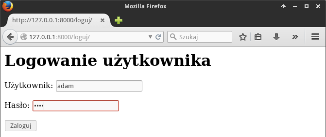

.. note::

    **Podsumujmy**: działanie wszystkich omówionych do tej pory widoków jest podobne.
    Po przejściu pod adres określony w pliku :file:`urls.py`, np. *127.0.0.1:8000/loguj/*,
    wywoływany jest powiązany z nim widok zdefiniowany w pliku :file:`views.py`,
    np. ``loguj()``. Tego typu operacja generuje żądanie typu :term:`GET`,
    w odpowiedzi na które zwracany jest szablon (np. :file:`loguj.html`)
    wyświetlający przekazny do niego formularz (np. ``AuthenticationForm``).

    Po wypełnieniu formularza użytkownik wciska odpowiedni przycisk, który
    inicjuje żądanietypu :term:`POST`, a więc przesyłanie danych na serwer.
    Widoki ``rejestruj()`` i ``loguj()`` wychwytują i przetwarzają takie żądania,
    tj. rejestrują lub logują użytkownika. W odpowiedzi użytkownik
    zostaje przekierowany z odopiwednim komunikatem na stonę główną.

Ćwiczenie 3
=================

Adresów logowania i wylogowywania nikt w serwisach nie wpisuje ręcznie.
Wstaw zatem odpowiednie linki do szablonu strony głównej. Użytkownik
niezalogowany powinien zobaczyć odnośnik *Zaloguj*, użytkownik
zalogowany – *Wyloguj*. Przykładowe strony mogą wyglądać tak:

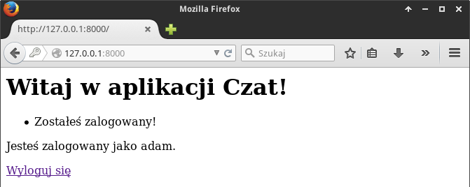

.. figure:: img/czat17log.png

Obsługa wiadomości
***********************************

Chcemy, by zalogowani użytkownicy mogli przeglądać wiadomości wszystkich użytkowników,
zmieniać, usuwać i dodawać własne.

Potrzebować będziemy widoku o nazwie np. ``wiadomosci()`` do wyświetlania
(żądania GET) i dodawania wiadomości (żądania POST), który zwracał będzie
szablon np. :file:`wiadomosci.html`. Widok ten powiążemy z adresem */wiadomosci*.
Do pliku :file:`views.py` dodajemy importy i kod funkcji:

.. raw:: html

    
Kod nr 

.. highlight:: python
.. literalinclude:: views_z5.py
    :linenos:
    :lineno-start: 57
    :lines: 57-

Widać powyżej, że treść przesłanej wiadomości wydobywamy ze słownika
``request.POST`` za pomocą metody ``get('tekst', '')``. Jej pierwszy argument
odpowiada nazwie pola formularza użytej w szablonie, które chcemy odczytać.
Drugi argument oznacza wartość domyślną, przydatną, jeśli
pole będzie niedostępne. Po sprawdzeniu długości wiadomości, możemy
ją utworzyć wykorzystując konstruktor naszego modelu
``Wiadomosc(tekst=tekst, data_pub=timezone.now(), autor=request.user)``.
W formie nazwanych argumentów podajemy mu wartości kolejnych pól.
Zapisanie nowej wiadomości w bazie sprowadza się do polecenia ``wiadomosc.save()``.

Na koniec przekierowujemy użytkownika do tego samego widoku,
ale tym razem jest to żądanie typu :term:`GET`.
W odpowiedzi na nie pobieramy wszystkie wiadomości z bazy (``Wiadomosc.objects.all()``),
i przekazujemy do szablonu, który zwracamy użytkownikowi.

Zadaniem szablonu zapisanego w pliku :file:`~/czat/czat/templates/wiadomosci.html`
jest wyświetlenie komunikatów zwrotnych, formularza dodawania wiadomości
i listy wiadomości dodanych.

.. raw:: html

    
Plik wiadomosci.html nr 

.. highlight:: html
.. literalinclude:: wiadomosci_z5.html
    :linenos:

Ćwiczenie 4
=====================

Powiąż widok ``wiadomosci()`` z adresem */wiadomosci* w pliku :file:`urls.py`,
nadając mu nazwę *wiadomosci*, a następnie uzupełnij szablon widoku głównego,
aby zalogowanym użytkownikom wyświetlał się link prowadzący do strony z wiadomościami.
W szablonie ``wiadomosci.html`` dodaj link do strony głównej i link wylogowania.

Zaloguj się i przetestuj wyświetlanie [#]_ i dodawanie wiadomości pod adresem
*127.0.0.1:8000/wiadomosci/*. Sprawdź, co się stanie po wysłaniu pustej
wiadomości.

.. [#] Jeżeli nie dodałeś do tej pory żadnej wiadomości, lista na początku
   będzie pusta.

Poniższe zrzuty prezentują efekty naszej pracy:

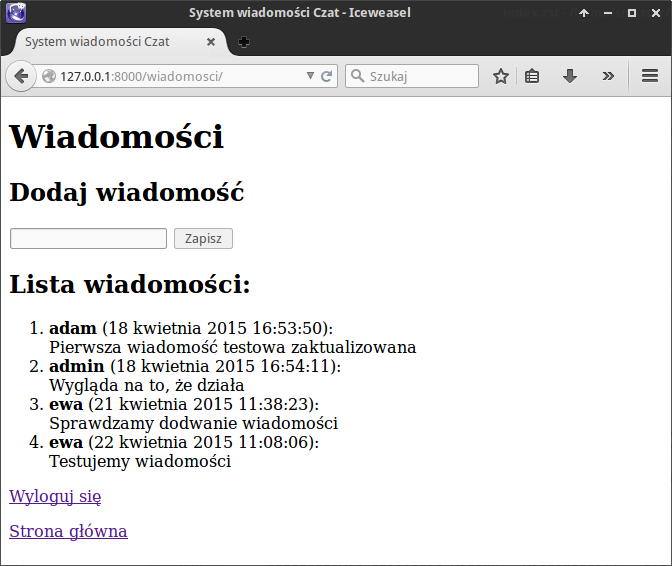

Materiały
***************

Słownik
================

.. include:: ../glossary.rst

1. O Django http://pl.wikipedia.org/wiki/Django_(informatyka)
2. Strona projektu Django https://www.djangoproject.com/
3. Co to jest framework? http://pl.wikipedia.org/wiki/Framework
4. Co nieco o HTTP i żądaniach GET i POST http://pl.wikipedia.org/wiki/Http

Źródła
===========

* :download:`czat_pp.zip <czat_pp.zip>`

Metryka
===============

:Autorzy: Robert Bednarz

:Utworzony: |date| o |time|

.. |date| date::
.. |time| date:: %H:%M

.. raw:: html

    

.. include:: ../../copyright.rst
