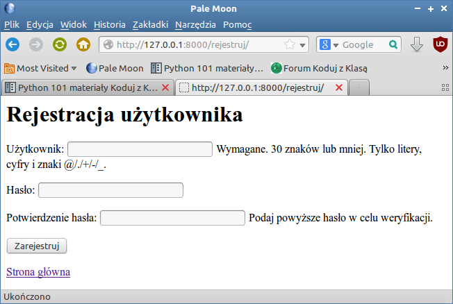
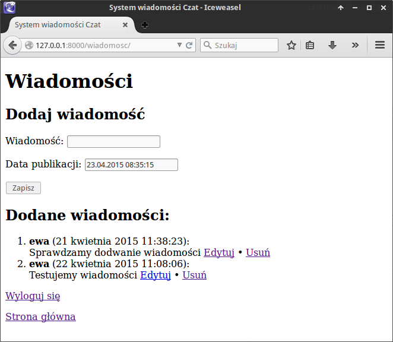
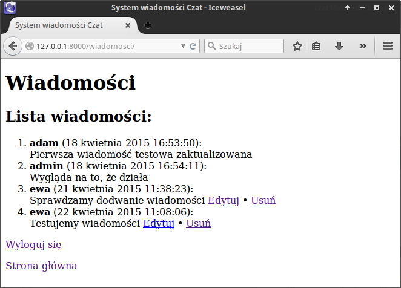
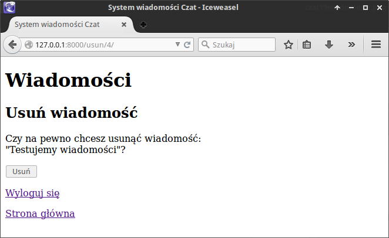

.. _czat-app2:

Czat (cz. 2)
#########################

Dodawanie, edycja, usuwanie czy przeglądanie danych zgromadzonych w bazie
są typowymi czynnościami w aplikacjach internetowych. Utworzony w scenariuszu :ref:`Czat (cz. 1) <czat-app>`
kod ilustruje "ręczną" obsługę żądań GET i POST, w tym tworzenie formularzy,
walidację danych itp. Django zawiera jednak gotowe mechanizmy, których
użycie skraca i ulepsza programistyczną pracę eliminując potencjalne błędy.

Będziemy rozwijać kod uzyskany po zrealizowaniu punktów **5.4.1 – 5.4.4** scenariusza :ref:`Czat (cz. 1) <czat-app>`.
Pobierz więc :download:`archiwum <czatpro2_z01.zip>` z potrzebnymi plikami
i rozpakuj w katalogu głównym. Utworzony zostanie katalog :file:`czatpro2`,
w którym będziemy pracować.

Na początku zajmiemy się obsługą użytkowników. Umożliwimy im samodzielne
zakładanie kont w serwisie, logowanie i wylogowywanie się. Później
zajmiemy się dodawaniem, edycją i usuwaniem wiadomości.
Inaczej niż w cz. 1 zadania te zrealizujemy za pomocą tzw. widoków wbudowanych opartych
na klasach (ang. `class-based generic views <https://docs.djangoproject.com/en/1.4/topics/class-based-views/>`_ ).

Rejestrowanie
*************

Na początku pliku :file:`czatpro2/czat/urls.py` aplikacji czat importujemy formularz tworzenia użytkownika
(``UserCreationForm``) oraz wbudowany widok przenaczony do dodawania danych (``CreateView``):

.. raw:: html

    
Kod nr 

.. highlight:: python
.. literalinclude:: urls.py
    :linenos:
    :lineno-start: 7
    :lines: 7-8

Następnie do listy ``paterns`` dopisujemy:

.. raw:: html

    
Plik <i>urls.py</i>. Kod nr 

.. highlight:: python
.. literalinclude:: urls.py
    :linenos:
    :lineno-start: 18
    :lines: 18-21

Powyższy kod wiąże adres URL */rejestruj* z wywołaniem widoku wbudowanego jako funkcji
``CreateView.as_view()``. Przekazujemy jej trzy parametry:

* ``template_name`` – szablon, który zostanie użyty do zwrócenia odpowiedzi;
* ``form_class`` – formularz, który zostanie przekazany do szablonu;
* ``success_url`` – adres, na który nastąpi przekierowanie w przypadku braku błędów
  (np. po udanej rejestracji);

Teraz tworzymy szablon formularza rejestracji, który zapisać należy w pliku :file:`czatpro/czat/templates/czat/rejestruj.html`:

.. raw:: html

    
Plik <i>rejestruj.html</i>. Kod nr 

.. highlight:: html
.. literalinclude:: rejestruj_z2.html
    :linenos:

Na koniec wstawimy link na stronie głównej, a więc uzupełniamy plik :file:`index.html`:

.. raw:: html

    
Plik <i>index.html</i>. Kod nr 

.. highlight:: html
.. literalinclude:: index_z2.html
    :linenos:

Zwróć uwagę na sposób tworzenia linków w szablonie: ````.
Nazwę definiowaną w parametrze ``name`` w pliku :file:`urls.py` aplikacji
poprzedzamy przestrzenią nazw zdefiniowaną w pliku adresów projektu (``namespace='czat'``).

**Ćwiczenie:** dodaj link do strony głównej w szablonie :file:`rejestruj.html`.

Uruchom aplikację (``python manage.py runserver``) i przetestuj dodawanie użytkowników:
spróbuj wysłać niepełne dane, np. bez hasła; spróbuj dodać dwa razy tego samego użytkownika.

Wy(logowanie)
*************

Na początku pliku :file:`urls.py` aplikacji dopisujemy wymagany import:

.. raw:: html

    
Kod nr 

.. highlight:: python
.. literalinclude:: urls.py
    :linenos:
    :lineno-start: 9
    :lines: 9

– a następnie:

.. raw:: html

    
Plik <i>urls.py</i>. Kod nr 

.. highlight:: python
.. literalinclude:: urls.py
    :linenos:
    :lineno-start: 22
    :lines: 22-27

Widać, że z adresami */loguj* i */wyloguj* wiążemy wbudowane w django widoki ``login``
i ``logout`` importowane z modułu ``django.contrib.auth.views``. Jedynym nowym
parametrem jest ``next_page``, za pomocą którego wskazujemy stronę
wyświetlaną po wylogowaniu (``reverse_lazy('czat:index')``).

Logowanie wymaga szablonu :file:`loguj.html`, który tworzymy i zapisujemy w podkatalogu :file:`templates/czat`:

.. raw:: html

    
Plik <i>loguj.html</i>. Kod nr 

.. highlight:: html
.. literalinclude:: loguj_z3.html
    :linenos:

Musimy jeszcze określić stronę, na którą powinien zostać przekierowany
użytkownik po udanym zalogowaniu. W tym wypadku na końcu pliku :file:`czatpro/czatpro/settings.py`
definujemy wartość zmiennej ``LOGIN_REDIRECT_URL``:

.. raw:: html

    
Kod nr 

.. code-block:: python

    # czatpro2/czatpro/settings.py

    from django.core.urlresolvers import reverse_lazy
    LOGIN_REDIRECT_URL = reverse_lazy('czat:index')

Na koniec warto uzupełnić plik :file:`index.html` o linki służące do logowania i wylogowania.
Spróbuj zrobić to sam i przetestuj działanie aplikacji.

.. figure:: img/czatpro2_03.png

Lista wiadomości
*****************

Chcemy, by zalogowani użytkownicy mogli przeglądać wiadomości wszystkich użytkowników,
zmieniać, usuwać i dodawać własne. Najprostszy sposób to skorzystanie z wspomnianych
widoków wbudowanych.

.. note::

    Django oferuje wbudowane widoki przeznaczone do typowych operacji:

    * DetailView i ListView – (ang. *generic display view*) widoki przeznaczone
      do prezentowania szczegółów i listy danych;
    * FormView, CreateView, UpdateView i DeleteView – (ang. *generic editing views*)
      widoki przeznaczone do wyświetlania formularzy ogólnych, w szczególności
      służących dodawaniu, uaktualnianiu, usuwaniu obiektów (danych).

Do wyświetlania listy wiadomości użyjemy klasy ``ListView``.
Do pliku :file:`urls.py` dopisujemy importy:

.. raw:: html

    
Kod nr 

.. highlight:: python
.. literalinclude:: urls.py
    :linenos:
    :lineno-start: 0
    :lines: 10-12

– i wiążemy adres */wiadomosci* z wywołaniem widoku:

.. raw:: html

    
Kod nr 

.. highlight:: python
.. literalinclude:: urls.py
    :linenos:
    :lineno-start: 28
    :lines: 28-34

Zakładamy, że wiadomości mogą oglądać tylko użytkownicy zalogowani. Dlatego
całe wywołanie widoku umieszczamy w funkcji ``login_required()``.

W wywołaniu ``ListView.as_view()`` wykorzystujemy kolejne parametry
modyfikujące działanie widoków:

* ``model`` – podajemy model, którego dane zostaną pobrane z bazy;
* ``context_object_name`` – pozwala zmienić domyślną nazwę (object_list)
  listy obiektów przekazanych do szablonu;
* ``paginate_by``– pozwala ustawić ilość obiektów wyświetlanych na stronie.

Parametr ``login_url`` określa adres, na który przekierowany zostanie
niezalogowany użytkownik.

.. raw:: html

    

Potrzebujemy szablonu, którego Django szuka pod domyślną nazwą
*<nazwa modelu>_list.html*, czyli w naszym przypadku tworzymy plik
:file:`~/czatpro/czat/templates/czat/wiadomosc_list.html`:

.. raw:: html

    
Plik <i>wiadomosc_list.html</i>. Kod nr 

.. highlight:: html
.. literalinclude:: wiadomosc_list_z4.html
    :linenos:

Kolejne wiadomości odczytujemy i wyświetlamy w pętli przy użyciu tagu ````.
Dostęp do właściwości obiketów umożliwia operator kropki, np.: ``{{ wiadomosc.autor.username }}``.

Zanim przetestujesz wyświetlanie wiadomości, dodaj link na stronie głównej!

.. figure:: img/czatpro2_04.png

Dodawanie wiadomości
********************

Zadanie to zrealizujemy wykorzystując widok ``CreateView``. Aby ułatwić
dodawanie wiadomości **dostosujemy klasę widoku** tak, aby użytkownik
nie musiał wprowadzać pola autor.

Na początek dopiszemy w pliku :file:`urls.py` skojarzenie adresu URL
*wiadomosc/* z wywołaniem klasy ``CreateView`` jako funkcji:

.. raw:: html

    
Kod nr 

.. highlight:: python
.. literalinclude:: urls.py
    :linenos:
    :lineno-start: 35
    :lines: 35-38

Dalej kodujemy w pliku :file:`views.py`. Na początku dodajemy importy:

.. raw:: html

    
Kod nr 

.. highlight:: python
.. literalinclude:: views.py
    :linenos:
    :lineno-start: 6
    :lines: 6-9

.. raw:: html

    
Kod nr 

.. highlight:: python
.. literalinclude:: views.py
    :linenos:
    :lineno-start: 19
    :lines: 19-39

Dostosowując widok ogólny, tworzymy opartą na nim klasę ``class UtworzWiadomosc(CreateView)``.
Nieomówiona dotąd właściwość ``fields`` pozwala wskazać pola, które mają znaleźć
się na formularzu. Jak widać, pomijamy pole ``autor``.

Pole to jest jednak wymagane. Aby je uzupełnić, nadpisujemy metodę
``form_valid()``, która sprawdza poprawność przesłanych danych i zapisuje je w bazie:

* ``wiadomosc = form.save(commit=False)`` – tworzymy obiekt wiadomości, ale go nie zapisujemy;
* ``wiadomosc.autor = self.request.user`` – uzupełniamy dane autora;
* ``wiadomosc.save()`` – zapisujemy obiekt;
* ``messages.success(self.request, "Dodano wiadomość!")`` – przygotowujemy komunikat,
  który wyświetlony zostanie po dodaniu wiadomości.

Metoda ``get_initial()`` pozwala ustawić domyślne wartości dla wybranych pól.
Wykorzystujemy ją do zainicjowania pola ``data_pub`` aktualna datą (``initial['data_pub'] = timezone.now()``).

Metoda ``get_context_data()`` z punktu widzenia dodawania wiadomości
nie jest potrzebna. Pozwala natomiast przekazać do szablonu dodatkowe dane,
w tym wypadku jest to lista wszystkich wiadomości: ``Wiadomosc.objects.all()``.
Wyświetlimy je poniżej formularza dodawania nowej wiadomości.

.. raw:: html

    

Domyślny szablon dodawania danych nazywa się *<nazwa modelu>_form.html*. Możemy go utworzyć
na podstawie szablonu :file:`wiadomosc_list.html`. Otwórz go i zapisz pod nazwą
:file:`wiadomosc_form.html`. Przed listą wiadomości umieść kod wyświetlający komunikaty i formularz:

.. raw:: html

    
Plik <i>wiadomosc_form.html</i>. Kod nr 

.. highlight:: html
.. literalinclude:: wiadomosc_form_z4.html
    :linenos:
    :lineno-start: 6
    :lines: 6-19

Zanim przetestujesz dodawanie wiadomości, dodaj odpowiedni link na stronie głównej!

Edycja wiadomości
*****************

Widok pozwalający na edycję wiadomości i jej aktualizację dostępny będzie
pod adresem ***/edytuj/id_wiadomości***, gdzie *id_wiadomosci* będzie identyfikatorem
obiektu do zaktualizowania. Zaczniemy od uzupełnienia pliku :file:`urls.py`:

.. raw:: html

    
Kod nr 

.. highlight:: python
.. literalinclude:: urls.py
    :linenos:
    :lineno-start: 39
    :lines: 39-42

Nowością w powyższym kodzie są wyrażenia regularne definiujące adresy z dodatkowym
parametrem, np. ``r'^edytuj/(?P<pk>\d+)/'``. Część ``/(?P<pk>\d+)`` oznacza,
że oczekujemy 1 lub więcej cyfr (``\d+``), które zostaną zapisane w zmiennej o nazwie
``pk`` (``?P<pk>``) – nazwa jest tu skrótem od ang. wyrażenia *primary key*, co znaczy
"klucz główny". Zmienna ta zawierać będzie identyfikator wiadomości i dostępna
będzie w klasie ``EdytujWiadomosc``, która dziedziczy, czyli dostosowuje wbudowany
widok ``UpdateView``.

Na początku pliku :file:`views.py` importujemy więc potrzebny widok:

.. raw:: html

    
Kod nr 

.. highlight:: python
.. literalinclude:: views.py
    :linenos:
    :lineno-start: 10
    :lines: 10

.. raw:: html

    
Kod nr 

.. highlight:: python
.. literalinclude:: views.py
    :linenos:
    :lineno-start: 42
    :lines: 42-57

Najważniejsza jest tu metoda ``get_object()``, która pobiera i zwraca wskazaną przez
identyfikator w zmiennej *pk* wiadomość: ``wiadomosc = Wiadomosc.objects.get(id=self.kwargs['pk'])``.
Omawianą metodę ``get_context_data()`` wykorzystujemy tak jak poprzednio, tzn. aby przekazać
do szablonu listę wiadomości zalogowanego użytkownika (``Wiadomosc.objects.filter(autor=self.request.user)``).

Właściwości ``model``, ``context_object_name``, ``template_name`` i ``success_url``
wyjaśniliśmy wcześniej. Jak widać, do edycji wiadomości można wykorzystać ten sam szablon,
którego użyliśmy podczas dodawania.

Formularz jednak dostosujemy. Tym razem wykorzystamy właściwość ``form_class``,
której przypisujemy utworzoną w nowym pliku :file:`forms.py` klasę zmieniającą
domyślne ustawienia:

.. raw:: html

    
Kod nr 

.. highlight:: python
.. literalinclude:: forms_z5.py
    :linenos:

Klasa ``EdytujWiadomoscForm`` oparta jest na wbudowanej klasie ``ModelForm``.
Właściwości formularza określamy w podklasie ``Meta``:

* ``model`` – oznacza to samo co w widokach, czyli model, dla którego tworzony jest formularz;
* ``fields`` – to samo co w widokach, lista pól do wyświetlenia;
* ``exclude`` – opcjonalnie lista pól do pominięcia;
* ``widgets`` – słownik, którego klucze oznaczają pola danych, a ich wartości
  odpowiadające im w formularzach HTML typy pól i ich właściwości, np. rozmiar.

Żeby przetestować aktualizowanie wiadomości, w szablonie :file:`wiadomosc_list.html`
trzeba wygenerować linki *Edytuj* dla wiadomości utworzonych przez zalogowanego użytkownika.
Wstaw w odpowiednie miejsce szablonu poniższy kod:

.. raw:: html

    
Plik wiadomosc_lista.html nr 

.. highlight:: html
.. literalinclude:: wiadomosc_list_z5.html
    :linenos:
    :lineno-start: 12
    :lines: 12-14

Dodaj również te same linki do listy wiadomości na stronach dodawania i aktualizowania.

Usuwanie wiadomości
*******************

**Usuwanie danych** realizujemy za pomocą widoku ``DeleteView``, który importujemy
na początku pliku :file:`urls.py`:

.. code-block:: python

    from django.views.generic import DeleteView

Podobnie, jak w przypadku edycji, usuwanie powiążemy z adresem URL zawierającym
identyfikator wiadomości ***/usun/id_wiadomości***. W pliku :file:`urls.py` dopisujemy:

.. raw:: html

    
Kod nr 

.. highlight:: python
.. literalinclude:: urls.py
    :linenos:
    :lineno-start: 43
    :lines: 43-49

Warto zwrócić uwagę, że podobnie jak w przypadku listy wiadomości, o ile wystarcza nam
domyślna funkcjonalność widoku wbudowanego, nie musimy niczego implementować w pliku :file:`views.py`.

Domyślny szablon dla tego widoku przyjmuje nazwę *<nazwa-modelu>_confirm_delete.html*,
dlatego uproścliśmy jego nazwę we właściwości ``template_name``. Tworzymy więc plik
:file:`wiadomosc_usun.html`:

.. raw:: html

    
Plik <i>wiadomosc_usun.html</i>. Kod nr 

.. highlight:: html
.. literalinclude:: wiadomosc_usun_z6.html
    :linenos:

Tag ``{{ object }}`` zostanie zastąpiony treścią wiadomoś zwróconą przez funkcję
"autoprezentacji" ``__unicode__()`` modelu.

Na koniec, podobnie jak w przypadku edycji wiadomości, trzeba dodać linki *Usuń* w szablonach wyświetlających
listę wiadomości. Spróbuj zrobic to samodzielnie, a następnie przetestuj działanie aplikacji.

Materiały
***************

1. O Django http://pl.wikipedia.org/wiki/Django_(informatyka)
2. Strona projektu Django https://www.djangoproject.com/
3. Co to jest framework? http://pl.wikipedia.org/wiki/Framework
4. Co nieco o HTTP i żądaniach GET i POST http://pl.wikipedia.org/wiki/Http

**Źródła:**

* :download:`czatpro_cz2.zip <czatpro_cz1.zip>`
