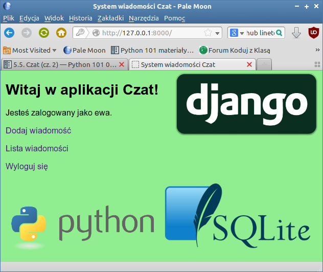
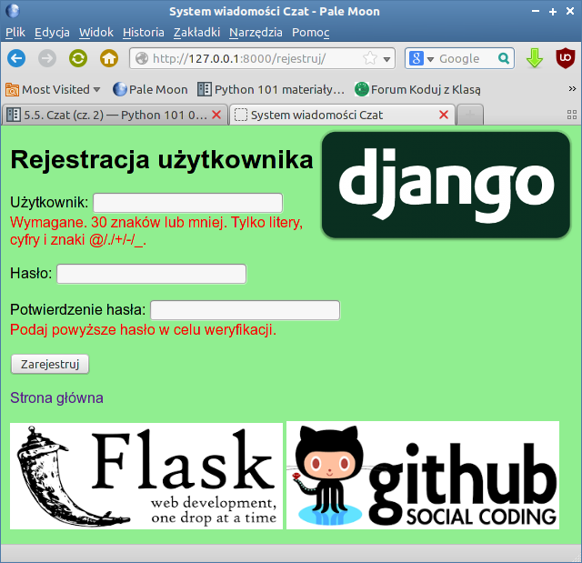

.. _czat-app3:

Czat (cz. 3)
#########################

Poniższy materiał koncentruje się na obsłudze szablonów (ang. *templates*)
wykorzystywanych w Django. Stanowi kontynuację projektu zrealizowanego
w scenariuszu :ref:`Czat (cz. 2) <czat-app2>`.

Na początku pobierz :download:`archiwum <czatpro3_z01.zip>` z potrzebnymi plikami
i rozpakuj je w katalogu domowym użytkownika.

Szablony
*****************

Zapewne zauważyłeś, że większość kodu w szablonach i stronach
HTML, które z nich powstają, powtarza się albo jest bardzo podobna.
Biorąc pod uwagę schematyczną budowę stron WWW jest to nieuniknione.

Szablony, jak można było zauważyć, składają się ze **zmiennych** i **tagów**.
Zmienne, które ujmowane są w podwójne nawiasy sześciokątne ``{{ zmienna }}``,
zastępowane są konkretnymi wartościami. Tagi z kolei, oznaczane notacją
````, tworzą mini-język szablonów i pozwalają kontrolować logikę budowania treści.
Najważniejsze tagi, ````, ````, ````
– już stosowaliśmy.

Spróbujmy uprościć i ujednolicić nasze szablony. Zacznijmy od szablonu
bazowego, który umieścimy w pliku :file:`~/czatpro3/czat/templates/czat/baza.html`:

.. raw:: html

    <div class="code_no">Plik <i>baza.html</i>. Kod nr <script>var code_no = code_no || 1; document.write(code_no++);</script></div>

.. highlight:: html
.. literalinclude:: baza_z02.html
    :linenos:

Jest to zwykły tekstowy dokument, zawierający schemat strony utworzony z
wymaganych znaczników HTML oraz bloki zdefiniowane za pomocą tagów mini-języka
szablonów ````. W pliku tym umieszczamy stałą i wspólną strukturę stron w serwisie
(np. nagłówek, menu, sekcja treści, stopka itp.) oraz wydzielamy bloki,
których treść będzie można zmieniać w szablonach konkretnych stron.

Wykorzystując szablon podstawowy, zmieniamy stronę główną, czyli plik
:file:`index.html`:

.. raw:: html

    <div class="code_no">Plik <i>index.html</i>. Kod nr <script>var code_no = code_no || 1; document.write(code_no++);</script></div>

.. highlight:: html
.. literalinclude:: index_z02.html
    :linenos:

Jak widać, szablon dziedziczy z szablonu bazowego – tag ````.
Dalej podajemy zawartość bloków, które są potrzebne na danej stronie.

Postępując na tej samej zasadzie modyfikujemy szablon rejestracji:

.. raw:: html

    <div class="code_no">Plik <i>rejestruj.html</i>. Kod nr <script>var code_no = code_no || 1; document.write(code_no++);</script></div>

.. highlight:: html
.. literalinclude:: rejestruj_z02.html
    :linenos:

**Ćwiczenie:** Wzorując się na podanych przykładach zmień pozostałe szablony tak,
aby opierały się na szablonie bazowym.
Następnie przetestuj działanie aplikacji. Wygląd stron nie powinien ulec zmianie!

.. figure:: img/czatpro3_z02.png

Style CSS i obrazki
********************

Nasze szablony zyskały na zwięzłości i przejrzystości, ale nadal pozbawione
są elementarnych dla dzisiejszych stron WWW zasobów, takich jak
style CSS, skrypty JavaScript czy zwykłe obrazki. Jak je dołączyć?

Przede wszystkim potrzebujemy osobnego katalogu :file:`~czatpro/czat/static/czat`.
W terminalu w katalogu projektu (!) wydajemy polecenie:

.. raw:: html

    <div class="code_no">Terminal. Kod nr <script>var code_no = code_no || 1; document.write(code_no++);</script></div>

.. code-block:: bash

    ~/czatpro3$ mkdir -p czat/static/czat
    ~/czatpro3$ cd czat/static/czat
    ~/czatpro3/czat/static/czat$ mkdir css js img

Ostatnie polecenie tworzy podkatalogi dla różnych typów
zasobów: arkuszy stylów CSS (:file:`css`), skrypów Java Script (:file:`js`)
i obrazków (:file:`img`).

Teraz przygotujemy przykładowy arkusz stylów CSS :file:`~/czatpro3/czat/static/czat/css/style.css`:

.. raw:: html

    <div class="code_no">Plik <i>style.css</i>. Kod nr <script>var code_no = code_no || 1; document.write(code_no++);</script></div>

.. highlight:: css
.. literalinclude:: style_z03.css
    :linenos:

Do podkatalogu :file:`~/czat/czat/static/czat/img` rozpakuj obrazki z podanego
:download:`archiwum `.

Teraz musimy dołączyć style i obrazki do szablonu bazowego :file:`baza.html`:

.. raw:: html

    <div class="code_no">Plik <i>baza.html</i>. Kod nr <script>var code_no = code_no || 1; document.write(code_no++);</script></div>

.. highlight:: html
.. literalinclude:: baza_z03.html
    :linenos:
    :lineno-start: 1
    :lines: 1-
    :emphasize-lines: 2, 8-9, 35-39

* ```` – ten kod umieszczamy na początku dokumentu;
  konfiguruje on ścieżkę do zasobów;

* ```` – za pomocą tego tagu wskazujemy lokalizację arkusza
  stylów w atrybucie ``href`` znacznika ``<link>``, który umieszczamy w sekcji
  ``<head>`` za znacznikiem ``<title>``.

  Ten sam tag służy do wskazywania ścieżki do obrazków w atrybucie ``href``
  znacznika ````. Kod z linii 5-8 umieszczamy na przed znacznikiem zamykającym
  ``</body>``.



**Ćwiczenie:** W szablonie bazowym stwórz block umożliwiający
zastępowanie domyślnych obrazków. Następnie zmień szablon :file:`rejestracja.html`
tak, aby wyświetlał inne obrazki, które znajdziesz w podkatalogu :file:`czat/static/img`.

.. tip::

    Tag ```` musisz wstawić do każdego szablonu,
    najlepiej zaraz po tagu ````, w którym chcesz odwoływać
    się do plików z katalogu :file:`static`.

.. figure:: img/czatpro3_z03a.png

Java Script
*************

Na ostatnim zrzucie widać wykonane ćwiczenie, czyli użycie dodatkowych
obrazków. Jednak strona nie wygląda dobrze, ponieważ treść podpowiedzi
nachodzi na logo Django (oczywiście przy małym rozmiarze okna przeglądarki).
Spróbujemy temu zaradzić.

Wykorzystamy prosty skrypt wykorzystujący bibliotekę `jQuery <https://jquery.com/>`_.
Ściągamy :download:`archiwum <js.zip>` i rozpakowujemy do katalogu
:file:`static/js`. Następnie do szablonu podstawowego :file:`baza.html`
dodajemy przed tagiem zamykającym ``</body>`` znaczniki ``<script>``,
w których wskazujemy położenie skryptów:

.. raw:: html

    <div class="code_no">Plik <i>baza.html</i>. Kod nr <script>var code_no = code_no || 1; document.write(code_no++);</script></div>

.. highlight:: html
.. literalinclude:: baza_z04.html
    :linenos:
    :lines: 43-44

Po odświeżeniu adresu */rejestruj* powinieneś zobaczyć poprawioną stronę:



Bootstrap
***********

`Bootstrap <http://getbootstrap.com/>`_  to jeden z najpopularniejszych frameworków,
który z wykorzystaniem języków HTML, CSS i JS ułatwia tworzenie responsywnych aplikacji sieciowych.
Zintegrowanie go z naszą aplikacją przy wykorzystaniu omówionych mechanizmów
jest całkiem proste.

Na początku ściągamy :download:`archiwum <bootstrap-3.3.6-dist.zip>` zawierające pliki
tworzące framework i rozpakowujemy je w dowolnym katalogu, np. :file:`Pobrane`.
Powstanie folder o nazwie :file:`bootstrap-3.3.6-dist`. Pliki z podfolderu :file:`css`
z rozszerzeniem ``*.css`` kopiujemy do katalogu :file:`static/czat/css`, pliki z podfolderu
:file:`js` kopiujemy do katalogu :file:`static/czat/js`, natomiast podfolder :file:`fonts`
kopiujemy do katalogu :file:`static/czat`.

.. tip::

    W systemie ``LxPup``, którego używamy na szkoleniach, najłatwiej rozpakować
    archiwum do bieżącego katalogu klikając go w menedżerze plików raz,
    następnie naciskając :kbd:`CTRL+E` i klikając dwa razy ``OK``.

    Do kopiowania plików otwieramy drugą kartę menedżera plików skrótem :kbd:`CTRL+T`.
    W pierwszej karcie po zaznaczeniu kopiujemy pliki naciskając :kbd:`CTRL+C`, w drugiej
    po wejściu do właściwego katalogu docelowego, np. :file:`~/czatpro3/czat/static/czat`,
    wklejamy skrótem :kbd:`CTRL+V`.

    Aby zaznaczyć kilka plików ułożonych nie po kolei, należy je klikać z wciśniętym klawiszem
    :kbd:`CTRL`. Aby zaznaczyć wszystkie pliki, naciśnij :kbd:`CTRL+A`.
    Aby przejść do katalogu nadrzędnego w menedżerze plików kliknij ikonę
    strzałki w górę lub naciśnij :kbd:`ALT+UP` lub :kbd:`BACKSPACE`.

Po skopiowaniu plików należy ich wersje skompresowane (mają w nazwie ``min``)
dołączyć do szablonu :file:`baza.html` za pomocą odpowiednich znaczników HTML-a
i tagów ````. Ważna przy tym jest kolejność ich dołączania.
Aby sprawdzić poprawność dołączenia *Bootstrapa* dopiszemy też kilka klas
w znacznikach ```` definiujących wyświetlanie obrazków. Nanieś
więc pokazane poniżej zmiany:

.. raw:: html

    <div class="code_no">Plik <i>baza.html</i>. Kod nr <script>var code_no = code_no || 1; document.write(code_no++);</script></div>

.. highlight:: html
.. literalinclude:: baza_z05.html
    :linenos:
    :lineno-start: 1
    :lines: 1-
    :emphasize-lines: 9-10, 40-41, 46

Po poprawnym wykonaniu operacji wejdźmy na stronę główną aplikacji.
Powinniśmy zobaczyć obraz podobny do poniższego:


cdn.

Materiały
***************

1. O Django http://pl.wikipedia.org/wiki/Django_(informatyka)
2. Strona projektu Django https://www.djangoproject.com/
3. Co to jest framework? http://pl.wikipedia.org/wiki/Framework
4. Co nieco o HTTP i żądaniach GET i POST http://pl.wikipedia.org/wiki/Http

**Źródła:**

* :download:`czatpro_cz3.zip <czatpro_cz3.zip>`
