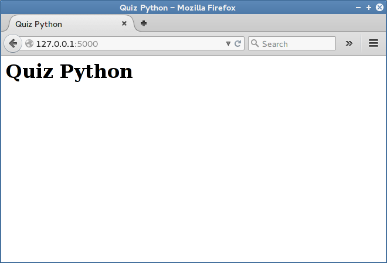
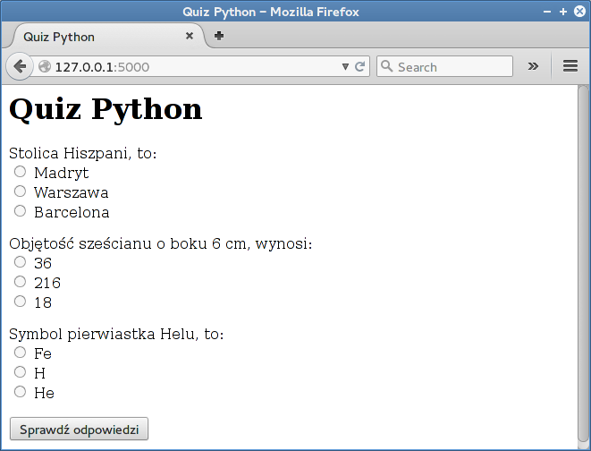

Quiz
#######################

Realizacja aplikacji internetowej Quiz w oparciu o mikro-framework Flask.

.. contents::
    :depth: 1
    :local:

Struktura katalogów
*********************

W katalogu użytkownika tworzymy nowy katalog dla aplikacji :file:`quiz`,
a w nim plik główny :file:`quiz.py`:

.. raw:: html

    
Terminal nr 

.. code-block:: bash

    ~$ mkdir quiz; cd quiz; touch quiz.py

Aplikacja na przykładzie quizu – użytkownik zaznacza w formularzu
poprawne odpowiedzi na pytania, przesyła je i otrzymuje informację
o wynikach – ma pokazać podstawy używania frameworka Flask.

Szkielet aplikacji
*********************

Utworzenie minimalnej aplikacji Flask pozwoli na uruchomienie testowego serwera www,
umożliwiającego wygodne rozwijanie kodu. W pliku :file:`quiz.py` wpisujemy:

.. raw:: html

    
Kod nr 

.. literalinclude:: quiz1.py
    :linenos:

Serwer uruchamiamy komendą:

.. raw:: html

    
Terminal nr 

.. code-block:: bash

    ~/quiz$ python quiz.py

.. figure:: serwer.png

Domyślnie serwer uruchamia się pod adresem *http://127.0.0.1:5000*.
Po wpisaniu go do przeglądarki internetowej otrzymamy stronę z błędem HTTP 404,
co wynika z faktu, że nasza aplikacja nie ma jeszcze zdefiniowanego żadnego zachowania
(czy też widoku) dla tego adresu.

Widok (strona główna)
*********************

Jeżeli chcemy, aby nasza aplikacja zwracała użytkownikowi jakieś strony www,
tworzymy tzw. :term:`widok`. Jest to funkcja Pythona powiązana z określonymi
adresami URL za pomocą tzw. dekoratorów. Widoki pozwalają name obsługiwać
żądania GET, kiedy (upraszczając nieco) użytkownik chce po prostu zobaczyć
stronę, i POST, kiedy użytkownik przesyła jakieś dane za pomocą formularza,
nasza aplikacja coś z nimi robi, a następnie odsyła odpowiedź.

Dzięki tzw. szablonom odpowiedź ta może zawierać oprócz stałych znaczników HTML
różne zmieniające się dane, np. wyniki quizu.
W widokach możemy nakazać, aby Flask renderował (łączył) kod HTML
z danymi i odsyłał do przeglądarki.

W pliku :file:`todo.py` umieścimy funkcję ``index()``, widok naszej strony głównej:

.. raw:: html

    
Kod nr 

.. literalinclude:: quiz2.py
    :linenos:
    :emphasize-lines: 5,9-15

Zauważmy, że widok (czyli funkcję) ``index()`` za pomocą dekoratora ``@app.route('/')``
wiążemy z adresem głównym (/), a więc jeżeli użytkownik wpisze w przeglądarce adres
serwera i wciśnie Enter, jego żądanie (typu GET) zostanie przechwycone i obsłużone
właśnie w tej funkcji.

Najprostszą formą zwrócenia użytkownikowi odpowiedzi
mogłaby by być instrukcja ``return 'Cześć, tu Python!'``, która odeśle
podany tekst do przeglądarki, a ta wyświetli go użytkownikowi.
Zazwyczaj będziemy jednak chcieli prezentować bardziej skomplikowane
dane, w dodatku sformatowane pod względem wizualnym. Potrzebujemy więc
szablonu. W katalogu :file:`quiz` tworzymy podkatalog :file:`templates`,
a w nim szablon :file:`index.html`. Można to zrobić w terminalu:

.. raw:: html

    
Terminal nr 

.. code-block:: bash

    ~/quiz$ mkdir templates; cd templates; touch index.html

Do pliku :file:`index.html` wstawiamy poniższy kod HTML:

.. raw:: html

    
Kod nr 

.. literalinclude:: templates/index2.html
    :linenos:

Po odwiedzeniu adresu *http://127.0.0.1:5000*, otrzymamy stronę HTML.

Pytania i odpowiedzi
*********************

Dane naszej aplikacji, a więc pytania i odpowiedzi, umieścimy w liście
``PYTANIA`` w postaci słowników zawierających: treść pytania,
listę możliwych odpowiedzi oraz poprawną odpowiedź.

W pliku :file:`quiz.py` wstawiamy listę pytań i aktualizujemy widok ``index()``,
przekazując do szablonu ``index.html`` pytania w zmiennej ``pytania``.

.. raw:: html

    
Kod nr 

.. literalinclude:: quiz3.py
    :linenos:
    :emphasize-lines: 9-39

Dodaliśmy konfigurację aplikacji w postaci słownika, ustalając sekretny klucz,
który przyda nam się w później podczas sprawdzania odpowiedzi.
Teraz zaktualizujemy szablon :file:`index.html`, aby wyświetlić listę pytań w postaci formularza HTML.

.. raw:: html

    
Kod nr 

.. literalinclude:: templates/index3.html
    :linenos:

Wewnątrz szablonu przeglądamy pytania zawarte w zmiennej ``pytania``
za pomocą instrukcji ````; dalej tworzymy
formularz HTML składający się z treści pytania ``{{ p.pytanie }}``
i listy odpowiedzi (kolejna pętla ````)
w postaci grupy opcji. Każda grupa odpowiedzi nazywana jest dla odróżnienia
numerem pytania liczonym od 0. Odpowiednią zmienną ustawiamy
w instrukcji ````, a używamy w kodzie ``name="{{ pnr }}"``.
Dzięki temu przyporządkujemy przesłane odpowiedzi do kolejnych pytań
podczas ich sprawdzania.

Warto zauważyć, że jeżeli potrzebujemy w szablonie instrukcji sterującej,
umieszczamy ją w znacznikach ````, natomiast kiedy chcemy
wyświetlić jakąś zmienną używamy notacji ``{{ }}``.

Po ponownym uruchomieniu serwera powinniśmy otrzymać następującą stronę internetową:

Oceniamy odpowiedzi
*********************

Mechanizm sprawdzana liczby poprawnych odpowiedzi umieścimy
w funkcji ``index()``. Uzupełniamy więc plik :file:`quiz.py`:

.. raw:: html

    
Kod nr 

.. literalinclude:: quiz4.py
    :linenos:
    :emphasize-lines: 5, 35, 37-49

W szablonie :file:`index.html` po znaczniku ``<h1>`` wstawiamy instrukcje wyświetlające wynik:

.. raw:: html

    
Kod nr 

.. literalinclude:: templates/index4.html
    :linenos:
    :lineno-start: 9
    :lines: 9-14

Jak to działa
=========================

Uzupełniliśmy dekorator ``app.route()``, aby obsługiwał zarówno żądania :term:`GET`
(wejście na stronę główną, po wpisaniu adresu => pokazujemy pytania),
jak i :term:`POST` (przesłanie odpowiedzi z formularza pytań => oceniamy odpowiedzi).

W widoku ``index()`` dodaliśmy instrukcję warunkową ``if request.method == 'POST':``,
która wykrywa żądania POST i wykonuje blok kodu zliczający poprawne odpowiedzi.
Przesłane dane zapisujemy w zmiennej: ``odpowiedzi = request.form``.
Następnie w pętli ``for pnr, odp_u in odpowiedzi.items()`` odczytujemy
kolejne pary danych, czyli numer pytania i udzieloną odpowiedź.

Następnie w instrukcji ``if odp_u == PYTANIA[int(pnr)]['odpok']:`` sprawdzamy,
czy nadesłana odpowiedź jest zgodna z poprawną, którą wydobywamy z
listy pytań za pomocą zmiennej ``pnr`` i klucza ``odpok``. Zwróćmy uwagę,
że wartości zmiennej ``pnr``, czyli numery pytań liczone od zera,
ustaliliśmy wcześniej w szablonie.

Jeżeli nadesłana odpowiedź jest poprawna, doliczamy punkt.
Informacje o wyniku przekazujemy użytkownikowi za pomocą funkcji ``flash()``,
która korzysta z tzw. sesji HTTP (właśnie dlatego musieliśmy ustalić
``SECRET_KEY`` dla naszej aplikacji), czyli mechanizmu pozwalającego
na rozróżnianie żądań przychodzących od różnych użytkowników.

Po uruchomieniu aplikacji, zaznaczeniu odpowiedzi i ich przesłaniu
otrzymujemy ocenę.

.. figure:: quiz4.png

Materiały
*******************************

Słownik
===============

.. include:: ../glossary.rst

1. `Strona projektu Flask`_
2. `Co to jest framework?`_
3. `Protokół HTTP`_ (żądania GET i POST)

.. _Strona projektu Flask: http://flask.pocoo.org/
.. _Co to jest framework?: http://pl.wikipedia.org/wiki/Framework
.. _Protokół HTTP: http://pl.wikipedia.org/wiki/Http

Źródła
===============

* :download:`quiz.zip <quiz.zip>`
* :download:`quiz_flask.pdf <../../pdf/quiz_flask.pdf>`

Kolejne wersje tworzenego kodu znajdziesz w katalogu ``~/python101/docs/quiz``.
Uruchamiamy je wydając polecenia:

.. code-block:: bash

    ~/python101$ cd docs/quiz
    ~/python101/docs/bazy$ python quizx.py

\- gdzie *x* jest numerem kolejnej wersji kodu.

Metryka
===============

:Autorzy: Robert Bednarz (ecg@ecg.vot.pl), Tomasz Nowacki

:Utworzony: |date| o |time|

.. |date| date::
.. |time| date:: %H:%M

.. raw:: html

    

.. include:: ../../copyright.rst
