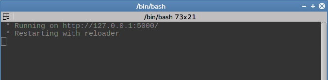
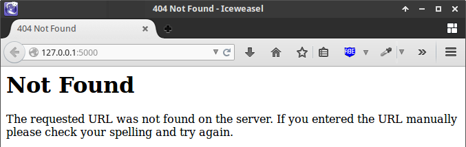
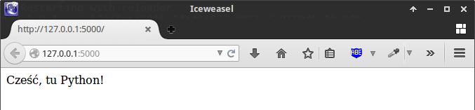
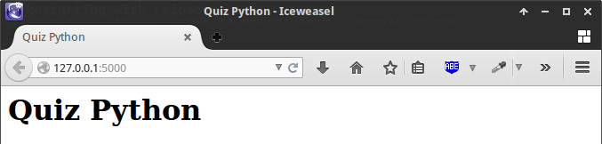
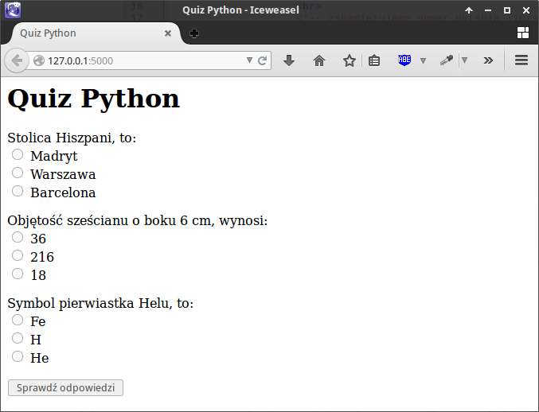
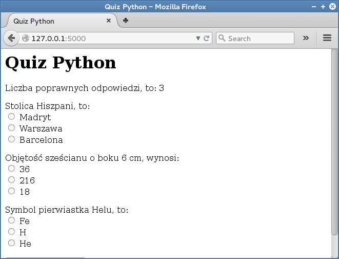

Quiz
#######################

Realizacja aplikacji internetowej Quiz w oparciu o :term:`framework` Flask.
Na stronie wyświetlamy pytania, użytkownik zaznacza poprawne odpowiedzi,
przesyła je na serwer i otrzymuje informację o wynikach.

.. contents::
    :depth: 1
    :local:

Projekt i aplikacja
*********************

W katalogu użytkownika tworzymy nowy katalog dla aplikacji :file:`quiz`,
a w nim plik główny :file:`quiz.py`:

.. raw:: html

    
Terminal nr 

.. code-block:: bash

    ~$ mkdir quiz; cd quiz; touch quiz.py

Utworzymy szkielet aplikacji Flask, co pozwoli na uruchomienie testowego serwera www,
umożliwiającego wygodne rozwijanie kodu. W pliku :file:`quiz.py` wpisujemy:

.. raw:: html

    
Kod nr 

.. highlight:: python
.. literalinclude:: quiz1.py
    :linenos:

Serwer uruchamiamy komendą:

.. raw:: html

    
Terminal nr 

.. code-block:: bash

    ~/quiz$ python quiz.py

Domyślnie serwer uruchamia się pod adresem *http://127.0.0.1:5000*.
Po wpisaniu go do przeglądarki internetowej otrzymamy :term:`kod odpowiedzi HTTP` 404,
tj. błąd "nie znaleziono", co wynika z faktu, że nasza aplikacja nie ma jeszcze zdefiniowanego żadnego
widoku dla tego adresu.

Widok (strona główna)
*********************

Jeżeli chcemy, aby nasza aplikacja zwracała użytkownikowi jakieś strony www,
tworzymy tzw. :term:`widok`. Jest to funkcja Pythona powiązana z określonymi
adresami URL za pomocą tzw. dekoratorów. Widoki pozwalają nam obsługiwać podstawowe
żądania protokołu :term:`HTTP`, czyli: :term:`GET`, wysyłane przez przeglądarkę,
kiedy użytkownik chce zobaczyć stronę, i :term:`POST`, kiedy użytkownik przesyła dane
na serwer za pomocą formularza.

W odpowiedzi aplikacja może odsyłać różne dane. Najczęściej
będą to znaczniki :term:`HTML` oraz żądane treści, np. wyniki quizu. Flask ułatwia
tworzenie takich dokumentów za pomocą szablonów.

W pliku :file:`todo.py` umieszczamy funkcję ``index()``, czyli widok strony głównej:

.. raw:: html

    
Kod nr 

.. highlight:: python
.. literalinclude:: quiz2.py
    :linenos:
    :emphasize-lines: 8-11

Widok (czyli funkcja) ``index()`` powiązana jest z adresem głównym (/)
za pomocą dekoratora ``@app.route('/')``. Dzięki temu, jeżeli użytkownik
wpisze w przeglądarce adres serwera, jego żądanie (GET)
zostanie przechwycone i obsłużone właśnie w tej funkcji.

Najprostszą odpowiedzią na żądanie GET jest zwrócenie jakiegoś tekstu.
Tak też robimy wywołując funkcję ``return 'Cześć, tu Python!'``, która odeśle
podany tekst do przeglądarki, a ta wyświetli go użytkownikowi.

Zazwyczaj będziemy prezentować bardziej skomplikowane dane, w dodatku
sformatowane wizualnie. Potrzebujemy szablonu.
Tworzymy więc plik :file:`~/quiz/templates/index.html`.
Można to zrobić w terminalu po ewentualnym zatrzymaniu serwera (CTRL+C):

.. raw:: html

    
Terminal nr 

.. code-block:: bash

    ~/quiz$ mkdir templates; touch templates/index.html

Jak widać szablony umieszczamy w podkatalogu :file:`tempaltes` aplikacji.
Do pliku :file:`index.html` wstawiamy poniższy kod HTML:

.. raw:: html

    
Plik index.html nr 

.. highlight:: html
.. literalinclude:: templates/index3.html
    :linenos:

Na koniec modyfikujemy widok ``index()``:

.. raw:: html

    
Kod nr 

.. highlight:: python
.. literalinclude:: quiz3.py
    :linenos:
    :emphasize-lines: 5, 11-12

Po zaimportowaniu (!) potrzebnej funkcji używamy jej do wyrenderowania
podanego jako argument szablonu: ``return render_template('index.html')``.
Pod adresem *http://127.0.0.1:5000* strony głównej, zobaczymy dokument HTML:

Pytania i odpowiedzi
*********************

Dane aplikacji, a więc pytania i odpowiedzi, umieścimy w liście
``PYTANIA`` w postaci słowników zawierających: treść pytania,
listę możliwych odpowiedzi oraz poprawną odpowiedź.

Modyfikujemy plik :file:`quiz.py`. Podany kod wstawiamy po inicjacji zmiennej
``app``, ale przed dekoratorem widoku ``index()``:

.. raw:: html

    
Kod nr 

.. highlight:: python
.. literalinclude:: quiz4.py
    :linenos:
    :emphasize-lines: 9-31, 36

Dodaliśmy konfigurację aplikacji w postaci słownika, ustalając sekretny klucz,
potrzebny do zarządzania sesjami różnych użytkowników.
Najważniejszą zmianą jest dołożenie drugiego argumentu funkcji ``render_template()``,
czyli słownika ``PYTANIA`` w zmiennej ``pytania``. Dzięki temu będziemy
mogli odczytać je w szablonie.

Do szablonu :file:`index.html` wstawiamy poniższy kod po nagłówku ``<h1>``.

.. raw:: html

    
Plik index.html nr 

.. highlight:: html
.. literalinclude:: templates/index4.html
    :linenos:
    :lines: 9-33

Znaczniki HTML w powyższym kodzie tworzą formularz (``<form>``).
Natomiast tagi, czyli polececnia dostępne w szablonach, pozwalają
wypełnić go danymi. Warto zapamiętać, że jeżeli potrzebujemy w szablonie instrukcji sterującej,
umieszczamy ją w znacznikach ````, natomiast kiedy chcemy
wyświetlić jakąś zmienną używamy notacji ``{{ }}``.

Z przekazaneej do szablonu listy pytań, czyli ze zmiennej ``pytania`` odczytujemy
w pętli ```` kolejne słowniki; dalej tworzymy elementy formularza,
czyli wyświetlamy treść pytania ``{{ p.pytanie }}``,
a w kolejnej pętli ```` odpowiedzi w postaci grupy opcji typu radio.

Każda grupa odpowiedzi nazywana jest dla odróżnienia numerem pytania liczonym od 0.
Odpowiednią zmienną ustawiamy w instrukcji ````,
a używamy w postaci ``name="{{ pnr }}"``. Dzięki temu przyporządkujemy
przesłane odpowiedzi do kolejnych pytań podczas ich sprawdzania.

Po ponownym uruchomieniu serwera powinniśmy otrzymać następującą stronę internetową:

Oceniamy odpowiedzi
*********************

Mechanizm sprawdzana liczby poprawnych odpowiedzi umieścimy
w funkcji ``index()``. Uzupełniamy więc plik :file:`quiz.py`:

.. raw:: html

    
Kod nr 

.. highlight:: python
.. literalinclude:: quiz5.py
    :linenos:
    :lineno-start: 32
    :lines: 32-49

Przede wszystkim importujemy potrzebne funkcje. Następnie
uzupełniamy dekorator ``app.route()``, aby obsługiwał zarówno żądania :term:`GET`
(odesłanie żądanej strony), jak i :term:`POST` (ocena przesłanych odpowiedzi
i odesłanie wyniku).

Instrukcja warunkowa ``if request.method == 'POST':`` wykrywa żądania POST
i wykonuje blok kodu zliczający poprawne odpowiedzi.
Dane pobieramy z przesłanego formularza i zapisujemy w zmiennej:
``odpowiedzi = request.form``. Następnie w pętli
``for pnr, odp_u in odpowiedzi.items()`` odczytujemy
kolejne pary danych, czyli numer pytania i udzieloną odpowiedź.

Instrukcja ``if odp_u == PYTANIA[int(pnr)]['odpok']:`` sprawdza,
czy nadesłana odpowiedź jest zgodna z poprawną, którą wydobywamy z
listy pytań za pomocą zmiennej ``pnr`` i klucza ``odpok``.
Zwróćmy uwagę, że wartości zmiennej ``pnr``, czyli numery pytań liczone od zera,
ustaliliśmy wcześniej w szablonie.

Jeżeli nadesłana odpowiedź jest poprawna, doliczamy punkt (``punkty += 1``).
Informacje o wyniku przekazujemy użytkownikowi za pomocą funkcji ``flash()``,
która korzysta z tzw. sesji HTTP (wykorzystującej ``SECRET_KEY``),
czyli mechanizmu pozwalającego na rozróżnianie żądań przychodzących
w tym samym czasie od różnych użytkowników.

W szablonie :file:`index.html` między znacznikami ``<h1>`` i ``<form>``
wstawiamy instrukcje wyświetlające wynik:

.. raw:: html

    
Plik index.html 

.. highlight:: html
.. literalinclude:: templates/index5.html
    :linenos:
    :lineno-start: 9
    :lines: 9-14

Po uruchomieniu aplikacji, zaznaczeniu odpowiedzi i ich przesłaniu
otrzymujemy ocenę.

Materiały
*******************************

**Źródła:**

* :download:`quiz.zip <quiz.zip>`
* :download:`quiz_flask.pdf <../../pdf/quiz_flask.pdf>`

Kolejne wersje tworzenego kodu znajdziesz w katalogu ``~/python101/docs/quiz``.
Uruchamiamy je wydając polecenia:

.. code-block:: bash

    ~/python101$ cd docs/quiz
    ~/python101/docs/bazy$ python quizx.py

\- gdzie *x* jest numerem kolejnej wersji kodu.
