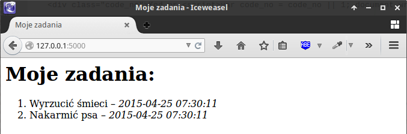
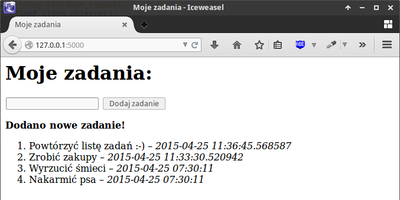
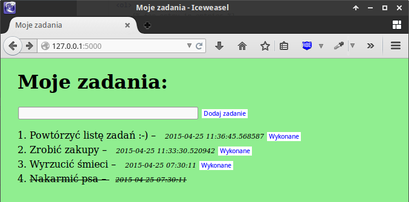

ToDo
##########################

.. _todo:

.. highlight:: python

Realizacja prostej listy ToDo (lista zadań do zrobienia) jako aplikacji
internetowej, z wykorzystaniem Pythona i frameworka Flask w wersji 0.10.1.
Aplikacja umożliwia dodawanie z określoną datą, przeglądanie i oznaczanie
jako wykonane różnych zadań, które zapisywane będą w bazie danych `SQLite <http://pl.wikipedia.org/wiki/SQLite>`_.

.. contents::
    :depth: 1
    :local:

Projekt i aplikacja
**********************

W katalogu użytkownika tworzymy nowy katalog dla aplikacji :file:`todo`,
a w nim plik główny :file:`todo.py`:

.. raw:: html

    
Terminal nr 

.. code-block:: bash

    ~ $ mkdir todo; cd todo; touch todo.py

Utworzymy szkielet aplikacji Flask, co pozwoli na uruchomienie testowego serwera www,
umożliwiającego wygodne rozwijanie kodu. W pliku :file:`todo.py` wpisujemy:

.. raw:: html

    
Kod nr 

.. highlight:: python
.. literalinclude:: todo_z1.py
    :linenos:

Serwer uruchamiamy komendą:

.. raw:: html

    
Terminal nr 

.. code-block:: bash

    ~/quiz$ python todo.py

.. figure:: img/serwer.png

Domyślnie serwer uruchamia się pod adresem *http://127.0.0.1:5000*.
Po wpisaniu go do przeglądarki internetowej otrzymamy :term:`kod odpowiedzi HTTP` 404,
tj. błąd "nie znaleziono", co wynika z faktu, że nasza aplikacja nie ma jeszcze
zdefiniowanego żadnego widoku dla tego adresu.

Odpowiedź aplikacji, tzw. :term:`widok`, to funkcja obsługująca wywołania powiązanego z nim adresu.
Widok (funkcja) zwraca najczęściej użytkownikowi wyrenderowaną z szablonu stronę internetową.

.. figure:: img/todo1.png

Widok (strona główna)
*********************

W pliku :file:`todo.py` umieszcamy funkcję ``index()``, domyślny widok naszej strony:

.. raw:: html

    
Kod nr 

.. highlight:: python
.. literalinclude:: todo_z2.py
    :linenos:

Widok ``index()`` za pomocą dekoratora ``@app.route('/')`` związaliśmy z adresem głównym (/).
Po odświeżeniu adresu *127.0.0.1:5000* zamiast błędu powinniśmy zobaczyć napis: "Cześć, tu Python!"

.. figure:: img/todo2.png

Model bazy danych
*********************

W katalogu aplikacji tworzymy plik :file:`schema.sql`, który zawiera opis
struktury tabeli z zadaniami. Do tabeli wprowadzimy przykładowe dane.

.. raw:: html

    
Kod nr 

.. highlight:: sql
.. literalinclude:: schema.sql
    :linenos:

Tworzymy bazę danych w pliku :file:`db.sqlite`, łączymy się z nią i
próbujemy wyświetlić dane, które powinny były zostać zapisane w tabeli *zadania*:
Pracę z bazą kończymy poleceniem ``.quit``.

.. raw:: html

    
Terminal nr 

.. code-block:: bash

    ~/todo$ sqlite3 db.sqlite < schema.sql
    ~/todo$ sqlite3 db.sqlite
    ~/todo$ select * from zadania;

.. figure:: img/sqlite.png

Połączenie z bazą danych
*************************

Bazę danych już mamy, teraz pora napisać funkcje umożiwiające łączenie się
z nią z poziomu naszej aplikacji. W pliku :file:`todo.py` dodajemy:

.. raw:: html

    
Kod nr 

.. highlight:: python
.. literalinclude:: todo_z3.py
    :linenos:

Na początku uzpełniliśmy importy. Następnie w konfiguracji aplikacji dodaliśmy
klucz zabezpieczający sesję, ustawiliśmy ścieżkę do pliku bazy danych
w katalogu aplikacji (stąd użycie funkcji ``app.root_path``) oraz nazwę aplikacji.

Utworzyliśmy również dwie funkcje odpowiedzialne za nawiązywanie
(``get_db``) i kończenie (``close_db``) połączenia z bazą danych.

Lista zadań
************

Wyświetlanie danych umożliwia wbudowany we Flask system szablonów,
czyli mechanizm renderowania kodu :term:`HTML` i żądanych danych.
Na początku pliku :file:`todo.py` dopisujemy wymagany import:

.. raw:: html

    
Kod nr 

.. code-block:: python

    from flask import render_template

Następnie modyfikujemy funkcję ``index()``:

.. raw:: html

    
Kod nr 

.. highlight:: python
.. literalinclude:: todo_z4.py
    :linenos:
    :emphasize-lines: 4-7
    :lineno-start: 36
    :lines: 36-42

W widoku ``index()`` tworzymy obiekt bazy danych (``db = get_db()``)
i wykonujemy zapytanie (``db.execute('select...')``), by pobrać z bazy
wszystkie zadania. Metoda ``fetchall()`` zwraca nam pobrane dane w formie listy.
Na koniec wywołujemy funkcję ``render_template()``, przekazując jej
nazwę szablonu oraz pobrane zadania. Wyrenderowany szablon zwracamy do użytkownika.

Szablon tworzymy w pliku :file:`~/todo/templates/zadania_lista.html`:

.. raw:: html

    
Plik zadania_lista.html nr 

.. highlight:: html
.. literalinclude:: templates/zadania_lista_z4.html
    :linenos:

Wewnątrz szablonu przeglądamy wszystkie wpisy (`zadania`) i umieszczamy
je na liście HTML. Do szablonu automatycznie przekazywany jest obiekt
``config`` (ustawienia aplikacji), z którego pobieramy tytuł strony (`SITE_NAME`).
Po odwiedzeniu strony *127.0.0.1:5000* powinniśmy zobaczyć listę zadań.

Dodawanie zadań
**************************

Wpisując adres w polu adresu przeglądarki, wysyłamy do serwera żądanie typu :term:`GET`,
które obsługujemy zwracając klientowi odpowiednie dane (listę zadań).
Dodawanie zadań wymaga przesłania danych z formularza na serwer – są to
żądania typu :term:`POST`, które modyfikują dane aplikacji.

Na początku pliku :file:`todo.py` trzeba, jak zwykle, zaimportować wymagane funkcje:

.. raw:: html

    
Kod nr 

.. code-block:: python

    from datetime import datetime
    from flask import flash, redirect, url_for, request

Następnie do widoku strony głównej dopisujemy kod obsługujący zapisywanie danych:

.. raw:: html

    
Kod nr 

.. highlight:: python
.. literalinclude:: todo_z5.py
    :linenos:
    :emphasize-lines: 1, 5-19, 24
    :lineno-start: 38
    :lines: 38-61

W dekoratorze dodaliśmy obsługę żądań POST, w widoku ``index()`` natomiast
instrukcję warunkową (``if``), która je wykrywa.
Dlej sprawdzamy, czy przesłane pole formularza jest puste. Jeśli tak, ustawiamy zmienną ``error``.
Jeśli nie, przygotowujemy dane, łączymy się z bazą, zapisujemy nowe zadanie
i tworzymy koumnikat potwierdzający.
Na koniec przekierowujemy użytkownika do widoku głównego (``redirect(url_for('index'))``),
ale tym razem z żądaniem GET, którego obsługa jest taka jak poprzednio,
czyli zwracamy listę zadań.

Warto zauważyć, że do szablonu możemy przekazywać wiele danych, w naszym przypadku
zmienną ``error`` zawierającą komunikat błędu. Lepszym sposobem zwracania
informacji użytkownikowi jest wykorzystanie dedykowanej funkcji ``flash()``.

Do szablonu :file:`zadania_lista.html` po znaczniku ``<h1>`` wstawiamy formularz
oraz kod wyświetlający komunikaty:

.. raw:: html

    
plik zadania_lista.html nr 

.. highlight:: html
.. literalinclude:: templates/zadania_lista_z5.html
    :linenos:
    :lineno-start: 10
    :lines: 10-25

Warto zwrócić uwagę na wykorzystanie wbudowanej funkcji ``url_for``,
która zamienia nazwę widoku (w tym wypadku ``index``) na powiązany z nim
adres URL (w tym wypadku ``/``). W ten sposób łączymy formularz
z widokiem (funkcją), który obsługuje dany adres.

Wygląd aplikacji
*****************

Wygląd aplikacji możemy zdefiniować w arkuszu stylów CSS, który umieścimy
w podkatalogu ``static`` aplikacji. Tworzymy plik :file:`~/todo/static/style.css` z przykładowymi
definicjami:

.. raw:: html

    
Plik style.css 

.. highlight:: css
.. literalinclude:: static/style.css
    :linenos:

Arkusz CSS podpinamy do pliku :file:`zadania_lista.html`, dodając w sekcji head znacznik ``<link... >``:

.. raw:: html

    
Plik zadania_lista.html nr 

.. highlight:: html
.. literalinclude:: templates/zadania_lista_z6.html
    :linenos:
    :emphasize-lines: 5
    :lineno-start: 3
    :lines: 3-8

Dzięki temu nasza aplikacja nabierze nieco lepszego wyglądu.

.. figure:: img/todo6.png

Zadania wykonane
*****************

Do każdego zadania dodamy formularz, którego wysłanie będzie oznaczało,
że wykonaliśmy dane zadanie, czyli zmienimy atrybut ``zrobione`` wpisu
z *0* (niewykonane) na *1* (wykonane). Odpowiednie żądanie typu POST
obsłuży nowy widok w pliku :file:`todo.py`, który wstawiamy po widoku
głównym i przed kodem uruchamiającym aplikację (``if __name__ == '__main__':``):

.. raw:: html

    
Kod nr 

.. highlight:: python
.. literalinclude:: todo_z7.py
    :linenos:
    :lineno-start: 64
    :lines: 64-71

W szablonie :file:`zadania_lista.html` modyfikujemy fragment wyświetlający
listę zadań i dodajemy formularz:

.. raw:: html

    
Plik zadania_lista.html nr 

.. highlight:: html
.. literalinclude:: templates/zadania_lista_z7.html
    :linenos:
    :lineno-start: 29
    :lines: 29-55

Aplikację można uznać za skończoną. Możemy dodawać zadania oraz zmieniać ich status.

Zadania dodatkowe
===========================

    Dodaj możliwość usuwania zadań.
    Dodaj mechanizm logowania użytkownika tak, aby użytkownik mógł dodawać i edytować tylko swoją listę zadań.
    Wprowadź osobne listy zadań dla każdego użytkownika.

Materiały
************************

**Źródła:**

* :download:`todo.zip <todo.zip>`
