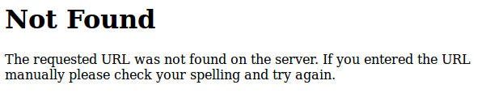
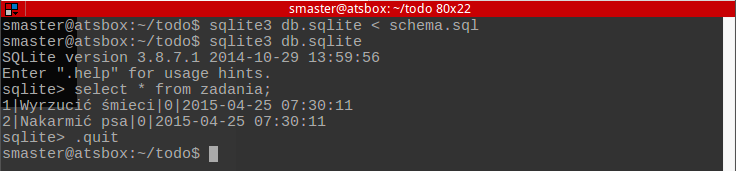
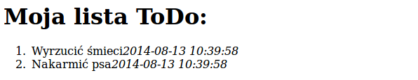
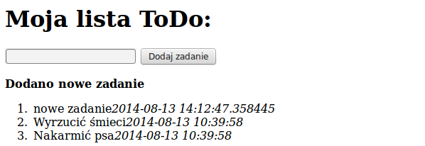
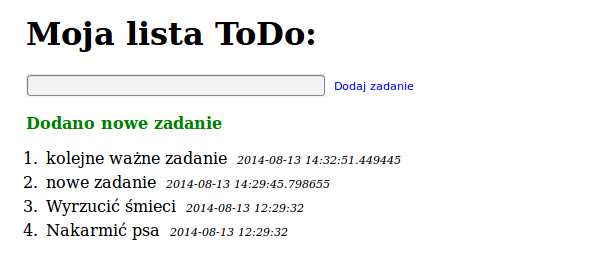
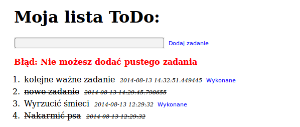

ToDo
##########################

.. _todo:

.. highlight:: python

Realizacja prostej listy ToDo (lista zadań do zrobienia) jako aplikacji internetowej, z wykorzystaniem Pythona i frameworka Flask w wersji 0.10.1.

.. contents::
    :depth: 1
    :local:

Struktura katalogów
**********************

Zaczynamy od utworzenia katalogu projektu ToDo w katalogu domowym użytkownika, a w nim pliku :file:`todo.py`:

.. raw:: html

    
Terminal nr 

.. code-block:: bash

    ~ $ mkdir todo; cd todo; touch todo.py

Aplikacja ma pozwalać na dodawanie z określoną datą, przeglądanie i oznaczanie jako wykonane różnych zadań, które zapisywane będą w bazie danych SQLite.

Szkielet aplikacji
*********************

Utworzenie minimalnej aplikacji Flask pozwoli na uruchomienie serwera deweloperskiego, umożliwiającego wygodne rozwijanie kodu. W pliku :file:`todo.py` wpisujemy:

.. raw:: html

    
Kod nr 

.. literalinclude:: todo_z1.py
    :linenos:

Serwer uruchamiamy komendą: ``python todo.py``

.. figure:: img/serwerrun.png

Domyślnie serwer uruchamia się pod adresem *127.0.0.1:5000*. Po wpisaniu adresu do przeglądarki internetowej
otrzymamy stronę z błędem HTTP 404, ponieważ nasza aplikacja
nie ma jeszcze zdefiniowanego żadnej odpowiedzi dla tego adresu.
Odpowiedź taka, tzw. :term:`widok`, to funkcja obsługująca wywołania powiązanego z nim adresu.
Widok (funkcja) zwraca najczęściej użytkownikowi wyrenderowaną z szablonu stronę internetową.

Definiowanie widoków
*********************

W pliku :file:`todo.py` umieścimy funkcję ``index()``, domyślny widok naszej strony:

.. raw:: html

    
Kod nr 

.. literalinclude:: todo_z2.py
    :linenos:

Widok ``index()`` za pomocą dekoratora związaliśmy z adresem głównym (/). Po odświeżeniu adresu *127.0.0.1:5000* zamiast błędu powinniśmy zobaczyć napis: "Witaj na moim serwerze!"

Model bazy danych
*********************

W katalogu aplikacji tworzymy plik :file:`schema.sql`, który zawiera opis struktury tabeli z zadaniami. Do tabeli wprowadzimy przykładowe dane.

.. raw:: html

    
Kod nr 

.. literalinclude:: schema.sql
    :linenos:

Tworzymy bazę danych w pliku :file:`db.sqlite`, łączymy się z nią i próbujemy wyświetlić dane, które powinny były zostać zapisane w tabeli *entries*:

.. raw:: html

    
Terminal nr 

.. code-block:: bash

    sqlite3 db.sqlite < schema.sql
    sqlite3 db.sqlite
    select \* from entries;

Pracę z bazą kończymy poleceniem ``.quit``.

Połączenie z bazą danych
*************************

Bazę danych już mamy, teraz pora napisać funkcje umożiwiające łączenie się z nią z poziomu naszej aplikacji. W pliku :file:`todo.py` dodajemy:

.. raw:: html

    
Terminal nr 

.. literalinclude:: todo_z3.py
    :linenos:

Dodaliśmy sekretny klucz zabezpieczający mechanizm sesji, ustawiliśmy ścieżkę do pliku bazy danych w katalogu aplikacji (stąd użycie funkcji ``app.root_path``) oraz nazwę aplikacji. Utworzyliśmy trzy funkcje odpowiedzialne za nawiązywanie (``connect_db``, ``get_db``) i kończenie (``close_db``) połączenia z bazą danych.

Pobieranie i wyświetlanie danych
*********************************

Wyświetlanie danych umożliwia wbudowany we Flask system szablonów (templatek), czyli mechanizm renderowania kodu HTML na podstawie plików zawierających instrukcje wstawiające wybrane dane z aplikacji oraz znaczniki HTML. Modyfikujemy funkcję ``index()`` w pliku :file:`todo.py`:

.. raw:: html

    
Kod nr 

.. code-block:: python

    # dodajemy nowe importy do pozostalych
    from flask import render_template

    # dekorator laczacy adres glowny z widokiem index
    @app.route('/')
    def index():
        db = get_db() # laczymy sie z baza
        # pobieramy wszystkie wpisy z bazy:
        cur = db.execute('select id, title, is_done, created_at from entries order by created_at desc;')
        entries = cur.fetchall()
        # renderujemy tempaltke i zwracamy ja do klienta
        return render_template('show_entries.html', entries=entries)

W widoku ``index()`` pobieramy obiekt bazy danych (`db`) i wykonujemy zapytanie (`select...`), by wyciągnąć wszystkie zapisane zadania. Na koniec renderujemy szablon przekazując do niego pobrane zadania (``entries``). Szablon, czyli plik :file:`show_entries.html`, umieszczamy w podkatalogu :file:`templates` aplikacji. Poniżej jego zawartość:

.. raw:: html

    
Kod nr 

.. literalinclude:: templates/show_entries_z1.html
    :linenos:

Wewnątrz szablonu przeglądamy wszystkie wpisy (`entries`) i umieszczamy je na liście HTML. Do szablonu automatycznie przekazywany jest obiekt ``config`` (dane konfiguracyjne), z którego pobieramy tytuł strony (`SITE_NAME`). Po odwiedzeniu strony *127.0.0.1:5000* powinniśmy zobaczyć listę zadań.

Formularz dodawania zadań
**************************

Aby umożliwić dodawanie i zapisywanie w bazie nowych zadań, modyfikujemy widok ``index()``, tak aby obsługiwał żądania POST, które zawierają dane wysłane z formularza na serwer.

.. raw:: html

    
Kod nr 

.. code-block:: python

    # dodajemy importy
    from datetime import datetime
    from flask import flash, redirect, url_for, request

    # dekorator laczacy adres glowny z widokiem index
    # poza powiazaniem adresu / z funkcja index, dodajemy mozliwosc akcpetacji
    # zadan HTTP POST (domyslnie dozwolone sa tyko zadania GET)
    @app.route('/', methods=['GET', 'POST'])
    def index():
        """Glowny widok strony. Obsluguje wyswietlanie i dodawanie zadan."""
        # zmienna przechowujaca informacje o ewentualnych bledach
        error = None

        # jezeli otrzymujemy dane POST z formularza, dodajemy nowe zadanie
        if request.method == 'POST':
            if len(request.form['entry']) > 0: # sprawdzamy poprawnosc przeslanych danych
                db = get_db() # nawiazujemy polaczenie z baza danych
                new_entry = request.form['entry'] # wyciagamy tresc zadania z przeslanego formularza
                is_done = '0' # ustalamy, ze nowo dodane zadanie nie jest jeszcze wykonane
                created_at = datetime.now() # data dodania
                # zapytanie do bazy, ktore wstawia nowy wiersz z danymi
                db.execute('insert into entries (title, is_done, created_at) values (?, ?, ?);', [new_entry, is_done, created_at])
                db.commit() # wykonujemy zapytanie
                flash('Dodano nowe zadanie') # informacja o pomyslnym dodaniu nowego zadania
                return redirect(url_for('index')) # przekierowujemy na strone glowna
            error = u'Nie możesz dodać pustego zadania' # komunikat o bledzie

        db = get_db() # laczymy sie z baza
        # pobieramy wszystkie wpisy z bazy:
        cur = db.execute('select id, title, is_done, created_at from entries order by created_at desc;')
        entries = cur.fetchall()
        # renderujemy tempaltke i zwracamy do klienta:
        return render_template('show_entries.html', entries=entries, error=error)

Wpisując adres w polu adresu przeglądarki, wysyłamy do serwera żądanie typu GET, które obsługujemy zwracając klientowi odpowiednie dane (listę zadań). Natomiast żądania typu POST są wykorzystywane do zmiany informacji na serwerze (np. dodania nowego wpisu). Dlatego widok ``index()`` rozszerzyliśmy o sprawdzanie typu żądania, w razie wykrycia danych POST, sprawdzamy poprawność danych przesłanych z formularza i jeżeli są poprawne, dodajemy nowe zadanie do bazy. W przeciwnym razie zwracamy użytkownikowi informację o błędzie.
Szablon :file:`show_entries.html` aktualizujemy, dodając odpowiedni formularz:

.. raw:: html

    
Kod nr 

    
.. literalinclude:: templates/show_entries_z2.html
    :linenos:

W szablonie dodaliśmy formularz oraz informację o błędzie lub sukcesie przy próbie dodawania zadania. Określając atrybut *action* w formularzu, skorzystaliśmy z wbudowanej funkcji ``url_for``, która zamienia nazwę widoku (w tym wypadku ``index``) na odpowiadający jej adres URL (w tym wypadku ``/``). W ten sposób łączymy formularz z konkretną funkcją Pythonową (widokiem), która obsługuje dany adres.

Wygląd aplikacji (opcja)
************************

Wygląd aplikacji możemy zdefiniować w arkuszu stylów CSS o nazwie :file:`style.css`, który zapisujemy w podkatalogu :file:`static` aplikacji:

.. raw:: html

    
Kod nr 

    
.. literalinclude:: static/style.css
    :linenos:

Zdefiniowane style podpinamy do pliku :file:`show_entries.html`, dodając w sekcji head wpis <link... >:

.. raw:: html

    
Kod nr 

.. code-block:: html

    <head>
        <title>{{ config.SITE_NAME }}</title>
        <link rel="stylesheet" type="text/css" href="{{ url_for('static', filename='style.css') }}">
    </head>

Dzięki temu nasza aplikacja nabierze nieco lepszego wyglądu.

Zadania wykonane (opcja)
**************************

Do każdego zadania dodamy formularz, którego wysłanie będzie oznaczało, że wykonaliśmy dane zadanie, czyli zmienimy atrybut ``is_done`` wpisu z *0* (niewykonane) na *1* (wykonane). Odpowiednie żądanie typu POST obsłuży nowy widok w pliku :file:`todo.py`. W szablonie :file:`show_entries.html` dodamy kod wyróżniający zadania wykonane.

.. raw:: html

    
Kod nr 

.. code-block:: python

    # dodajemy ponad definicja if __main__(...)

    # nadajemy osobny adres, oraz zezwalamy jedynie na zadania typu POST
    @app.route('/mark_as_done', methods=['POST'])
    def mark_as_done():
        """Zmiana statusu zadania na wykonane."""
        # z przeslanego formularza pobieramy identyfikator zadania
        entry_id = request.form['id']
        db = get_db() # laczymy sie z baza danych
        # przygotowujemy zapytanie aktualizujace pole is_done zadania o danym identyfikatorze
        db.execute('update entries set is_done=1 where id=?', [entry_id,])
        db.commit() # zapisujemy nowe dane
        return redirect(url_for('index')) # na koniec przekierowujemy na liste wszystkich zadan

W szablonie :file:`show_entries.html` modyfikujemy fragment wyświetlający listę zadań i dodajemy formularz:

.. raw:: html

    
Kod nr 

.. code-block:: html

        <ol>
            
                <li>
                    <!-- dodatkowe dekoracje dla zadan zakonczonych -->
                    
                        
                    

                    {{ entry.title }}<em>{{ entry.created_at }}</em>

                    <!-- dodatkowe dekoracje dla zadan zakonczonych -->
                    
                        
                    
                    
                    <!-- formularz zmiany statusu zadania -->
                    
                        <form method="POST" action="{{ url_for('mark_as_done') }}">
                            <!-- wysylamy jedynie informacje o id zadania -->
                            <input type="hidden" name="id" value="{{ entry.id }}"/>
                            <button type="submit">Wykonane</button>
                        </form>
                    
                </li>
            
        </ol>

Aplikację można uznać za skończoną. Możemy dodawać zadania oraz zmieniać ich status.

Zadania dodatkowe
===========================

    Dodaj możliwość usuwania zadań.
    Dodaj mechanizm logowania użytkownika tak, aby użytkownik mógł dodawać i edytować tylko swoją listę zadań.
    Wprowadź osobne listy zadań dla każdego użytkownika.

Materiały
************************

Słownik
====================

.. include:: ../glossary.rst

1. Strona projektu Flask http://flask.pocoo.org/
2. Informacje o SQLite http://pl.wikipedia.org/wiki/SQLite
3. Co to jest framework? http://pl.wikipedia.org/wiki/Framework
4. Co nieco o HTTP i żądaniach GET i POST http://pl.wikipedia.org/wiki/Http

Źródła
=====================

* :download:`todo_all.zip <todo_all.zip>`
* :download:`todo_flask_sqlite.pdf <../../pdf/todo_flask_sqlite.pdf>`

