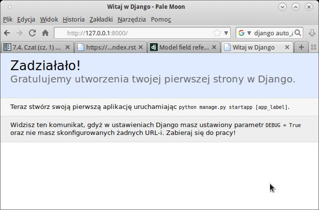
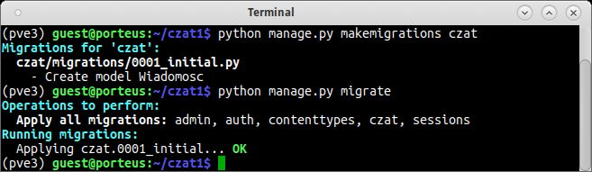
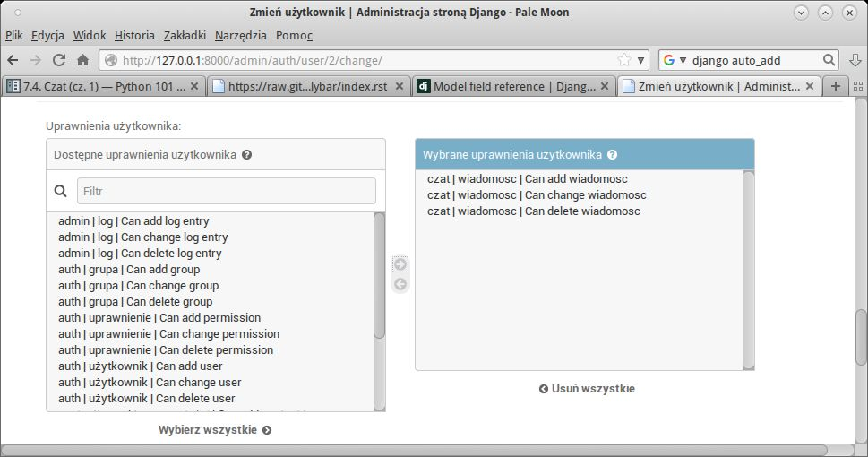
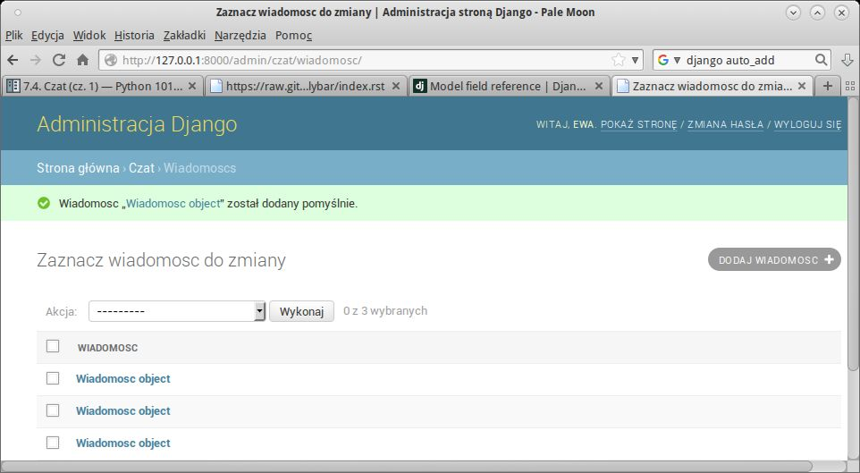
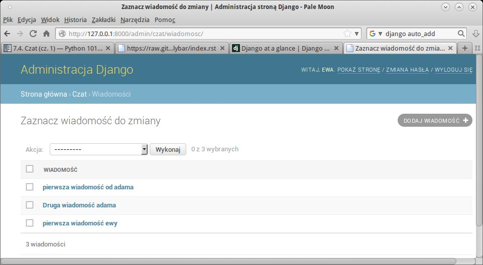
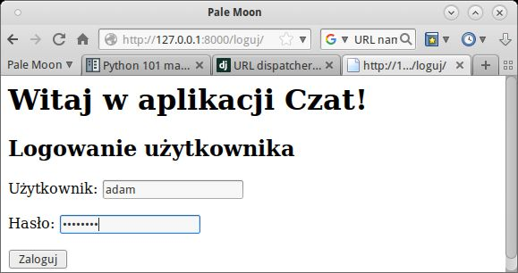
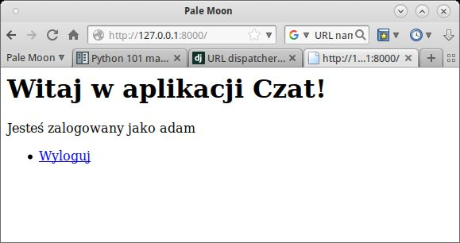
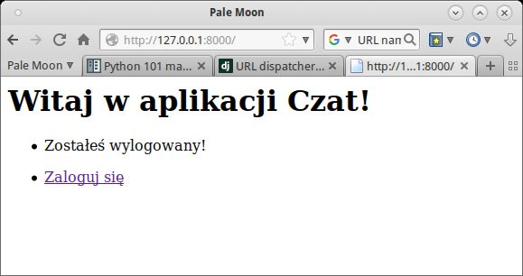
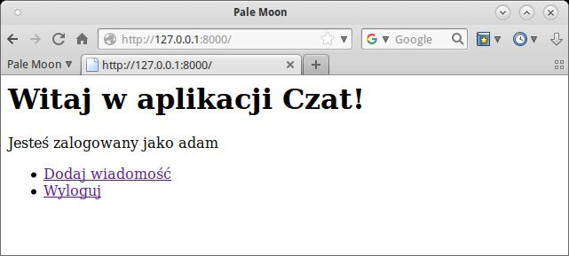
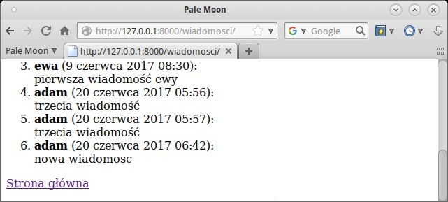

.. _czat-app:

Czat (cz. 1)
###########################

.. highlight:: python

Zastosowanie Pythona i frameworka Django do stworzenia aplikacji internetowej
Czat; prostego czata, w którym zarejestrowani użytkownicy będą mogli wymieniać się
krótkimi wiadomościami.

.. attention::

    **Wymagane oprogramowanie**:

      * Python v. 3.x
      * Django v. 1.11.2
      * Interpreter bazy SQLite3

.. contents::
    :depth: 1
    :local:

.. _czat1-env:

Środowisko
==========

W katalogu domowym tworzymy wirtualne środowisko Pythona:

.. raw:: html

    
Terminal nr 

.. code-block:: bash

    ~$ virtualenv -p python3 pve3
    ~$ source pve3/bin/activate
    (pve3) ~$ pip install Django==1.11.2

.. warning::

    Polecenie ``source pve3/bin/activate`` aktywuje wirtualne środowisko Pythona.
    Zawsze wydajemy je przed rozpoczęciem pracy nad projektem. Innymi słowy w terminalu
    ścieżka katalogu musi być poprzedzona prefiksem wirtualnego środowiska: ``(pve3)``.

Projekt i aplikacja
===================

Utworzymy nowy projekt Django. Wydajemy polecenia:

.. raw:: html

    
Terminal nr 

.. code-block:: bash

    (pve3) ~/$ django-admin.py startproject czat1
    (pve3) ~$ cd czat1
    (pve3) ~$ python manage.py migrate

- ``startproject`` – tworzy katalog :file:`czat1` z **podkatalogiem ustawień projektu**
  o takiej samej nazwie (:file:`czat1`),
- ``migrate`` – tworzy inicjalną bazę danych z tabelami wykorzystywanymi przez Django.

**Struktura plików projektu** – w terminalu wydajemy jedno z poleceń:

.. code-block:: bash

    (.pve) ~/czat1$ tree -L 2
    [lub]
    (.pve) ~/czat1$ ls -R

.. figure:: img/django_projekt.jpg

Zewnętrzny katalog :file:`czat1` to tylko pojemnik na projekt, jego nazwę można zmieniać.
Zawiera on:

    - :file:`manage.py` – skrypt Pythona do zarządzania projektem;
    - :file:`db.sqlite3` – bazę danych w domyślnym formacie SQLite3.

**Katlog projektu** :file:`czat1/czat1` zawiera:

    - :file:`settings.py` – konfiguracja projektu;
    - :file:`urls.py` – lista obsługiwanych adresów URL;
    - :file:`wsgi.py` – plik konfiguracyjny wykorzystywany przez serwery WWW.

Plik :file:`__init__.py` obecny w danym katalogu wskazuje, że dany katalog jest modułem Pythona.

Serwer deweloperski
===================

Serwer uruchamiamy poleceniem w terminalu:

.. code-block:: bash

    (pve3) ~/czat1$ python manage.py runserver

Łączymy się z serwerem wpisując w przeglądarce adres: ``127.0.0.1:8000``.
W terminalu możemy obserwować żądania obsługiwane przez serwer.
Większość zmian w kodzie nie wymaga restartowania serwera.
Serwer zatrzymujemy naciskając w terminalu skrót :kbd:`CTRL+C`.

.. figure:: img/django_it_worked.jpg

Aplikacja
=========

W ramach jednego projektu (serwisu internetowego) może działać wiele aplikacji.
Utworzymy teraz aplikację `czat` i zbadamy jej strukturę plików:

.. code-block:: bash

    (.pve) ~/czat1$ python manage.py startapp czat
    (.pve) ~/czat1$ tree czat
    lub:
    (.pve) ~/czat1$ ls -R czat

.. figure:: img/django_aplikacja.jpg

**Katalog aplikacji** :file:`czat1/czat` zawiera:

    - :file:`apps.py` – ustawienia aplikacji;
    - :file:`admin.py` – konfigurację panelu administracyjnego;
    - :file:`models.py` – plik definiujący modele danych przechowywanych w bazie;
    - :file:`views.py` – plik zawierający funkcje lub klasy definiujące tzw. *widoki* (ang. *views*), obsługujące żądania klienta przychodzące do serwera.

Ustawienia projektu
===================

Dostosujemy ustawienia projektu: zarejestrujemy aplikację w projekcie,
ustawimy polską wersję językową oraz zlokalizujemy datę i czas.
Edytujemy plik :file:`czat1/settings.py`:

.. raw:: html

    
Plik <i>settings.py</i>Kod nr 

.. code-block:: python

    # czat1/settings.py

    INSTALLED_APPS = [
        'czat.apps.CzatConfig', # rejestrujemy aplikacje czat
        'django.contrib.admin',
        'django.contrib.auth',
        'django.contrib.contenttypes',
        'django.contrib.sessions',
        'django.contrib.messages',
        'django.contrib.staticfiles',
    ]

    LANGUAGE_CODE = 'pl'  # ustawienie jezyka

    TIME_ZONE = 'Europe/Warsaw'  # ustawienie strefy czasowej

Uruchom ponownie serwer deweloperski i sprawdź w przeglądarce, jak wygląda strona powitalna.

Model danych
============

Budowanie aplikacji w Django nawiązuje do wzorca projektowego :term:`MVC`, czyli
Model-Widok-Kontroler. Więcej informacji na ten temat umieściliśmy w osobnym
materiale :ref:`MVC <mvc_wzorzec>`.

Zaczynamy więc od zdefiniowania modelu (zob. :term:`model`), czyli klasy opisującej tabelę zawierającą
wiadomości. Atrybuty klasy odpowiadają polom tabeli. Instancje tej klasy będą reprezentować wiadomości
utworzone przez użytkowników, czyli rekordy tabeli. Każda wiadomość będzie zwierała treść,
datę dodania oraz wskazanie autora (użytkownika).

W pliku :file:`czat/models.py` wpisujemy:

.. raw:: html

    
Plik <i>models.py</i>Kod nr 

.. highlight:: python
.. literalinclude:: models_z1.py
    :linenos:

Opisując klasę ``Wiadomosc`` podajemy nazwy poszczególnych właściwości (pól)
oraz typy przechowywanych w nich danych.

.. note:: Typy pól:

    * ``CharField`` – pole znakowe, przechowuje niezbyt długie napisy, np. nazwy;
    * ``Date(Time)Field`` – pole daty (i czasu);
    * ``ForeignKey`` – pole klucza obcego, czyli relacji; wymaga nazwy powiązanego modelu jako pierwszego argumentu.

  Właściwości pól:

    * ``verbose_name`` lub napis podany jako pierwszy argument – przyjazna nazwa pola;
    * ``max_length`` – maksymalna długość pola znakowego;
    * ``help_text`` – tekst podpowiedzi;
    * ``auto_now_add=True`` – data (i czas) wstawione zostaną automatycznie.

**Utworzenie migracji** – po dodaniu lub zmianie modelu należy zaktualizować bazę danych,
tworząc tzw. migrację, czyli zapis zmian:

.. raw:: html

    
Terminal nr 

.. code-block:: bash

    (.pve) ~/czat1$ python manage.py makemigrations czat
    (.pve) ~/czat1$ python manage.py migrate

.. note::

    Domyślnie Django korzysta z bazy SQLite zapisanej w pliku :file:`db.sqlite3`.
    Warto zobaczyć, jak wygląda. W terminalu wydajemy polecenie ``python manage.py dbshell``,
    które otworzy bazę w interpreterze ``sqlite3``. Następnie:
    * ``.tables`` - pokaże listę tabel;
    * ``.schema czat_wiadomosc`` - pokaże instrukcje SQL-a użyte do utworzenia podanej tabeli
    * ``.quit`` - wyjście z interpretera.

Panel administracyjny
=====================

Panel administratora pozwala dodawać użytkowników i wprowadzać dane.
W pliku :file:`czat/admin.py` umieszczamy kod:

.. raw:: html

    
Plik <i>admin.py</i>Kod nr 

.. highlight:: python
.. literalinclude:: admin.py
    :linenos:
    :emphasize-lines: 5, 8

Po zaimportowaniu modelu rejestrujemy go w panelu: ``admin.site.register(models.Wiadomosc)``.

.. note::

    Warto zapamiętać, że każdy model, funkcję, formularz czy widok, których chcemy użyć,
    musimy najpierw zaimportować za pomocą klauzuli typu ``from <skąd> import <co>``.

**Konto administratora** tworzymy wydając w terminalu polecenie:

.. raw:: html

    
Terminal nr 

.. code-block:: bash

    (.pve) ~/czat1$ python manage.py createsuperuser

– na pytanie o nazwę, email i hasło administratora, podajemy: "admin", "", "zaq1@WSX".

Ćwiczenie
---------

1) Uruchom/zrestartuj serwer, w przeglądarce wpisz adres *127.0.0.1:8000/admin/*
   i zaloguj się na konto administratora.

.. figure:: img/django_admin.jpg

2) Dodaj użytkowników "adam" i "ewa" z hasłami "zaq1@WSX".

   Na stronie, która wyświetla się po utworzeniu konta, zaznacz opcję "W zespole".
   W sekcji "Dostępne uprawnienia" zaznacz prawa dodawania (*add*), zmieniania (*change*)
   oraz usuwania (*del*) wiadomości (wpisy typu: "czat | wiadomosc | Can add wiadomosc")
   i przypisz je użytkownikowi naciskając strzałkę w prawo.

3) Z konta "adam" dodaj dwie przykładowe wiadomości, a z konta "ewa" – jedną.

Uzupełnienie modelu
===================

W formularzu dodawania wiadomości widać, że etykiety opisujące nasz model
nie są spolszczone. Uzupełniamy więc plik :file:`czat/models.py`:

.. raw:: html

    
Plik <i>models.py</i>Kod nr 

.. highlight:: python
.. literalinclude:: models.py
    :linenos:
    :lineno-start: 8
    :lines: 8-21
    :emphasize-lines: 8-14

Podklasa ``Meta`` pozwala zdefiniować formy liczby pojedynczej i mnogiej oraz
domyślny sposób sortowania wiadomości (``ordering = ['data_pub']``).
Zadaniem funkcji ``__str__()`` jest "autoprezentacja" klasy,
czyli w naszym wypadku wyświetlenie treści wiadomości.

Odśwież panel administracyjny (np. klawiszem :kbd:`F5`).

Strona główna
================

Aby utworzyć stronę główną, zakodujemy pierwszy :term:`widok` (zob. :ref:`więcej »»» <mvc_widok>`),
czyli funkcję o zwyczajowej nazwie ``index()``. W pliku :file:`views.py` umieszczamy:

.. raw:: html

    
Plik <i>views.py</i>Kod nr 

.. highlight:: python
.. literalinclude:: views_z1.py
    :linenos:
    :emphasize-lines: 10

Najprostszy widok zwraca do klienta (przeglądarki) jakiś tekst:
``return HttpResponse("Witaj w aplikacji Czat!")``.

**Adresy URL**, które ma obsługiwać nasza aplikacja, definiujemy w pliku :file:`czat/urls.py`.
Tworzymy nowy plik i uzupełniamy go kodem:

.. raw:: html

    
Plik <i>urls.py</i>Kod nr 

.. highlight:: python
.. literalinclude:: urls_z1.py
    :linenos:
    :emphasize-lines: 7-10

- ``app_name = 'czat'`` – określamy przestrzeń nazw, w której dostępne będą mapowania
  między adresami url a widokami naszej aplikacji,
- ``url()`` – funkcja, która wiąże zdefiniowany adres URL z widokiem,
- ``r'^$'`` – wyrażenie regularne opisujące adres URL, symbol ``^`` to początek,
  ``$`` – koniec łańcucha. Zapis ``r'^$'`` to adres główny serwera;
- ``views.index`` – przykładowy widok, czyli funkcja zdefiniowana w pliku :file:`czat/views.py`;
- ``name='index'`` – nazwa, która pozwoli na generowanie adresów url dla linków w kodzie HTML.

Konfigurację adresów URL naszej aplikacji musimy włączyć do konfiguracji adresów URL projektu.
W pliku :file:`czat1/urls.py` dopisujemy:

.. raw:: html

    
Plik <i>urls.py</i>Kod nr 

.. highlight:: python
.. literalinclude:: urls_p1.py
    :linenos:
    :emphasize-lines: 1, 6
    :lineno-start: 16
    :lines: 16-

- ``include()`` – funkcja pozwala na import adresów URL wskazanej aplikacji,
- ``'czat.urls'`` – plik konfiguracyjny aplikacji.

Przetestuj stronę główną wywołując adres ``127.0.0.1:8000``.

.. figure:: img/django_index1.jpg

Widoki i szablony
=================

Typową odpowiedzią na wywołanie jakiegoś adresu URL są strony zapisane w języku HTML.
**Szablony** takich stron umieszczamy w podkatalogu ``aplikacja/templates/aplikacja``.
Tworzymy więc katalog:

.. raw:: html

    
Terminal nr 

.. code-block:: bash

    (pve3) ~/czat1$ mkdir -p czat/templates/czat

Następnie tworzymy szablon :file:`templates/czat/index.html`, który zawiera:

.. raw:: html

    
Plik <i>index.html</i>. Kod nr 

.. highlight:: html
.. literalinclude:: index_z2.html
    :linenos:

W pliku :file:`views.py` zmieniamy instrukcję odpowiedzi:

.. raw:: html

    
Plik <i>views.py</i>Kod nr 

.. highlight:: python
.. literalinclude:: views_z2.py
    :linenos:
    :emphasize-lines: 2, 7-8
    :lineno-start: 4
    :lines: 4-

Funkcja ``render()`` jako pierwszy parametr pobiera obiekt typu ``HttpRequest`` zawierający informacje
o żądaniu, jako drugi nazwę szablonu z katalogiem nadrzędnym.

Po uruchomieniu serwera i wpisaniu adresu *127.0.0.1:8000* zobaczymy tekst,
który umieściliśmy w szablonie:

.. figure:: img/django_index2.jpg

(Wy)logowanie
=============

Udostępnimy użytkownikom możliwość logowania i wylogowywania się,
aby mogli dodawać i przeglądać wiadomości.

Na początku w pliku :file:`views.py`, dopisujemy importy wymaganych obiektów,
później dodajemy widoki ``loguj()`` i ``wyloguj()``:

.. raw:: html

    
Plik <i>views.py</i>Kod nr 

.. highlight:: python
.. literalinclude:: views.py
    :linenos:
    :lineno-start: 6
    :lines: 6-9

.. raw:: html

    
Plik <i>views.py</i>Kod nr 

.. highlight:: python
.. literalinclude:: views.py
    :linenos:
    :lineno-start: 19
    :lines: 19-37

**Logowanie** rozpoczyna się od wyświetlenia odpowiedniej strony – to żądanie typu :term:`GET`.
Widok logowania zwraca wtedy szablon: ``return render(request, 'czat/loguj.html', kontekst)``.
Parametr ``kontekst`` to słownik, który pod kluczem ``form`` zawiera pusty formularz logowania
utworzony w instrukcji ``AuthenticationForm()``.

Wypełnienie formularza danymi i przesłanie ich na serwer to żądanie typu :term:`POST`.
Wykrywamy je w instrukcji ``if request.method == 'POST':``. Następnie tworzymy instancję
formularza wypełnioną przesłanymi danymi: ``form = AuthenticationForm(request, request.POST)``.
Jeżeli dane są poprawne ``if form.is_valid():``, możemy zalogować użytkownika
za pomocą funkcji ``login(request, form.get_user())``.

Tworzymy również informację zwrotną dla użytkownika, wykorzystując system komunikatów:
``messages.error(request, "...")``. Tak utworzone komunikaty możemy odczytać
w każdym szablonie ze zmiennej ``messages``.

**Wylogowanie** polega na użyciu funkcji ``logout(request)`` – wyloguje ona
użytkownika, którego dane zapisane są w przesłanym żądaniu. Po utworzeniu
informacji zwrotnej podobnie jak po udanym logowaniu przekierowujemy użytkownika
na stronę główną (``return redirect(reverse('index'))``) z żądaniem jej wyświetlenia (typu GET).

**Szablon logowania** :file:`templates/czat/loguj.html` zawiera kod:

.. raw:: html

    
Plik <i>loguj.html</i> Kod nr 

.. highlight:: html
.. literalinclude:: loguj_z3.html
    :linenos:

W szablonach wykorzystujemy tagi dwóch rodzajów:

- ```` – pozwalają używać instrukcji sterujących, np. warunkowych lub pętli,
- ``{{ zmienna }}`` – służą wyświetlaniu wartości zmiennych lub wywoływaniu metod obiektów przekazanych do szablonu.

- ```` – instrukcja sprawdza, czy aktualny użytkownik jest zalogowany,
- ```` – zabezpieczenie formularza przed atakiem typu csrf,
- ``{{ form.as_p }}`` – automatyczne wyświetlenie pól formularza w akapitach,
- ```` – wstawienie adresu do odnośnika: w cudzysłowach podajemy przestrzeń nazw
  naszej aplikacji (``app_name``), a później nazwę widoku (``name``) zdefiniowane w pliku :file:`czat/urls.py`,
- ``{{ user.username }}`` – tak wyświetlamy nazwę zalogowanego użytkownika.

**Komunikaty zwrotne** przygotowane dla użytkownika w widokach wyświetlimy po
uzupełnieniu szablonu :file:`index.html`. Po znaczniku ``<h1>`` wstawiamy poniższy kod:

.. raw:: html

    
Plik <i>index.html</i> Kod nr 

.. highlight:: html
.. literalinclude:: index.html
    :linenos:
    :lineno-start: 7
    :lines: 7-13

- ```` – sprawdzamy, czy mamy jakieś komunikaty,
- ```` – w pętli pobieramy kolejne komunikaty...
- ``{{ komunikat|capfirst }}`` – i wyświetlamy z dużej litery za pomocą filtra.

**Mapowanie adresów URL na widoki** – w pliku :file:`czat/urls.py` dopisujemy reguły:

.. raw:: html

    
Plik <i>urls.py</i>Kod nr 

.. highlight:: python
.. literalinclude:: urls.py
    :linenos:
    :lineno-start: 10
    :lines: 10-11

Działanie dodanych funkcji testujemy pod adresami: ``127.0.0.1:8000/loguj`` i ``127.0.0.1:8000/wyloguj``.
Używamy nazw i haseł utworzonych wcześniej użytkowników.
Przykładowy formularz wygląda tak:

Ćwiczenie
---------

Adresów logowania i wylogowywania nikt nie wpisuje ręcznie. Wstaw kod generujący
odpowiednie linki do szablonu strony głównej po bloku wyświetlającym komunikaty.
Użytkownik niezalogowany powinien zobaczyć odnośnik *Zaloguj*,
użytkownik zalogowany – *Wyloguj*.
Przykładowe działanie stron może wyglądać tak:

Dodawanie wiadomości
====================

Chcemy, by zalogowani użytkownicy mogli dodawać wiadomości,
a także przeglądać wiadomości innych.

Zaczynamy od dodania **widoku** o nazwie np. ``wiadomosci()``.
Do pliku :file:`views.py` dodajemy import i kod funkcji:

.. raw:: html

    
Plik <i>views.py</i>Kod nr 

.. highlight:: python
.. literalinclude:: views.py
    :linenos:
    :lineno-start: 10
    :lines: 10

.. raw:: html

    
Plik <i>views.py</i>Kod nr 

.. highlight:: python
.. literalinclude:: views.py
    :linenos:
    :lineno-start: 40
    :lines: 40-57

Obsługa żądania typu GET (wyświetlenie wiadomości i formularza):

- ``wiadomosci = Wiadomosc.objects.all()`` – pobieramy wszystkie wiadomości z bazy,
  używając wbudowanego w Django systemu ORM.
- ``return render(request, 'czat/wiadomosci.html', kontekst)`` – zwracamy szablon,
  któremu przekazujemy słownik ``kontekst`` zawierający wiadomości.

Obsługa żądania typu POST (przesłanie danych z formularza):

- ``tekst = request.POST.get('tekst', '')`` – wiadomość pobieramy ze słownika
  ``request.POST`` za pomocą metody ``get('tekst', '')``, pierwszy argument to
  nazwa pola formularza użytego w szablonie, drugi argument to wartość domyślna,
  jeśli pole będzie niedostępne.
- ``if not 0 < len(tekst) <= 250:`` – sprawdzenie minimalnej i maksymalnej
  długości wiadomości,
- ``Wiadomosc(tekst=tekst, autor=request.user)`` – utworzenie instancji wiadomości
  za pomocą konstruktora modelu, któremu przekazujemy wartości wymaganych pól,
- ``wiadomosc.save()`` – zapisanie nowej wiadomości w bazie.

**Szablon** zapisany w pliku :file:`templates/czat/wiadomosci.html`
będzie wyświetlał komunikaty zwrotne, np. błędy, a także formularz dodawania
i listę wiadomości:

.. raw:: html

    
Plik <i>wiadomosci.html</i>. Kod nr 

.. highlight:: html
.. literalinclude:: wiadomosci_z4.html
    :linenos:

- ``<input type="text" name="tekst" />`` – "ręczne" przygotowanie formularza,
  czyli wstawienie kodu HTML pola do wprowadzania tekstu wiadomości,
- ``{{ wiadomosc.tekst }}`` – wyświetlenie właściwości obiektu przekazanego
  w kontekście.

**Adres URL**, obsługiwany przez widok ``wiadomosci()``, definiujemy w
pliku :file:`czat/urls.py`, nadając mu nazwę *wiadomosci*:

.. raw:: html

    
Plik <i>urls.py</i>Kod nr 

.. highlight:: python
.. literalinclude:: urls.py
    :linenos:
    :lineno-start: 12
    :lines: 12

Ćwiczenie
---------

* W szablonie widoku strony głównej dodaj link "Dodaj wiadomość" dla
  zalogowanych użytkowników.
* W szablonie wiadomości dodaj link "Strona główna".
* Zaloguj się i przetestuj wyświetlanie [#]_ i dodawanie wiadomości pod adresem
  *127.0.0.1:8000/wiadomosci/*. Sprawdź, co się stanie po wysłaniu pustej
  wiadomości.

.. [#] Jeżeli nie dodałeś do tej pory żadnej wiadomości, lista na początku
   będzie pusta.

Poniższe zrzuty prezentują efekty naszej pracy:

Materiały
=========

1. O Django http://pl.wikipedia.org/wiki/Django_(informatyka)
2. Strona projektu Django https://www.djangoproject.com/
3. Co to jest framework? http://pl.wikipedia.org/wiki/Framework
4. Co nieco o HTTP i żądaniach GET i POST http://pl.wikipedia.org/wiki/Http

**Źródła:**

* :download:`czat1.zip <czat1.zip>`
