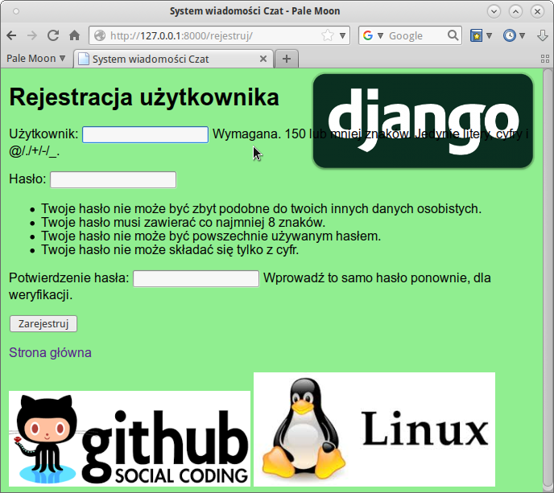
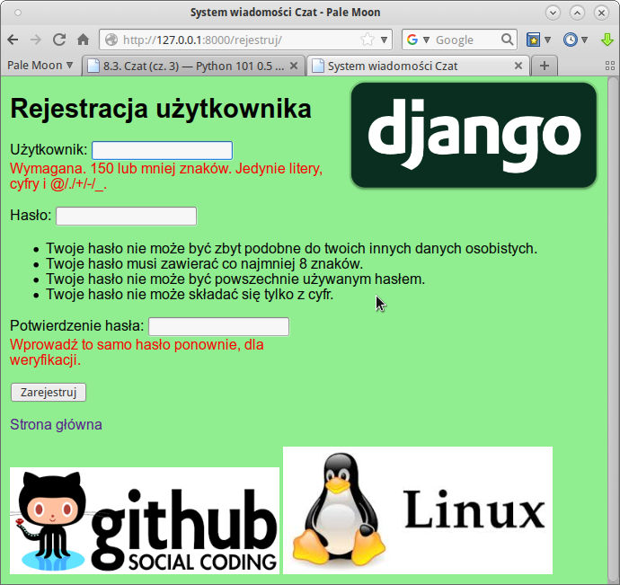
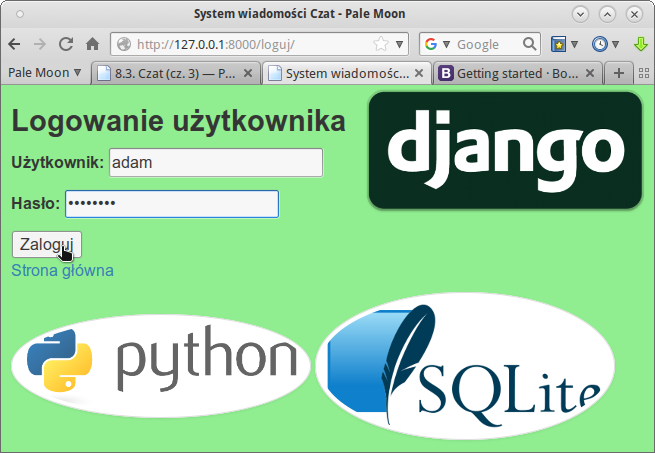

.. _czat-app3:

Czat (cz. 3)
#########################

Poniższy materiał koncentruje się na obsłudze szablonów (ang. *templates*)
wykorzystywanych w Django. Stanowi kontynuację projektu zrealizowanego
w scenariuszu :ref:`Czat (cz. 2) <czat-app2>`.

Na początku pobierz :download:`archiwum <czat3_z01.zip>` z potrzebnymi plikami
i rozpakuj je w katalogu domowym użytkownika. Następnie wydaj polecenia:

.. raw:: html

    <div class="code_no">Terminal nr <script>var ter_no = ter_no || 1; document.write(ter_no++);</script></span></div>

.. code-block:: bash

    ~$ source pve3/bin/activate
    (pve3) ~$ cd czat3
    (pve3) ~/czat3$ python manage.py check


.. warning::

    Przypominamy, że pracujemy w wirtualnym środowisku Pythona z zainstalowanym frameworkiem
    Django, które powinno znajdować się w katalogu :file:`pve3`. Zobacz w scenariuszu Czat (cz. 1),
    jak utworzyć takie :ref:`środowisko <czat1-env>`.


Szablony
========

Zapewne zauważyłeś, że większość kodu w szablonach i stronach
HTML, które z nich powstają, powtarza się albo jest bardzo podobna.
Biorąc pod uwagę schematyczną budowę stron WWW jest to nieuniknione.

Szablony, jak można było zauważyć, składają się ze **zmiennych** i **tagów**.
Zmienne, które ujmowane są w podwójne nawiasy sześciokątne ``{{ zmienna }}``,
zastępowane są konkretnymi wartościami. Tagi z kolei, oznaczane notacją
````, tworzą mini-język szablonów i pozwalają kontrolować logikę budowania treści.
Najważniejsze tagi, ````, ````, ````
– już stosowaliśmy.

Spróbujmy uprościć i ujednolicić nasze szablony. Zacznijmy od szablonu
bazowego, który umieścimy w pliku :file:`templates/czat/baza.html`:

.. raw:: html

    <div class="code_no">Plik <i>baza.html</i>. <span class="right">Kod nr <script>var code_no = code_no || 1; document.write(code_no++);</script></span></div>

.. highlight:: html
.. literalinclude:: baza_z02.html
    :linenos:

Jest to zwykły tekstowy dokument, zawierający schemat strony utworzony z
wymaganych znaczników HTML oraz bloki zdefiniowane za pomocą tagów ````.
W pliku tym umieszczamy wspólną strukturę stron w serwisie
(np. nagłówek, menu, sekcja treści, stopka itp.) oraz wydzielamy bloki,
których treść będzie można zmieniać w szablonach konkretnych stron.

Wykorzystując szablon podstawowy, zmieniamy stronę główną, czyli plik
:file:`index.html`:

.. raw:: html

    <div class="code_no">Plik <i>index.html</i>. <span class="right">Kod nr <script>var code_no = code_no || 1; document.write(code_no++);</script></span></div>

.. highlight:: html
.. literalinclude:: index_z02.html
    :linenos:

Jak widać, szablon dziedziczy z szablonu bazowego – tag ````.
Dalej podajemy zawartość bloków, które są potrzebne na danej stronie.

Postępując na tej samej zasadzie modyfikujemy szablon rejestracji:

.. raw:: html

    <div class="code_no">Plik <i>rejestruj.html</i>. <span class="right">Kod nr <script>var code_no = code_no || 1; document.write(code_no++);</script></span></div>

.. highlight:: html
.. literalinclude:: rejestruj_z02.html
    :linenos:

Ćwiczenie
---------

Wzorując się na podanych przykładach zmień pozostałe szablony tak,
aby opierały się na szablonie bazowym.
Następnie przetestuj działanie aplikacji. Wygląd stron nie powinien ulec zmianie!

Dla przykładu szablon :file:`wiadomosc_list.html` powinien wyglądać tak:

.. raw:: html

    <div class="code_no">Plik <i>wiadomosc_list.html</i>. <span class="right">Kod nr <script>var code_no = code_no || 1; document.write(code_no++);</script></span></div>

.. highlight:: html
.. literalinclude:: wiadomosc_list_z02.html
    :linenos:

Style CSS i obrazki
===================

Nasze szablony zyskały na zwięzłości i przejrzystości, ale nadal pozbawione
są elementarnych dla dzisiejszych stron WWW zasobów, takich jak
style CSS, skrypty JavaScript czy zwykłe obrazki. Jak je dołączyć?

Przede wszystkim potrzebujemy osobnego katalogu :file:`czat/static/czat`.
W terminalu w katalogu projektu (!) wydajemy polecenia:

.. raw:: html

    <div class="code_no">Terminal. Kod nr <script>var code_no = code_no || 1; document.write(code_no++);</script></div>

.. code-block:: bash

    (.pve) ~/czat3$  mkdir -p czat/static/czat
    (.pve) ~/czat3$  cd czat/static/czat
    (.pve) ~/czat3/czat/static/czat$ mkdir css js img

Ostatnie polecenie tworzy podkatalogi dla różnych typów zasobów:

* :file:`css` – arkusze stylów CSS,
* :file:`js` – skrypty Java Script,
* :file:`img` – obrazki.


Tworzymy przykładowy arkusz stylów CSS :file:`style.css` i zapisujemy
w katalogu :file:`static/czat/css`:

.. raw:: html

    <div class="code_no">Plik <i>style.css</i>. <span class="right">Kod nr <script>var code_no = code_no || 1; document.write(code_no++);</script></span></div>

.. highlight:: css
.. literalinclude:: style_z03.css
    :linenos:

Do podkatalogu :file:`static/czat/img` rozpakuj obrazki z pobranego :download:`archiwum `.

Teraz musimy dołączyć style i obrazki do szablonu bazowego :file:`baza.html`:

.. raw:: html

    <div class="code_no">Plik <i>baza.html</i>. <span class="right">Kod nr <script>var code_no = code_no || 1; document.write(code_no++);</script></span></div>

.. highlight:: html
.. literalinclude:: baza_z03.html
    :linenos:
    :lineno-start: 1
    :lines: 1-
    :emphasize-lines: 2, 8-9, 35-39

* ```` – ten kod umieszczamy na początku dokumentu,
  konfiguruje on ścieżkę do zasobów;
* ```` – ten tag wskazuje lokalizację dołączanego do strony pliku,
  np. arkusza CSS czy obrazka, tag umieszczamy jako wartość atrybutu ``href``.


Ćwiczenie
---------

W szablonie bazowym stwórz blok umożliwiający zastępowanie domyślnych obrazków.
Następnie zmień szablon :file:`rejestracja.html` tak, aby wyświetlał inne obrazki,
które znajdziesz w podkatalogu :file:`czat/static/img`.

.. tip::

    Tag ```` musisz wstawić zaraz po tagu ````
    do każdego szablonu, w którym chcesz odwoływać się do plików
    z katalogu :file:`static`.



Java Script
===========

Na ostatnim zrzucie widać wykonane ćwiczenie, czyli użycie dodatkowych
obrazków. Jednak strona nie wygląda dobrze, ponieważ treść podpowiedzi
nachodzi na logo Django (oczywiście przy małym rozmiarze okna przeglądarki).
Spróbujemy temu zaradzić.

Wykorzystamy prosty skrypt wykorzystujący bibliotekę `jQuery <https://jquery.com/>`_.
Ściągamy :download:`archiwum <js.zip>` i rozpakowujemy do katalogu
:file:`static/js`. Następnie do szablonu podstawowego :file:`baza.html`
dodajemy przed tagiem zamykającym ``</body>`` znaczniki ``<script>``,
w których wskazujemy położenie skryptów:

.. raw:: html

    <div class="code_no">Plik <i>baza.html</i>. <span class="right">Kod nr <script>var code_no = code_no || 1; document.write(code_no++);</script></span></div>

.. highlight:: html
.. literalinclude:: baza_z04.html
    :linenos:
    :lines: 43-44

Po odświeżeniu adresu */rejestruj* powinieneś zobaczyć poprawioną stronę:



Bootstrap
=========

`Bootstrap <http://getbootstrap.com/>`_  to jeden z najpopularniejszych frameworków,
który z wykorzystaniem języków HTML, CSS i JS ułatwia tworzenie responsywnych aplikacji sieciowych.
Zintegrowanie go z naszą aplikacją przy wykorzystaniu omówionych mechanizmów
jest całkiem proste.

Wchodzimy na stronę `Getting started <http://getbootstrap.com/getting-started/#download-cdn>`_,
kopiujemy linki dołączające arkusze CSS i wklejamy je za znacznikiem ``<title>``
w szablonie bazowym:

.. raw:: html

    <div class="code_no">Plik <i>baza.html</i>. <span class="right">Kod nr <script>var code_no = code_no || 1; document.write(code_no++);</script></span></div>

.. highlight:: html
.. literalinclude:: baza_z05.html
    :linenos:
    :lines: 8-12

Następnie kopiujemy link dołączający Java Script i wklejamy na końcu szablonu
bazowego po linku włączającym *jQuery*.

.. raw:: html

    <div class="code_no">Plik <i>baza.html</i>. <span class="right">Kod nr <script>var code_no = code_no || 1; document.write(code_no++);</script></span></div>

.. highlight:: html
.. literalinclude:: baza_z05.html
    :linenos:
    :lines: 49-52
    :emphasize-lines: 2-3


Na koniec użyjemy dla przykładu klas ``img-thumbnail`` i ``img-circle`` Bootstrapa
w znacznikach ```` szablonu bazowego:

.. raw:: html

    <div class="code_no">Plik <i>baza.html</i>. <span class="right">Kod nr <script>var code_no = code_no || 1; document.write(code_no++);</script></span></div>

.. highlight:: html
.. literalinclude:: baza_z05.html
    :linenos:
    :lines: 44-45



.. note::

    Można oczywiście dołączać pliki Bootstrapa po pobraniu i umieszczeniu
    ich w podkatalogach folderu :file:`static` za pomocą omawianego tagu
    ````.


Materiały
=========

1. O Django http://pl.wikipedia.org/wiki/Django_(informatyka)
2. Strona projektu Django https://www.djangoproject.com/
3. Co to jest framework? http://pl.wikipedia.org/wiki/Framework
4. Co nieco o HTTP i żądaniach GET i POST http://pl.wikipedia.org/wiki/Http

**Źródła:**

* :download:`czat3.zip <czat3.zip>`
