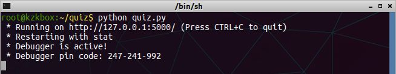
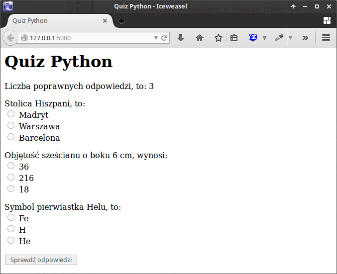

.. _quiz-app:

Quiz
#####

Realizacja aplikacji internetowej Quiz w oparciu o :term:`framework` Flask 0.12.x.
Na stronie wyświetlamy pytania, użytkownik zaznacza poprawne odpowiedzi,
przesyła je na serwer i otrzymuje informację o wynikach.

.. contents::
    :depth: 1
    :local:

Projekt i aplikacja
===================

W katalogu użytkownika tworzymy nowy katalog aplikacji o nazwie :file:`quiz`:

.. raw:: html

    
Terminal nr 

.. highlight:: bash
.. code-block:: bash

    ~$ mkdir quiz; cd quiz;

Utworzymy szkielet aplikacji Flask, co pozwoli na uruchomienie testowego serwera www,
umożliwiającego wygodne rozwijanie kodu. W nowym pliku o nazwie :file:`quiz.py`
wpisujemy poniższy kod i zapisujemy w katalogu aplikacji.

.. raw:: html

    
Kod nr 

.. highlight:: python
.. literalinclude:: quiz1.py
    :linenos:

Serwer uruchamiamy komendą:

.. raw:: html

    
Terminal nr 

.. code-block:: bash

    ~/quiz$ python3 quiz.py

Domyślnie serwer uruchamia się pod adresem *http://127.0.0.1:5000*.
Po wpisaniu go do przeglądarki internetowej otrzymamy :term:`kod odpowiedzi HTTP` 404,
tj. błąd "nie znaleziono", co wynika z faktu, że nasza aplikacja nie ma jeszcze zdefiniowanego żadnego
widoku dla tego adresu.

.. figure:: img/quiz1.png

.. tip::

    Działanie serwera w terminalu zatrzymujemy skrótem :kbd:`CTRL+C`.

Strona główna
=============

Jeżeli chcemy, aby nasza aplikacja zwracała użytkownikowi jakieś strony www,
tworzymy tzw. :term:`widok`. Jest to funkcja Pythona powiązana z określonymi
adresami URL za pomocą tzw. dekoratorów. Widoki pozwalają nam obsługiwać podstawowe
żądania protokołu :term:`HTTP`, czyli: :term:`GET`, wysyłane przez przeglądarkę,
kiedy użytkownik chce zobaczyć stronę, i :term:`POST`, kiedy użytkownik przesyła dane
na serwer za pomocą formularza.

W odpowiedzi aplikacja może odsyłać różne dane. Najczęściej
będą to znaczniki :term:`HTML` oraz treści, np. wyniki quizu. Flask ułatwia
tworzenie takich dokumentów za pomocą szablonów.

W pliku :file:`quiz.py` umieszczamy kod:

.. raw:: html

    
Kod nr 

.. highlight:: python
.. literalinclude:: quiz2.py
    :linenos:
    :emphasize-lines: 9-11

Widok (czyli funkcja) ``index()`` powiązany jest z adresem głównym (/)
za pomocą dekoratora ``@app.route('/')``. Funkcja zostanie wykonana w odpowiedzi
na żądanie GET wysłane przez przeglądarkę po wpisaniu i zatwierdzeniu przez
użytkownika adresu serwera.

Najprostszą odpowiedzią jest zwrócenie jakiegoś tekstu: ``return 'Cześć, tu Python!'``.

.. figure:: img/quiz2.png

Zazwyczaj będziemy prezentować bardziej skomplikowane dane, w dodatku
sformatowane wizualnie. Potrzebujemy szablonów. Będziemy je zapisywać
w katalogu :file:`quiz/templates`, który utworzymy np. poleceniem:

.. raw:: html

    
Terminal nr 

.. code-block:: bash

    ~/quiz$ mkdir templates

Następnie w nowym pliku :file:`templates/index.html` umieszczamy kod:

.. raw:: html

    
Plik <i>index.html</i>. Kod nr 

.. highlight:: html
.. literalinclude:: templates/index3.html
    :linenos:

Na koniec modyfikujemy funkcję ``index()`` w pliku :file:`quiz.py`:

.. raw:: html

    
Kod nr 

.. highlight:: python
.. literalinclude:: quiz3.py
    :linenos:
    :emphasize-lines: 5, 13

Do renderowania szablonu (zob: :term:`renderowanie szablonu`) używamy
funkcji ``render_template('index.html')``, która jako argument przyjmuje
nazwę pliku szablonu. Pod adresem *http://127.0.0.1:5000* strony głównej,
zobaczymy dokument HTML:

.. figure:: img/quiz3.png

Pytania i odpowiedzi
====================

Dane aplikacji, a więc pytania i odpowiedzi, umieścimy w liście
``DANE`` w postaci słowników zawierających: treść pytania,
listę możliwych odpowiedzi oraz poprawną odpowiedź.

Modyfikujemy plik :file:`quiz.py`. Podany kod wstawiamy po inicjacji zmiennej
``app``, ale przed dekoratorem widoku ``index()``:

.. raw:: html

    
Kod nr 

.. highlight:: python
.. literalinclude:: quiz4.py
    :linenos:
    :emphasize-lines: 9-27, 33

W konfiguracji aplikacji dodaliśmy sekretny klucz, wykorzystywany podczas
korzystania z sesji (zob :term:`sesja`).

**Dane aplikacji**

Każda aplikacja korzysta z jakiegoś źródła danych. W najprostszym przypadku
dane zawarte są w samej aplikacji. Dodaliśmy więc listę słowników ``DANE``,
którą przekazujemy dalej jako drugi argument do funkcji ``render_template()``.
Dzięki temu będziemy mogli odczytać je w szablonie w zmiennej ``pytania``.

Do szablonu :file:`index.html` wstawiamy poniższy kod po nagłówku ``<h1>``.

.. raw:: html

    
Plik <i>index.html</i>. Kod nr 

.. highlight:: html
.. literalinclude:: templates/index4.html
    :linenos:
    :lines: 9-33

Znaczniki HTML w powyższym kodzie tworzą formularz (``<form>``).
Natomiast tagi, czyli polecenia dostępne w szablonach, pozwalają
wypełnić go danymi.

* ```` – tak wstawiamy instrukcje sterujące;
* ``{{ zmienna }}`` – tak wstawiamy wartości zmiennych przekazanych do szablonu.

Z przekazanej do szablonu listy pytań, czyli ze zmiennej ``pytania`` odczytujemy
w pętli ```` kolejne słowniki; dalej tworzymy elementy formularza,
czyli wyświetlamy treść pytania ``{{ p.pytanie }}``, a w kolejnej pętli
```` odpowiedzi w postaci grupy opcji typu radio.

Każda grupa odpowiedzi nazywana jest dla odróżnienia numerem pytania liczonym od 0.
Odpowiednią zmienną ustawiamy w instrukcji ````,
a używamy w postaci ``name="{{ pnr }}"``. Dzięki temu przyporządkujemy
przesłane odpowiedzi do kolejnych pytań podczas ich sprawdzania.

Po ponownym uruchomieniu serwera powinniśmy otrzymać następującą stronę internetową:

.. figure:: img/quiz4.png

Oceniamy odpowiedzi
===================

Mechanizm sprawdzana liczby poprawnych odpowiedzi umieścimy w funkcji ``index()``.
Na początku pliku :file:`quiz.py` dodajemy potrzebne importy:

.. raw:: html

    
Kod nr 

.. highlight:: python
.. literalinclude:: quiz5.py
    :linenos:
    :lineno-start: 6
    :lines: 6

– i uzupełniamy kod funkcji ``index()``:

.. raw:: html

    
Kod nr 

.. highlight:: python
.. literalinclude:: quiz5.py
    :linenos:
    :lineno-start: 30
    :lines: 30-45

* ``methods=['GET', 'POST']`` – lista zawiera obsługiwane typy żądań,
  chcemy obsługiwać zarówno żądania :term:`GET` (odesłanie żądanej strony),
  jak i :term:`POST` (ocena przesłanych odpowiedzi i odesłanie wyniku);
* ``if request.method == 'POST':`` – instrukcja warunkowa, która wykrywa
  żądania POST i wykonuje blok kodu zliczający poprawne odpowiedzi;
* ``odpowiedzi = request.form`` – przesyłane dane z formularza pobieramy z obiektu
  ``request`` i zapisujemy w zmiennej odpowiedzi;
* ``for pnr, odp in odpowiedzi.items()`` – w pętli odczytujemy
  kolejne pary danych, czyli numer pytania i udzieloną odpowiedź;
* ``if odp == DANE[int(pnr)]['odpok']:`` – sprawdzamy, czy nadesłana odpowiedź
  jest zgodna z poprawną, którą wydobywamy z listy pytań.

Zwróćmy uwagę, że wartości zmiennej ``pnr``, czyli numery pytań liczone od zera,
ustaliliśmy wcześniej w szablonie.

Jeżeli nadesłana odpowiedź jest poprawna, doliczamy punkt (``punkty += 1``).
Informacje o wyniku przekazujemy użytkownikowi za pomocą funkcji ``flash()``,
która korzysta z tzw. sesji HTTP (wykorzystującej ``SECRET_KEY``),
czyli mechanizmu pozwalającego na rozróżnianie żądań przychodzących
w tym samym czasie od różnych użytkowników.

W szablonie :file:`index.html` między znacznikami ``<h1>`` i ``<form>``
wstawiamy instrukcje wyświetlające wynik:

.. raw:: html

    
Plik <i>index.html</i>. Kod nr 

.. highlight:: html
.. literalinclude:: templates/index5.html
    :linenos:
    :lineno-start: 9
    :lines: 9-14

Po uruchomieniu aplikacji, zaznaczeniu odpowiedzi i ich przesłaniu
otrzymujemy ocenę.

Materiały
=========

**Źródła:**

* :download:`Instrukcja w pdf dla Pythona 2 <../../pdf/quiz_flask.pdf>`
