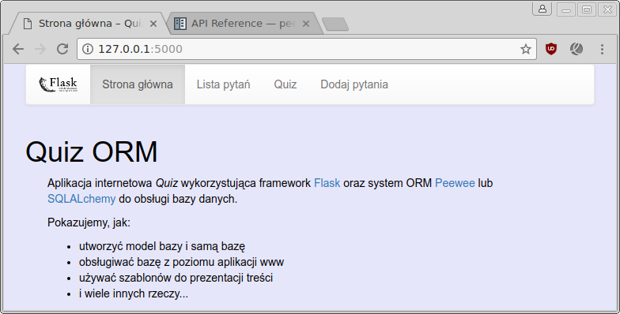
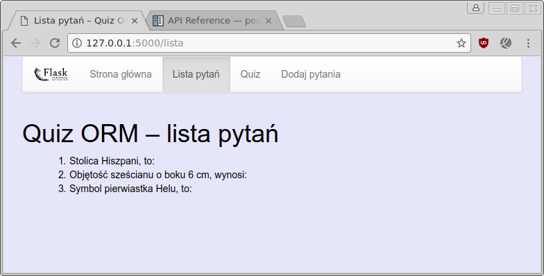
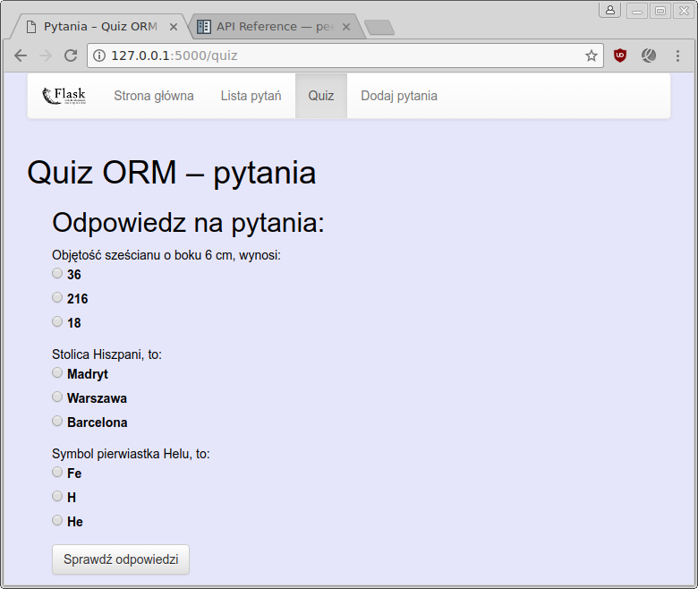
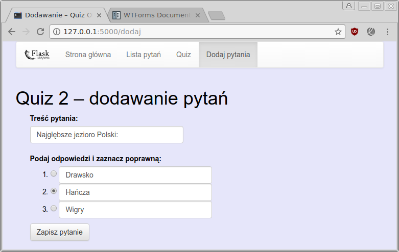
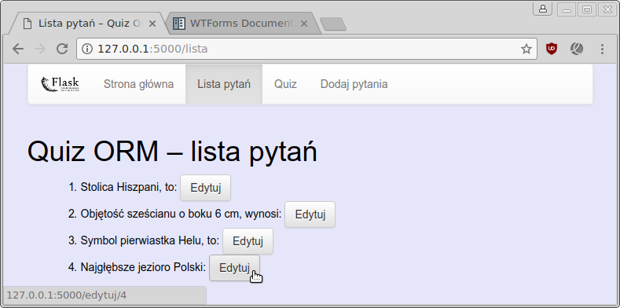
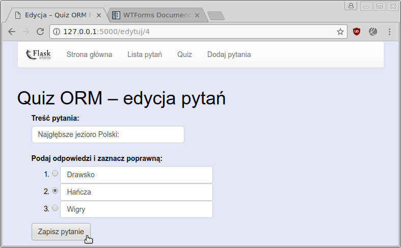
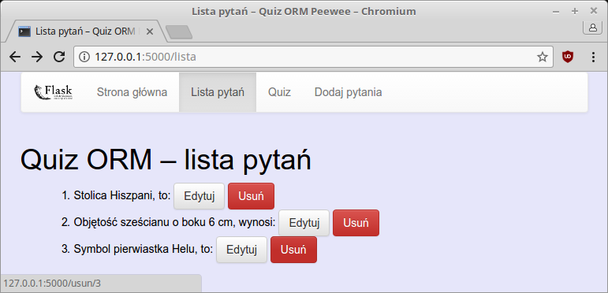
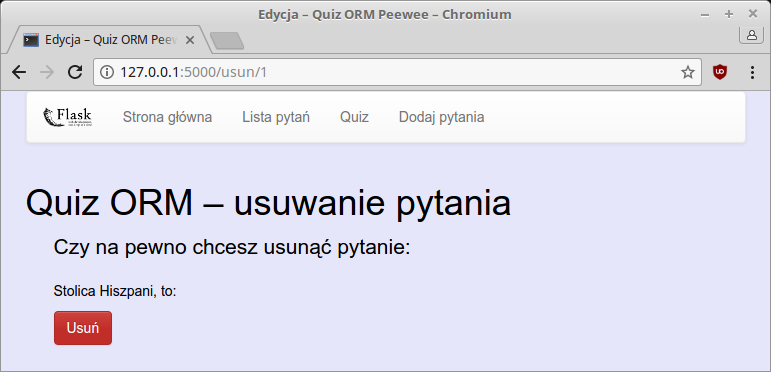

.. _quiz-orm:

Quiz ORM
#####################

Realizacja aplikacji internetowej Quiz w oparciu o :term:`framework` `Flask`_ 0.12.x
i bazę danych `SQLite`_ zarządzaną systemem ORM `Peewee`_ lub `SQLAlchemy`_.

.. _Flask: http://flask.pocoo.org
.. _SQLite: http://www.sqlite.org
.. _Peewee: http://peewee.readthedocs.org/en/latest
.. _SQLAlchemy: http://www.sqlalchemy.org

Zalecamy zapoznanie się z materiałami zawartymi w scenariuszach:

* :ref:`Podstawy Pythona <podstawy-python>`,
* :ref:`Bazy danych w Pythonie <bazy-python>`,
* :ref:`Quiz <quiz-app>`,
* :ref:`ToDo <todo-app>`.

Wykorzystywane biblioteki instalujemy przy użyciu instalatora ``pip``:

.. code-block:: bash

    ~$ sudo pip install peewee flask-wtf

.. note::

    W budowanym poniżej kodzie wykorzystamy ORM Peewee, na końcu omówimy
    różnice w przypadku użycia SQLAlchemy.

.. contents::
    :depth: 1
    :local:

Modularyzacja
=============

Scenariusze :ref:`Quiz <quiz-app>` i :ref:`ToDo <todo-app>` pokazują możliwość
umieszczenia całego kodu aplikacji obsługiwanej przez Flaska w jednym pliku.
Dla celów szkoleniowych to dobre rozwiązanie, ale w bardziej rozbudowanych projektach
wygodniej umieścić poszczególne części aplikacji w osobnych plikach.

Kod rozmieścimy więc następująco:

* ``app.py`` – konfiguracja aplikacji Flaska i połączeń z bazą,
* ``models.py`` – klasy opisujące tabele, pola i relacje w bazie,
* ``views.py`` – widoki, czyli funkcje, powiązane z adresami URL, obsługujące żądania użytkownika,
* ``forms.py`` – definicje formularza wykorzystywanego w aplikacji,
* ``main.py`` – główny plik naszej aplikacji wiążący wszystkie powyższe, odpowiada za utworzenie początkowej bazy,
* ``dane.py`` – moduł opcjonalny, odczytanie przykładowych danych z pliku :file:`pytania.csv`
  i dodanie ich do bazy.

Wszystkie pliki muszą znajdować się w katalogu aplikacji ``quiz-orm``,
który zawierać będzie również podkatalogi:

* ``templates`` – tu umieścimy szablony html,
* ``static`` – to miejsce dla arkuszy stylów, obrazki i/lub skryptów *js*.

Ściągamy przygotowane przez nas archiwum :download:`quiz-orm_skel.zip <quiz-orm-skel.zip>`
i rozpakowujemy w wybranym katalogu. Początkowy kod pozwoli uruchomić aplikację
i wyświetlić zawartość strony głównej. Aplikację uruchamiamy wydając
w katalogu :file:`quiz-orm` polecenie:

.. raw:: html

    
Terminal. Kod nr 

.. code-block:: bash

    ~/quiz-orm$ python3 main.py

.. figure:: img/quiz-orm_skel.png

Szablon podstawowy
==================

W omówionych do tej pory, wspomnianych wyżej, scenariuszach aplikacji internetowych
każdy szablon zawierał kompletny kod strony. W praktyce jednak duża część kodu HTML
powtarza się na każdej stronie w ramach danego serwisu. Tę wspólną część kodu
umieścimy w szablonie podstawowym :file:`templates/szkielet.html`:

.. raw:: html

    
Szablon <i>szkielet.html</i>. Kod nr 

.. highlight:: html
.. literalinclude:: quiz2_pw/templates/szkielet.html
    :linenos:
    :emphasize-lines: 9-18, 83-90

Szablon oparty jest na frameworku `Bootstrap <http://getbootstrap.com/>`_.
Odpowiednie linki do stylów CSS, pobieranych z systemu
`CDN <https://pl.wikipedia.org/wiki/Content_Delivery_Network>`_
zostały skopiowane ze strony
`Getting started <http://getbootstrap.com/getting-started/>`_
i wklejone w podświetlonych liniach. Do szablonu dołączono również wymaganą
przez Bootstrapa bibliotekę `jQuery <https://jquery.com/>`_.

* ``{{ url_for('static', filename='style.css') }}`` – funkcja ``url_for()``
  pozwala wygenerować ścieżkę do zasobów umieszczonych w podkatalogu :file:`static`;
* ``...`` – tagi sterujące, wymagają zamknięcia(!),
* ```` – tag pozwala definiować miejsca, w których
  szablony dziedziczące mogą wstawiać swój kod,
* ``{{ zmienna }}`` – tagi pozwalające wstawiać wartości zmiennych dostępnych
  domyślnie i przekazanych do szablonu,
* ``container``, ``row``, ``navbar`` itd. – klasy Bootstrapa tworzące podstawowy
  układ (ang. *layout*) strony,
* ``navigation_bar`` – lista na podstawie której generowane są pozycje menu,
* ``active_page`` – zmienna zawierająca identyfikator aktywnej strony,
* ``get_flashed_messages(with_categories=true)`` – funkcja zwracająca komunikaty
  dla użytkownika oznaczone kategoriami, wykorzystywanymi jako klasy
  CSS.

Dodatkowo szablon wykorzystuje zawarty w początkowym archiwum
plik :file:`static/style.css`.

**Szablon strony głównej** z pliku :file:`index.html` zmieniamy
następująco:

.. raw:: html

    
Szablon <i>index.html</i>. Kod nr 

.. highlight:: html
.. literalinclude:: quiz2_pw/templates/index.html
    :linenos:

* ```` – wskazanie dziedziczenia z szablonu podstawowego;
* `` treść `` – zastąpienie lub uzupełnienie treści
  bloków zdefiniowanych w szablonie podstawowym.

Po odświeżeniu strony powinniśmy zobaczyć w przeglądarce nowy wygląd strony:

Baza danych
============

Konfigurację bazy danych obsługiwanej przez wybrany system ORM umieścimy w pliku
:file:`app.py`. Zaczynamy od uzupełnienia ustawień w słowniku ``config`` i
utworzenia obiektu bazy danych:

.. raw:: html

    
Peewee <i>app.py</i>. Kod nr 

.. highlight:: python
.. literalinclude:: quiz2_pw/app.py
    :linenos:

* ``before_request()``, ``after_request()`` – funkcje wykorzystywane do otwierania
  i zamykania połączenia z bazą SQLite przed żądaniem i po żądaniu (ang. *request*),
* ``g`` – specjalny obiekt Flaska do przechowywania danych kontekstowych aplikacji.

Modele
======

Modele pozwalają opisać strukturę naszej bazy danych w postaci definicji klas
i ich właściwości. Na podstawie tych definicji system ORM utworzy odpowiednie
tabele i kolumny. Wykorzystamy tabelę ``Pytanie``, zawierającą treść pytania
i poprawną odpowiedź, oraz tabelę ``Odpowiedź``, która przechowywać będzie
wszystkie możliwe odpowiedzi. Relację *jeden-do-wielu* między tabelami
tworzyć będzie pole ``pnr``, czyli klucz obcy,
przechowujący identyfikator pytania.

.. raw:: html

    
Peewee <i>models.py</i>. Kod nr 

.. literalinclude:: quiz2_pw/models.py
    :linenos:

* ``BaseModel`` – klasa określająca obiekt bazy,
* ``unique=True`` – właściwość wymagająca niepowtarzalnej zawartości pola,
* ``ForeignKeyField()`` – definicja klucza obcego, tworzenie relacji,
* ``on_delete = 'CASCADE'`` – usuwanie rekordów z powiązanych tabel.

Identyfikatory pytań i odpowiedzi, czyli pola ``id`` w każdej tabeli
tworzone są automatycznie.

Metody ``__str__(self)`` służą "autoprezentacji" obiektów utworzonych na podstawie
danego modelu, są wykorzystywane np. podczas używania funkcji ``print()``.

Dane początkowe
===============

Moduł ``dane.py``:

.. raw:: html

    
Peewee <i>dane.py</i>. Kod nr 

.. highlight:: python
.. literalinclude:: quiz2_pw/dane.py
    :linenos:

* ``pobierz_dane()`` – funkcja wykorzystuje moduł ``csv``, który ułatwia odczytywanie
  danych zapisanych w tym formacie, zobacz
  `format CSV <https://pl.wikipedia.org/wiki/CSV_(format_pliku)>`_, zwraca tuplę
  3-elementowych tupli (:-));
* ``dodaj_pytania()`` – funkcja dodaje przykładowe pytania i odpowiedzi wykorzystując
  składnię wykorzystywanego systemu ORM;
* ``for pytanie,odpowiedzi,odpok in dane:`` – pętla rozpakowuje pytanie,
  listę odpowiedzi i odpowiedź poprawną z przekazanych tupli;
* ``p = Pytanie(pytanie=pytanie, odpok=odpok)`` – utworzenie obiektu pytania;
* ``odp = Odpowiedz(pnr=p.id, odpowiedz=o.strip())`` – utworzenie obiektu odpowiedzi;
* ``save()`` – metoda zapisująca utworzony/zmieniony obiekt w bazie danych.

Zawartość dołączonego do archiwum pliku :file:`pytania.csv`:

.. raw:: html

    
Plik <i>pytania.csv</i>. Kod nr 

.. literalinclude:: quiz2_pw/pytania.csv
    :linenos:

Kod uruchamiający utworzenie bazy i dodanie do niej przykładowych danych umieścimy
w pliku :file:`main.py`:

.. raw:: html

    
Peewee <i>main.py</i>. Kod nr 

.. highlight:: python
.. literalinclude:: quiz2_pw/main.py
    :linenos:
    :lineno-start: 4
    :lines: 4-
    :emphasize-lines: 8-10

[todo]

Odczyt
=======

Skrót :term:`CRUD` (*Create* (tworzenie), *Read* (odczyt), *Update* (aktualizacja), *Delete* (usuwanie))
oznacza podstawowe operacje wykonywane na bazie danych.

Zaczniemy od widoku ``lista()`` pobierającego wszystkie pytania i zwracającego
szablon z ich listą:

.. raw:: html

    
Peewee <i>views.py</i>. Kod nr 

.. highlight:: python
.. literalinclude:: quiz2_pw/views.py
    :linenos:
    :lines: 4-24
    :emphasize-lines: 13-21

* ``pytania = Pytanie().select()`` – pobranie z bazy wszystkich pytań.
* ``redirect(url_for('index'))`` – przekierowanie użytkownika na adres obsługiwany
  przez podany jako argument widok.

Kod szablonu :file:`lista.html`:

.. raw:: html

    
Szablon <i>lista.html</i>. Kod nr 

.. highlight:: html
.. literalinclude:: quiz2_pw/templates/lista01.html
    :linenos:
    :lines: 1-

Po uzupełnieniu kodu w przeglądarce powinniśmy zobaczyć listę pytań:

Quiz
====

Widok wyświetlający pytania i odpowiedzi w formie quizu
i sprawdzający udzielone przez użytkownika odpowiedzi to również przykład operacji
odczytu danych danych z bazy. Dodajemy funkcję ``quiz()``:

.. raw:: html

    
Peewee <i>views.py</i>. Kod nr 

.. highlight:: python
.. literalinclude:: quiz2_pw/views.py
    :linenos:
    :lines: 27-48
    :lineno-start: 27

* ``@app.route('/quiz', methods=['GET', 'POST'])`` – określenie obsługiwanego adresu URL
  oraz akcpetowanych metod żądań,

* ``request.method`` – wykorzystana metoda: GET lub POST,
* ``request.form`` – formularz przesłany w żądaniu POST,
* ``for pid, odp in request.form.items():`` – pętla odczytująca przesłane identyfikatory
  pytań i udzielone odpowiedzi.

Zapytania ORM:

* ``Pytanie().select().annotate(Odpowiedz)`` – pobranie wszystkich pytań razem
  z odpowiedziami,
* ``Pytanie.select(Pytanie.odpok).where(Pytanie.id == int(pid)).scalar()`` –
  pobranie poprawnej odpowiedzi dla pytania o podanym identyfikatorze,
  metoda ``scalar()`` zwraca pojedynczą wartość.

Szablon ``quiz.html`` – oparty na omówionym wcześniej wzorcu – wyświetla pytania
i możliwe odpowiedzi jako pola opcji typu radio button:

.. raw:: html

    
Szablon <i>quiz.html</i>. Kod nr 

.. highlight:: html
.. literalinclude:: quiz2_pw/templates/quiz.html
    :linenos:

Dodawanie
=========

Dodawanie nowych pytań i odpowiedzi wymaga formularza. Gdybyśmy stworzyli go
"ręcznie" w szablonie html, musielibyśmy napisać sporo kodu sprawdzającego
poprawność przesyłanych danych. Dlatego skorzystamy z biblioteki
`Flask-wtf <https://flask-wtf.readthedocs.io/en/stable/>`_, pozwalającej
wykorzystać formularze `WTForms <https://wtforms.readthedocs.io/en/latest/>`_.

Formularz definiujemy w pliku :file:`forms.py`:

.. raw:: html

    
Peewee <i>forms.py</i>. Kod nr 

.. highlight:: python
.. literalinclude:: quiz2_pw/forms.py
    :linenos:
    :lines: 1-

* ``StringField()`` – definicja pola tekstowego,
* ``FieldList(StringField())`` – definicja trzech pól tekstowych,
* ``Required(message=blad1)`` – pole wymagane,
* ``RadioField()`` – pola jednokrotnego wyboru, opcje definiuje się
  w postaci listy ``choices`` zawierającej pary wartość - etykieta,
* ``HiddenField()`` – pole ukryte.

Funkcja pomocnicza i widok obsługujący dodawanie:

.. raw:: html

    
Peewee <i>views.py</i>. Kod nr 

.. highlight:: python
.. literalinclude:: quiz2_pw/views.py
    :linenos:
    :lines: 51-78
    :lineno-start: 51

* ``flash_errors()`` – zadaniem funkcji jest przygotowanie komunikatów dla użytkownika
  zawierających ewentualne błędy walidacji formularza dostępne w słowniku
  ``form.errors``,
* ``form = DodajForm()`` – utworzenie pustego formularza,
* ``form.validate_on_submit()`` – funkcja zwraca prawdę, jeżeli żądanie jest typu POST
  i formularz zawiera poprawne dane, czyli przechodzi procedurę walidacji,
  funkcja automatycznie wypełnia obiekt formularza przesłanymi danymi,
* ``form.pole.data`` – odczyt wartości danego pola formularza,
* ``odpok=odp[int(form.odpok.data)]`` – jako poprawną odpowiedź zapisujemy tekst
  odpowiedzi.

Do szablonu przekazujemy formularz i osobno listę opcji odpowiedzi.
Kod szablonu :file:`dodaj.html`:

.. raw:: html

    
Szablon <i>dodaj.html</i>. Kod nr 

.. highlight:: html
.. literalinclude:: quiz2_pw/templates/dodaj.html
    :linenos:

* ```` – instrukcja włączania kodu z innego pliku.

Kod renderujący formularz jest taki sam podczas dodawania, jak i edycji danych.
Dlatego umieścimy go w osobnym pliku:

.. raw:: html

    
Szablon <i>pytanie_form.html</i>. Kod nr 

.. highlight:: html
.. literalinclude:: quiz2_pw/templates/pytanie_form.html
    :linenos:

Formularz renderujemy "ręcznie", aby uzyskać odpowiedni układ pól.
Po nazwie pola można opcjonalnie podawać klasy CSS, które mają
zostać użyte w kodzie HTML, np. ``form.pytanie(class="form-control")``.

Efekt prezentuje się następująco:

Edycja
======

Zaczniemy od dodania w pliku :file:`views.py` funkcji pomocniczych i widoku ``edytuj()``:

.. raw:: html

    
Peewee <i>views.py</i>. Kod nr 

.. highlight:: python
.. literalinclude:: quiz2_pw/views.py
    :linenos:
    :lines: 81-120
    :lineno-start: 81

Żądanie wyświetlenia aktualizowanego pytania (GET):

* ``'/edytuj/<int:pid>'`` – definicja adresu URL mówiąca, że oczekujemy wywołań
  w postaci */edytuj/1*, przy czym końcowa liczba to identyfikator pytania,
* ``p = get_or_404(pid)`` – próbujemy pobrać z bazy dane pytania o podanym identyfikatorze,
  funkcja pomocnicza ``get_or_404()`` zwróci obiekt, a jeżeli nie będzie to możliwe,
  wywoła błąd ``abort(404)`` – co oznacza, że żądanego zasobu nie odnaleziono,
* ``page_not_found(e)`` – funkcja, którą za pomocą dekoratora rejestrujemy do obsługi
  błędów HTTP 404, zwraca szablon :file:`404.html`,
* ``for i in range(3)`` – pętla, w której ustalamy numer poprawnej odpowiedzi (``p.odpok=i``),
  który przekażemy do formularza, aby zaznaczony został właściwy przycisk radio,
* ``form = DodajForm(obj=p)`` – przed przekazaniem formularza do szablonu
  wypełniamy go danymi używając parametru ``obj``.

Żądanie zapisania danych z formularza (POST):

* ``p.pytanie = form.pytanie.data`` – aktualizujemy dane pytania
  po sprawdzeniu ich poprawności;
* ``for i, o in enumerate(p.odpowiedzi)`` – pętla, w której aktualizujemy
  kolejne odpowiedzi: ``o.odpowiedz = odp[i]``.

Szablon :file:`404.html` może wyglądać np. tak:

.. raw:: html

    
Szablon <i>404.html</i>. Kod nr 

.. highlight:: html
.. literalinclude:: quiz2_pw/templates/404.html
    :linenos:
    :lines: 1-

Szablon edycji jest bardzo podobny do szablonu dodawania, ponieważ wykorzystujemy
ten sam formularz. Tworzymy więc plik :file:`edytuj.html`:

.. raw:: html

    
Szablon <i>edytuj.html</i>. Kod nr 

.. highlight:: html
.. literalinclude:: quiz2_pw/templates/edytuj.html
    :linenos:
    :lines: 1-

Linki umożliwiające edycję pytań wygenerujemy w na liście pytań. W pliku
:file:`lista.html` po kodzie ``{{ pytanie }}`` wstawiamy:

.. raw:: html

    
Szablon <i>lista.html</i>. Kod nr 

.. highlight:: html
.. literalinclude:: quiz2_pw/templates/lista.html
    :linenos:
    :lines: 12-13
    :lineno-start: 12
    :emphasize-lines: 2

* ``{{ url_for('edytuj', pid=p.id ) }}`` – funkcja generuje adres dla podanego
  widoku dodając na końcu identyfikator pytania.

Usuwanie
========

Pozostaje umożliwienie usuwania pytań i odpowiedzi. W pliku :file:`views.py`
dodajemy widok ``usun()``:

.. raw:: html

    
Peewee <i>views.py</i>. Kod nr 

.. highlight:: python
.. literalinclude:: quiz2_pw/views.py
    :linenos:
    :lines: 123-
    :lineno-start: 123

* ``'/usun/<int:pid>'`` – podobnie jak w przypadku edycji widok obsłuży adres URL
  zawierający identyfikator pytania, który wykorzystujemy do pobrania obiektu
  z bazy danych,
* ``p.delete_instance(recursive=True)`` – obsługując żądanie typu POST,
  usuwamy pytania, a także wszystkie skojarzone z nim odpowiedzi
  (opcja ``recursive``).

W przypadku żądania typu GET zwracamy formularz potwierdzenia usunięcia
:file:`pytanie_usun.html`:

.. raw:: html

    
Szablon <i>pytanie_usun.html</i>. Kod nr 

.. highlight:: html
.. literalinclude:: quiz2_pw/templates/pytanie_usun.html
    :linenos:

* ``action="{{ url_for('usun', pid=pytanie.id) }}`` – generujemy adres, pod który
  wysłane zostanie potwierdzenie.

Na koniec należy wstawić link umożliwiający usunięcie pytania do szablonu
:file:`lista.html`:

.. raw:: html

    
Szablon <i>lista.html</i>. Kod nr 

.. highlight:: html
.. literalinclude:: quiz2_pw/templates/lista.html
    :linenos:
    :lines: 13-14
    :lineno-start: 13
    :emphasize-lines: 2

SQLAlchemy
==========

Instalacja wymaganych modułów:

.. code-block:: bash

    ~$ sudo pip install  sqlalchemy flask-sqlalchemy flask-wtf

Obsługa bazy nie wymaga w przypadku SQLAlchemy funkcji nawiązujących
i kończących połączenia z bazą. Wszystko odbywa się w sesji tworzonej
automatycznie.

.. raw:: html

    
SQLAlchemy <i>app.py</i>. Kod nr 

.. literalinclude:: quiz2_sa/app.py
    :linenos:

* ``SQLALCHEMY_TRACK_MODIFICATIONS=False`` – wyłączenie nieużywanego przez nas
  śledzenia modyfikacji obiektów i emitowania sygnałów.

W pliku :file:`dane.py` należy zaimportować obiekt umożliwiający zarządzanie
bazą danych, następnie modyfikujemy funkcję ``dodaj_pytanie()``:

.. raw:: html

    
SQLAlchemy <i>dane.py</i>. Kod nr 

.. code-block:: python

    from app import baza

.. literalinclude:: quiz2_sa/dane.py
    :linenos:
    :lines: 24-
    :lineno-start: 24
    :emphasize-lines: 5-6, 9-10

W operacjach dodawania, również w funkcji ``dodaj()`` (zob. niżej)
korzystamy z metod obiektu sesji:

* ``session.add()`` – dodaje obiekt,
* ``session.commit()`` – zatwierdza zmiany w bazie.

W pliku :file:`main.py` zmieniamy tylko jedną linią:

.. raw:: html

    
SQLAlchemy <i>main.py</i>. Kod nr 

.. literalinclude:: quiz2_sa/main.py
    :linenos:
    :lineno-start: 11
    :lines: 11-12
    :emphasize-lines: 2

* ``create_all()`` – funkcja tworzy wszystkie tabele na podstawie zadeklarowanych
  modeli:

.. raw:: html

    
SQLAlchemy <i>models.py</i>. Kod nr 

.. literalinclude:: quiz2_sa/models.py
    :linenos:

* ``from app import baza`` – jedyny import, którego potrzebujemy, to obiekt
  ``baza`` udostępniający wszystkie klasy i metody SQLAlchemy,
* ``primary_key=True`` – definicja klucza podstawowego, czyli identyfikatora
  pytania i odpowiedzi,
* ``ForeignKey()`` – określenie klucza obcego, czyli relacji,
* ``relationship()`` – relacja zwrotna, właściwość ``Pytanie.odpowiedzi``,
* ``backref=baza.backref('pytanie')`` – relacja zwrotna, właściwość ``Odpowiedz.pytanie``,
* ``cascade="all, delete, delete-orphan"`` – usuwanie rekordów z powiązanych tabel.

Zmiany w pliku :file:`views.py` dotyczą głównie innej składni zapytań do bazy.
Na początku drobne zmiany w importach: usuwamy obiekt ``abort`` i dodajemy
import obiektu ``baza``:

.. raw:: html

    
SQLAlchemy <i>views.py</i>. Kod nr 

.. highlight:: python
.. literalinclude:: quiz2_sa/views.py
    :linenos:
    :lines: 4-5
    :lineno-start: 4

**Funkcja** ``lista()`` – zmieniamy instrukcje odczytujące pytania z bazy:

.. literalinclude:: quiz2_sa/views.py
    :linenos:
    :lines: 18-20
    :lineno-start: 18
    :emphasize-lines: 2-3

* ``pytania = Pytanie.query.all()`` – pobranie z bazy wszystkich pytań
  w formie listy.

**Funkcja** ``quiz()`` – zmieniamy zapytanie odczytujące poprawną odpowiedź:

.. literalinclude:: quiz2_sa/views.py
    :linenos:
    :lines: 34-35
    :lineno-start: 34

– a także zapytanie odczytujące pytania oraz odpowiedzi z bazy:

.. literalinclude:: quiz2_sa/views.py
    :linenos:
    :lines: 42-43
    :lineno-start: 42
    :emphasize-lines: 2

* ``.join()`` – metoda pozwala odczytać odpowiedzi powiązane relacją z pytaniem.

**Funkcja** ``dodaj()`` – zmieniamy polecenia dodające obiekty do bazy:

.. literalinclude:: quiz2_sa/views.py
    :linenos:
    :lines: 68-84
    :lineno-start: 68
    :emphasize-lines: 2-3, 6-7

**Funkcje** ``edytuj()`` i ``usun()`` – zmieniamy kod pobierający obiekt o podanym
identyfikatorze z bazy:

.. literalinclude:: quiz2_sa/views.py
    :linenos:
    :lines: 92
    :lineno-start: 92

**Funkcja** ``get_or_404()`` – jest niepotrzebna i należy ją usunąć. Zamiast niej
używamy metody dostępnej w SQLAlchemy.

**Funkcja** ``edytuj()`` – upraszczamy kod aktualizujący obiekty w bazie, :

.. literalinclude:: quiz2_sa/views.py
    :linenos:
    :lines: 98-101
    :lineno-start: 98
    :emphasize-lines: 4

**Funkcja** ``usun()`` – kod usuwający obiekty z bazy przyjmuje postać:

.. literalinclude:: quiz2_sa/views.py
    :linenos:
    :lines: 120-122
    :lineno-start: 120
    :emphasize-lines: 2-3

Źródła
======

* :download:`quiz-orm-peewee.zip <quiz-orm-peewee.zip>`
* :download:`quiz-orm-sqlalchemy.zip <quiz-orm-sqlalchemy.zip>`
