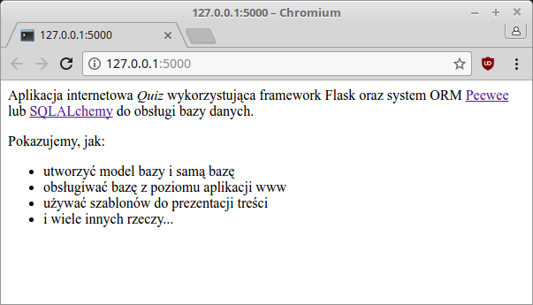

.. _quiz-orm:

Quiz ORM
#####################

Realizacja aplikacji internetowej Quiz w oparciu o :term:`framework` `Flask`_ 0.12.x
i bazę danych `SQLite`_ zarządzaną systemem ORM `Peewee`_ lub `SQLAlchemy`_.

.. _Flask: http://flask.pocoo.org
.. _SQLite: http://www.sqlite.org
.. _Peewee: http://peewee.readthedocs.org/en/latest
.. _SQLAlchemy: http://www.sqlalchemy.org

Zalecamy zapoznanie się z materiałami zawartymi w scenariuszach:
* :ref:`Podstawy Pythona <podstawy-python>`,
* :ref:`Bazy danych w Pythonie <bazy-python>`,
* :ref:`Quiz <quiz-app>`,
* :ref:`ToDo <todo-app>`.

Wykorzystywane biblioteki instalujemy przy użyciu instalatora ``pip``:

.. highlight:: bash
.. code-block:: bash

    ~$ sudo pip install peewee sqlalchemy flask-sqlalchemy flask-wtf

.. contents::
    :depth: 1
    :local:

Modularyzacja
=============

Scenariusze :ref:`Quiz <quiz-app>` i :ref:`ToDo <todo-app>` pokazują możliwość
umieszczenia całego kodu aplikacji obsługiwanej przez Flaska w jednym pliku.
Dla celów szkoleniowych to dobre rozwiązanie, ale w bardziej rozbudowanych projektach
wygodniej umieścić poszczególne części aplikacji w osobnych plikach.

Kod rozmieścimy więc następująco:

    - ``app.py`` – konfiguracja aplikacji Flaska i połączeń z bazą,
    - ``models.py`` – klasy opisujące tabele, pola i relacje w bazie,
    - ``views.py`` – widoki, czyli funkcje, powiązane z adresami URL, obsługujące żądania użytkownika,
    - ``forms.py`` – definicje formularza wykorzystywanego w aplikacji,
    - ``main.py`` – główny plik naszej aplikacji wiążący wszystkie powyższe, odpowiada za utworzenie początkowej bazy,
    - ``dane.py`` – moduł opcjonalny, odczytanie przykładowych danych z pliku :file:`pytania.csv`
      i dodanie ich do bazy.

Wszystkie pliki muszą znajdować się w katalogu aplikacji ``quiz-orm``,
który zawierać będzie również podkatalogi:

* ``templates`` – tu umieścimy szablony html,
* ``static`` – to miejsce dla arkuszy stylów, obrazki i/lub skryptów *js*.

Ściągamy przygotowane przez nas archiwum :download:`quiz-orm_skel.zip <quiz-orm_skel.zip>`
i rozpakowujemy w wybranym katalogu. Początkowy kod pozwoli uruchomić aplikację
i wyświetlić zawartość strony głównej. Aplikację uruchamiamy wydając
w katalogu :file:`quiz-orm` polecenie:

.. raw:: html

    
Terminal. Kod nr 

.. code-block:: bash

    ~/quiz-orm$ python3 main.py

.. figure:: img/quiz-orm01.png

Szablon podstawowy
==================

W omówionych do tej pory, wspomnianych wyżej, scenariuszach aplikacji internetowych
każdy szablon zawierał kompletny kod strony. W praktyce jednak duża część kodu HTML
powtarza się na każdej stronie w ramach danego serwisu. Tę wspólną część kodu
umieścimy w szablonie podstawowym :file:`templates/szkielet.html`:

.. raw:: html

    
Szablon <i>szkielet.html</i>. Kod nr 

.. highlight:: html
.. literalinclude:: quiz2_pw/templates/szkielet.html
    :linenos:
    :emphasize-lines: 10, 12, 74, 76

Szablon oparty jest na frameworku `Bootstrap <http://getbootstrap.com/>`_.
Odpowiednie linki do stylów CSS, pobieranych z systemu
`CDN <https://pl.wikipedia.org/wiki/Content_Delivery_Network>`_ zostały
skopiowane ze strony `Getting started <http://getbootstrap.com/getting-started/>`_
i wklejone w podświetlonych liniach. Do szablonu dołączono również wymaganą
przez Bootstrapa bibliotekę `jQuery <https://jquery.com/>`_.

* ``{{ url_for('static', filename='style.css') }}`` – funkcja ``url_for()``
  pozwala wygenerować scieżkę do zasobów umieszczonych w podkatalogu :file:`static`;
* ``...`` – tagi sterujące, wymagają zamknięcia(!);
* ```` – tag pozwala definiować miejsca, w których
  szablony dziedziczące mogą wstawiać swój kod;
* ``{{ zmienna }}`` – tagi pozwlające wstawiać wartości zmiennych dostępnych
  domyślnie i przekazanych do szablonu;
* ``container``, ``row``, ``navbar`` itd. – klasy Bootstrapa tworzące podstawowy
  układ (ang. *layout*) strony;
* ``navigation_bar`` – lista na podstawie której generowane są pozycje menu;
* ``active_page`` – zmienna zawierająca identyfikator aktywnej strony;
* ``get_flashed_messages(with_categories=true)`` – funkcja zwracająca komunikaty
  dla użytkownika oznaczone kategoriami, wykorzystywanymi jako klasy
  CSS.

Dodatkowo szablon wykorzystuje zawarty w początkowym archwium
plik :file:`static/style.css`:

.. raw:: html

    
Arkusz stylów <i>style.css</i>. Kod nr 

.. highlight:: html
.. literalinclude:: quiz2_pw/static/style.css
    :linenos:

**Szablon strony głównej** zawarty w pliku :file:`index.html` zmieniamy
następująco:

.. raw:: html

    
Szablon <i>index.html</i>. Kod nr 

.. highlight:: html
.. literalinclude:: quiz2_pw/templates/index.html
    :linenos:

* ```` – wskazanie dzidziczenia z szablonu podstawowego;
* `` treść `` – zastąpienie lub uzupełnienie treści
  bloków zdefiniowanych w szablonie podstawowym.

Po odświeżeniu strony powinniśmy zobaczyć w przeglądarce nowy wygląd strony:

.. figure:: img/quiz-orm03.png

Baza danych
============

Konfigurację bazy danych obsługiwanej przez wybrany system ORM umieścimy w pliku
:file:`app.py`. Zaczynamy od uzupełnienia ustawień w słowniku ``config`` i
utworzenia obiektu bazy danych:

.. raw:: html

    
Peewee *app.py*. Kod nr 

.. highlight:: python
.. literalinclude:: quiz2_pw/app.py
    :linenos:

* ``before_request()``, ``after_request()`` – funkcje wykorzystywane do otwierania
  i zamykania połączenia z bazą SQLite przed żądaniem i po żądaniu (ang. *request*),
* ``g`` – specjalny obiekt Flaska do przechowywania danych kontekstowych aplikacji.

.. raw:: html

    
SQLAlchemy *app.py*. Kod nr 

.. literalinclude:: quiz2_sa/app.py
    :linenos:

* ``SQLALCHEMY_TRACK_MODIFICATIONS=False`` – wyłączenie niużywanego przez nas
  śledzenia modyfikacji obiektów i emitowania sygnałów.

Modele
======

Modele pozwalają opisać strukturę naszej bazy danych w postaci definicji klas
i ich właściwości. Na podstawie tych definicji system ORM utworzy odpowiednie
tabele i kolumny. Wykorzystamy tabelę ``Pytanie``, zawierającą treść pytania
i poprawną odpowiedź, oraz tabelę ``Odpowiedź``, która przechowywać będzie
wszystkie możliwe odpowiedzi. Relację *jeden-do-wielu* między tabelami
tworzyć będzie pole ``pnr``, czyli klucz obcy,
przechowujący identyfikator pytania.

.. raw:: html

    
Peewee *models.py*. Kod nr 

.. literalinclude:: quiz2_pw/models.py
    :linenos:

* ``BaseModel`` – klasa określająca obiekt bazy,
* ``unique=True`` – właściwość wymagająca niepowtarzalnej zawartości pola,
* ``ForeignKeyField()`` – definicja klucza obcego, tworzenie relacji,
* ``on_delete = 'CASCADE'`` – usuwanie rekordów z powiązanych tabel.

Identyfikatory pytań i odpowiedzi, czyli pola ``id`` w każdej tabeli
tworzone są automatycznie.

.. raw:: html

    
SQLAlchemy *models.py*. Kod nr 

.. literalinclude:: quiz2_sa/models.py
    :linenos:

* ``primary_key=True`` – definicja klucza podstawowego, czyli identyfikatora
  pytania i odpowiedzi,
* ``ForeignKey()`` – określenie klucza obcego, czyli relacji,
* ``relationship()`` – relacja zwrotna, właściwość ``Pytanie.odpowiedzi``,
* ``backref=baza.backref('pytanie')`` – relacja zwrotna, właściwość ``Odpowiedz.pytanie``,
* ``cascade="all, delete, delete-orphan"`` – usuwanie rekordów z powiązanych tabel.

Dzięki rozszerzeniu ``flask.ext.sqlalchemy`` jedyny import, którego potrzebujemy,
to obiekt ``baza`` udostępniający wszystkie klasy i metody SQLAlchemy.

Metody ``__str__(self)`` służą "autoprezentacji" obiektów utworzonych na podstawie
danego modelu, są wykorzystywane np. podczas używania funkcji ``print()``.

Dane początkowe
===============

Moduł ``dane.py``:

.. raw:: html

    
Peewee <i>dane.py</i>. Kod nr 

.. highlight:: python
.. literalinclude:: quiz2_pw/dane.py
    :linenos:

* ``pobierz_dane()`` – funkcja wykorzystuje moduł ``csv``, który ułatwia odczytywanie
  danych zapisanych w tym formacie, zobacz
  `format CSV <https://pl.wikipedia.org/wiki/CSV_(format_pliku)>`_, zwraca tuplę
  3-elementowych tupli (:-));
* ``dodaj_pytania()`` – funkcja dodaje przykładowe pytania i odpowiedzi wykorzystując
  składnię wykorzytywanego systemu ORM;
* ``for pytanie,odpowiedzi,odpok in dane:`` – pętla rozpakowuje pytanie,
  listę odpowiedzi i odpowiedź poprawną z przekazanych tupli;
* ``p = Pytanie(pytanie=pytanie, odpok=odpok)`` – utworzenie obiektu pytania;
* ``odp = Odpowiedz(pnr=p.id, odpowiedz=o.strip())`` – utworzenie obiektu odpowiedzi;

*Peewee* do zapisu utworzonego/zmienionego obiektu wymaga wywołania tylko jednej metody: ``save()``.
W *SQLAlchemy* najpierw zapisujemy obiekt w sesji, a następnie w bazie, czyli:
``session.add(obj)`` i ``session.commit()``. Kod funkcji ``dodaj_pytanie()`` w SQLAlchemy:

.. raw:: html

    
SQLAlchemy <i>dane.py</i>. Kod nr 

.. highlight:: python
.. literalinclude:: quiz2_sa/dane.py
    :linenos:
    :lineno-start: 24
    :lines: 24-
    :emphasize-lines: 5-6, 9-10

Zawartość dołączonego do archiwum pliku :file:`pytania.csv`:

.. raw:: html

    
Plik <i>pytania.csv</i>. Kod nr 

.. literalinclude:: quiz2_pw/pytania.csv
    :linenos:

Kod uruchamiający utworzenie bazy i dodanie do niej przykładowych danych umieścimy
w pliku :file:`main.py`:

.. raw:: html

    
Peewee <i>main.py</i>. Kod nr 

.. literalinclude:: quiz2_pw/main.py
    :linenos:
    :lineno-start: 10
    :lines: 10-
    :emphasize-lines: 2-4

Kod *SQLAlchemy* różni się tylko jedną linią:

.. raw:: html

    
SQLAlchemy <i>main.py</i>. Kod nr 

.. literalinclude:: quiz2_sa/main.py
    :linenos:
    :lineno-start: 10
    :lines: 10-
    :emphasize-lines: 2-4

Odczyt
=======

Skrót :term:`CRUD` (*Create* (tworzenie), *Read* (odczyt), *Update* (aktualizacja), *Delete* (usuwanie))
oznacza podstawowe operacje wykonywane na bazie danych.

Zaczniemy od widoku ``lista()`` pobierającego wszystkie pytania i zwracającego
szablon z ich listą:

.. raw:: html

    
Peewee <i>views.py</i>. Kod nr 

.. highlight:: python
.. literalinclude:: quiz2_pw/views.py
    :linenos:
    :lines: 4-24
    :emphasize-lines: 13-21

* ``pytania = Pytanie().select()`` – pobranie z bazy wszystkich pytań.
* ``redirect(url_for('index'))`` – przekierowanie użytkownika na adres obsługiwany
  przez podany jako argument widok.

.. raw:: html

    
SQLAlchemy <i>views.py</i>. Kod nr 

.. highlight:: python
.. literalinclude:: quiz2_sa/views.py
    :linenos:
    :lines: 4-25
    :emphasize-lines: 14-22

Zapytania:

* ``pytania = Pytanie.query`` – pobranie z bazy wszystkich pytań,
* ``pytania.all()`` – metoda zwraca rezultat zapytania w formie listy.

Kod szablonu :file:`lista.html`:

.. raw:: html

    
Szablon <i>lista.html</i>. Kod nr 

.. highlight:: html
.. literalinclude:: quiz2_pw/templates/lista01.html
    :linenos:
    :lines: 1-

Po uzupełnieniu kodu w przeglądarce powinniśmy zobaczyć listę pytań:

.. figure:: img/quiz-orm_lista.png

Quiz
====

Widok wyświetlający pytania i odpowiedzi w formie quizu
i sprawdzający udzielone przez użytkownika odpowiedzi to również przykład operacji
odczytu danych danych z bazy. Dodajemy funkcję ``quiz()``:

.. raw:: html

    
Peewee <i>views.py</i>. Kod nr 

.. highlight:: python
.. literalinclude:: quiz2_pw/views.py
    :linenos:
    :lines: 28-48
    :lineno-start: 28

* ``@app.route('/quiz', methods=['GET', 'POST'])`` – określenie obsługiwanego adresu URL
  oraz akcpetowanych metod żądań;
* ``request`` – obiekt zawierający treści żądania, m. in.:
    - ``method`` – wykorzystana metoda: GET lub POST,
    - ``form`` – formularz przesłany w żądaniu POST;
* ``for pid, odp in request.form.items():`` – pętla odczytująca przesłane identyfikatory
  pytań i udzielone odpowiedzi.

Zapytania ORM:

* ``Pytanie().select().annotate(Odpowiedz)`` – pobranie wszystkich pytań razem
  z odpowiedziami,
* ``Pytanie.select(Pytanie.odpok).where(Pytanie.id == int(pid)).scalar()`` –
  pobranie poprawnej odpowiedzi dla pytania o podanym identyfikatorze,
  metoda ``scalar()`` zwraca pojedynczą wartość.

Używając SQLAlchemy należy użyć nieco innej składni zapytań:

* ``Pytanie.query.join(Odpowiedz)`` – pobranie wszystkich pytań razem
  z odpowiedziami,
* ``baza.session.query(Pytanie.odpok).filter(Pytanie.id == int(pid)).scalar()`` –
  pobranie poprawnej odpowiedzi dla pytania o podanym identyfikatorze.

Szablon ``quiz.html`` – oparty na omówionym wcześniej wzorcu – wyświetla pytania
i możliwe odpowiedzi jako pola opcji typu radio button:

.. raw:: html

    
Szablon <i>quiz.html</i>. Kod nr 

.. highlight:: html
.. literalinclude:: quiz2_pw/templates/quiz.html
    :linenos:

.. figure:: img/quiz-orm_quiz.png

Dodawanie
=========

Dodawanie nowych pytań i odpowiedzi wymaga formularza. Gdybyśmy stworzyli go
"ręcznie" w szablonie html, musielibyśmy napisać sporo kodu sprawdzającego
poprawność przesyłanych danych. Dlatego skorzystamy z biblioteki
`Flask-wtf <https://flask-wtf.readthedocs.io/en/stable/>`_, pozwalającej
wykorzystać formularze `WTForms <https://wtforms.readthedocs.io/en/latest/>`_.

Formularz definiujemy w pliku :file:`forms.py`:

.. raw:: html

    
Peewee <i>forms.py</i>. Kod nr 

.. highlight:: python
.. literalinclude:: quiz2_pw/forms.py
    :linenos:
    :lines: 1-

* ``StringField()`` – definicja pola tekstowego,
* ``FieldList(StringField())`` – definicja trzech pól tekstowych,
* ``Required(message=blad1)`` – pole wymagane,
* ``RadioField()`` – pola jednokrotnego wyboru, opcje definiuje się
  w postaci listy ``choices`` zawierającej pary wartość - etykieta,
* ``HiddenField()`` – pole ukryte.

Funkcja pomocnicza i widok obsługujący dodawanie:

.. raw:: html

    
Peewee <i>views.py</i>. Kod nr 

.. highlight:: python
.. literalinclude:: quiz2_pw/views.py
    :linenos:
    :lines: 51-78
    :lineno-start: 51

* ``flash_errors()`` – zadaniem funkcji jest przygotowanie koumnikatów dla użytkownika
  zawierających ewentualne błędy walidacji formularza dostępne w słowniku
  ``form.errors``,
* ``form = DodajForm()`` – utworzenie pustego formularza,
* ``form.validate_on_submit()`` – funkcja zwraca prawdę, jeżeli żądanie jest typu POST
  i formularz zawiera poprawne dane, czyli przechodzi procedurę walidacji,
  funkcja automatycznie wypełnia obiekt formularza przesłanymi danymi,
* ``form.pole.data`` – odczyt wartości danego pola formularza,
* ``odpok=odp[int(form.odpok.data)]`` – jako poprawną odpowiedź zapisujemy tekst
  odpowiedzi.

Do szablonu przekazujemy formularz i osobno listę opcji odpowiedzi.
Kod szablonu :file:`dodaj.html`:

.. raw:: html

    
Szablon <i>dodaj.html</i>. Kod nr 

.. highlight:: html
.. literalinclude:: quiz2_pw/templates/dodaj.html
    :linenos:

* ```` – instrukcja włączania kodu z innego pliku.

Kod renderujący formularz jest taki sam podczas dodawania, jak i edycji danych.
Dlatego umieścimy go w osobnym pliku:

.. raw:: html

    
Szablon <i>pytanie_form.html</i>. Kod nr 

.. highlight:: html
.. literalinclude:: quiz2_pw/templates/pytanie_form.html
    :linenos:

Formularz renderujemy "ręcznie", aby uzyskać odpowiedni układ pól.
Po nazwie pola można opcjonalnie podawać klasy CSS, które mają
zostać użyte w kodzie HTML, np. ``form.pytanie(class="form-control")``.

Efekt prezentuje się następująco:

.. figure:: img/quiz-orm_dodawanie.png

Edycja
======

Zaczniemy od dodania w pliku :file:`views.py` funkcji pomocniczych i widoku ``edytuj()``:

.. raw:: html

    
Peewee <i>views.py</i>. Kod nr 

.. highlight:: python
.. literalinclude:: quiz2_pw/views.py
    :linenos:
    :lines: 81-120
    :lineno-start: 81

* ``'/edytuj/<int:pid>'`` – taka definicja adresu URL zakłada, że oczekujemy wywołań
  w postaci */edytuj/1*, przy czym końcowa liczba to identyfikator pytania;
* ``p = get_or_404(pid)`` – próbujemy pobrać z bazy dane pytania o podanym identyfikatorze,
  funkcja pomocnicza ``get_or_404()`` zwróci obiekt, a jeżeli nie będzie to możliwe,
  wywoła błąd ``abort(404)`` – co oznacza, że żądanego zasobu nie odnaleziono;
* ``page_not_found(e)`` – funkcja, którą za pomocą dekoratora rejestrujemy do obsługi
  błędów HTTP 404, zwraca szablon :file:`404.html`;

Obiekt ``p`` zawiera dane (pytanie, poprawną odpowiedź, odpowiedzi) odczytane z bazy.
Jego pole ``odpok`` zawiera tekst poprawnej odpowiedzi, ale w formularzu
poprawna odpowiedź wskazywana jest przez odpowiednią opcję typu radio,
której wartością jest kolejny numer. Numer ten odnajdujemy w pętli
``for i in range(3)`` i odpowiednio zmieniamy wartość pola: ``p.odpok = i``.

* ``form = DodajForm(obj=p)`` – przed przekazaniem formularza do szablonu
  wypełniamy go danymi używając paramatru ``obj``;
* ``p.pytanie = form.pytanie.data`` – w taki sposób aktualizujemy dane pytania
  po sprawdzeniu ich poprawności;
* ``for i, o in enumerate(p.odpowiedzi)`` – pętla, w której aktualizujemy
  kolejne odpowiedzi: ``o.odpowiedz = odp[i]``.

Linki umożliwiające edycję pytań wygenerujemy w na liście pytań. W pliku
:file:`lista.html` po kodzie ``{{ pytanie }}`` wstawiamy:

.. raw:: html

    
Szablon <i>pytanie_form.html</i>. Kod nr 

.. highlight:: html
.. literalinclude:: quiz2_pw/templates/lista.html
    :linenos:
    :lines: 12-13
    :lineno-start: 12
    :emphasize-lines: 2

* ``{{ url_for('edytuj', pid=p.id ) }}`` – funkcja generuje adres dla podanego
  widoku dodając na końcu identyfikator pytania.

.. figure:: quiz-orm_edycja.png

Usuwanie
========

Można zadać pytanie, jak do szablonu ``dodaj.html`` trafiają pytania, które
chcemy edytować. Odpowiada za to widok ``edytuj()``

.. raw:: html

    
Peewee. Kod nr 

.. highlight:: python
.. literalinclude:: quiz2_pw/views.py
    :emphasize-lines: 9,12
    :linenos:
    :lineno-start: 90
    :lines: 90-103

Na początku pobieramy wszystkie pytania przy użyciu takiego samego kodu
jak w widoku ``quiz()`` i sprawdzamy, czy w ogóle jakieś są. Jeżeli tak,
przekazujemy pytania do szablonu ``edytuj.html``.

.. raw:: html

    
Szablon <i>edytuj.html</i>. Kod nr 

.. highlight:: html
.. literalinclude:: quiz2_pw/templates/edytuj.html
    :linenos:

Zadaniem szablonu jest wyświetlenie treści pytań i dwóch przycisków typu
*submit*, umożliwiających edycję lub usunięcie pytania. Przyciski te
są częścią formularzy, które zawierają tylko jedno ukryte pole przechowujące
*id* pytania. O tym, gdzie trafia identyfikator decyduje atrybutu *action*
w formularzu: ``{{ url_for('edytuj') }}`` lub ``{{ url_for('usun') }}``.
Używamy tu funkcji ``url_for``, która na podstawie podanego widoku generuje
odpowiadający mu adres url.

Jeżeli użytkownik wybierze edycję, do omawianego widoku ``edytuj()`` trafia
żądanie :term:`POST`, które obsługujemy w ten sposób, że na podstawie
odebranego identyfikatora tworzymy obiekt z żądanym pytaniem i odpowiedziami
(w SQLAlchemy stosujemy tu polecenie: ``Pytanie.query.get(pid)``), a następnie
każemy go wyrenderować w szablonie ``dodaj.html``. Działanie tego szablonu
omówiono wyżej. Jeżeli użytkownik kliknie przycisk *Usuń* jego żądanie
trafia do widoku ``usun()``. Funkcja ta przedstawia się następująco:

.. raw:: html

    
Peewee. Kod nr 

.. highlight:: python
.. literalinclude:: quiz2_pw/views.py
    :emphasize-lines: 5-6
    :linenos:
    :lineno-start: 106
    :lines: 106-

Działanie jest proste. Tworzymy obiekt reprezentujący pytanie o przesłanym
identyfikatorze i wywołujemy metodę, która go usuwa.. W Peewee korzystamy z polecenia:
``Pytanie.get(Pytanie.id == int(pid))`` i metody ``delete_instance(recursive = True)``;
dodatkowy argument ``recursive`` zapewnia kaskadowe usunięcie wszystkich odpowiedzi.
W SQLAlchemy pozyskany obiekt ``p = Pytanie.query.get(pid)`` usuwamy za pomocą
metody sesji ``baza.session.delete(p)``, którą finalnie zapisujemy ``baza.session.commit()``.
Na koniec wywołujemy za pomocą tzw. przekierowania widok strony głównej
(``return redirect(url_for('index'))``), który wyświetli przygotowane dla użytkownika komunikaty.
*Nota bene*, podobnie postąpiliśmy również w innych omówionych wyżej widokach.

.. figure:: quiz2_5.png

Poćwicz sam
===========

    Spróbuj napisać wersję omówionej w innym scenariuszu aplikacji :ref:`ToDo <todo>`
    przy wykorzystaniu wybranego systemu ORM, tj. Peewee lub SQLAlchemy.

Źródła
======

* :download:`quiz-orm.zip <quiz-orm.zip>`
