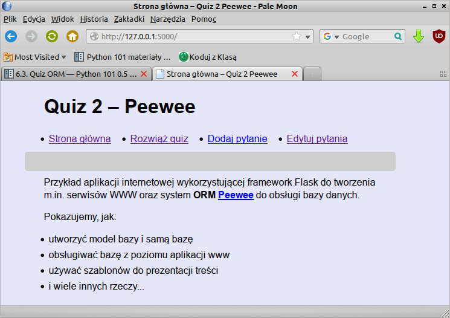

.. _quiz-orm:

Quiz ORM
#####################

Realizacja aplikacji internetowej Quiz w oparciu o :term:`framework` `Flask`_ 0.12.x
i bazę danych `SQLite`_ zarządzaną systemem ORM `Peewee`_ lub `SQLAlchemy`_.

.. _Flask: http://flask.pocoo.org
.. _SQLite: http://www.sqlite.org
.. _Peewee: http://peewee.readthedocs.org/en/latest
.. _SQLAlchemy: http://www.sqlalchemy.org

.. contents::
    :depth: 1
    :local:

Wymagania
=========

Zalecamy zapoznanie się z materiałami zawartymi w scenariuszach:
* :ref:`Podstawy Pythona <podstawy-python>`,
* :ref:`Bazy danych w Pythonie <bazy-python>`,
* :ref:`Quiz <quiz-app>`,
* :ref:`ToDo <todo-app>`.

Wykorzystywane biblioteki instalujemy przy użyciu instalatora ``pip``:

.. highlight:: bash
.. code-block:: bash

    ~$ sudo pip install peewee sqlalchemy flask-sqlalchemy

Modularyzacja
=============

Scenariusze "Quiz" i "ToDo" pokazują możliwość umieszczenia całego kodu
aplikacji obsługiwanej przez Flaska w jednym pliku. Dla celów
szkoleniowych to dobre rozwiązanie, ale w praktycznych realizacjach
wygodniej umieścić poszczególne części aplikacji w osobnych plikach,
których nazwy określają ich przeznaczenie.
Podejście takie usprawnia rozwijanie aplikacji.

Kod rozmieścimy następująco:

    - ``app.py`` – konfiguracja aplikacji Flaska i połączeń z bazą,
    - ``models.py`` – klasy opisujące tabele, pola i relacje w bazie,
    - ``views.py`` – widoki, czyli funkcje, powiązane z adresami URL, obsługujące żądania użytkownika,
    - ``forms.py`` – definicje formularza wykorzystywanego w aplikacji,
    - ``main.py`` – główny plik naszej aplikacji wiążący wszystkie powyższe, odpowiada za utworzenie początkowej bazy,
    - ``dane.py`` – moduł opcjonalny, odczytanie przykładowych danych z pliku *csv* i dodanie ich do bazy.

Wszystkie powyższe pliki muszą znajdować się w katalogu aplikacji ``quiz-orm``,
który zawierać będzie podkatalogi:

* ``templates`` – tu umieścimy wszystkie szablony html,
* ``static`` – tu znaleźć się mogą arkusze stylów, obrazki i/lub skrypty *js*.

Potrzebną strukturę katalogów można utworzyć poleceniami:

.. highlight:: bash
.. code-block:: bash

    ~$ mkdir quiz-orm; cd quiz-orm
    ~$ mkdir templates static


Aplikacja i baza
================

Zaczynamy od utworzenia obiektu aplikacji (````app = Flask(__name__)````),
uzupełnienia ustawień w słowniku ``config`` i utworzenia obiektu bazy danych:

.. raw:: html

    <div class="code_no">Peewee *app.py*. <span class="right">Kod nr <script>var code_no = code_no || 1; document.write(code_no++);</script></span></div>

.. highlight:: python
.. literalinclude:: quiz2_pw/app.py
    :linenos:

* ``before_request()``, ``after_request()`` – funkcje wykorzystywane do otwierania
  i zamykania połączenia z bazą SQLite przed żądaniem i po żądaniu (ang. *request*),
* ``g`` – specjalny obiekt Flaska do przechowywania danych kontekstowych aplikacji.

.. raw:: html

    <div class="code_no">SQLAlchemy *app.py*. <span class="right">Kod nr <script>var code_no = code_no || 1; document.write(code_no++);</script></span></div>

.. literalinclude:: quiz2_sa/app.py
    :linenos:

* ``SQLALCHEMY_TRACK_MODIFICATIONS=False`` – wyłączenie niużywanego przez nas
  śledzenia modyfikacji obiektów i emitowania sygnałów.

Modele
======

Modele to miejsce, w którym opisujemy strukturę naszej bazy danych,
a więc definiujemy klasy – odpowiadające tabelom i ich właściwości -
odpowiadające kolumnom. Wykorzystamy tabelę ``Pytanie``,
zawierającą treść pytania i poprawną odpowiedź, oraz tabelę ``Odpowiedź``,
która przechowywać będzie wszystkie możliwe odpowiedzi.
Relację *jeden-do-wielu* między tabelami tworzyć będzie pole ``pnr``,
czyli klucz obcy (``ForeignKey``), przechowujący identyfikator pytania.

.. raw:: html

    <div class="code_no">Peewee *models.py*. <span class="right">Kod nr <script>var code_no = code_no || 1; document.write(code_no++);</script></span></div>

.. literalinclude:: quiz2_pw/models.py
    :linenos:

* ``BaseModel`` – klasa określająca obiekt bazy,
* ``unique=True`` – właściwość wymagająca niepowtarzalnej zawartości pola,
* ``ForeignKeyField()`` – definicja klucza obcego, tworzenie relacji,
* ``on_delete = 'CASCADE'`` – usuwanie rekordów z powiązanych tabel.

Identyfikatory pytań i odpowiedzi, czyli pola ``id`` w każdej tabeli
tworzone są automatycznie.

.. raw:: html

    <div class="code_no">SQLAlchemy *models.py*. <span class="right">Kod nr <script>var code_no = code_no || 1; document.write(code_no++);</script></span></div>

.. literalinclude:: quiz2_sa/models.py
    :linenos:

* ``primary_key=True`` – definicja klucza podstawowego, czyli identyfikatora
  pytania i odpowiedzi,
* ``ForeignKey()`` – określenie klucza obcego, czyli relacji,
* ``relationship()`` – relacja zwrotna, właściwość ``Pytanie.odpowiedzi``,
* ``backref=baza.backref('pytanie')`` – relacja zwrotna, właściwość ``Odpowiedz.pytanie``,
* ``cascade="all, delete, delete-orphan"`` – usuwanie rekordów z powiązanych tabel.

Dzięki rozszerzeniu ``flask.ext.sqlalchemy`` jedyny import, którego potrzebujemy,
to obiekt ``baza`` udostępniający wszystkie klasy i metody SQLAlchemy.

Metody ``__str__(self)`` służą "autoprezentacji" obiektów utworzonych na podstawie
danego modelu, są wykorzystywane np. podczas używania funkcji ``print()``.

Strona główna
=============

Strony widoczne w przeglądarce powstają dzięki widokom, czyli funkcjom obsługującym
przypisane im adresy url. Po wykonaniu określonych operacji w odpowiedzi na żądania
użytkownika zwracają szablony html uzupełnione o ewentualne dane.

Początek pliku :file:`views.py` dla Peewee:

.. raw:: html

    <div class="code_no">Peewee <i>views.py</i> <span class="right">Kod nr <script>var code_no = code_no || 1; document.write(code_no++);</script></span></div>

.. literalinclude:: quiz2_pw/views.py
    :linenos:
    :lineno-start: 1
    :lines: 1-12

Początek pliku :file:`views.py` dla SQLAlchemy:

.. raw:: html

    <div class="code_no">SQLAlchemy <i>views.py</i> <span class="right">Kod nr <script>var code_no = code_no || 1; document.write(code_no++);</script></span></div>

.. literalinclude:: quiz2_sa/views.py
    :linenos:
    :lineno-start: 1
    :lines: 1-13

* ``return render_template('index.html')`` – zwrócenie wyrenderowanego szablonu ``index.html``
  w odpowiedzi na wpisanie adresu domyślnego serwera, w środowisku
  deweloperskim będzie to *http://127.0.0.1:5000/*.


Szablon podstawowy
==================

W omówionych do tej pory scenariuszach aplikacji internetowych (*Quiz*, *ToDo*)
każdy szablon zawierał kompletny kod strony. W praktyce jednak duża część kodu HTML
powtarza się na każdej stronie w ramach danego serwisu. Tę wspólną część kodu
umieścimy w szablonie podstawowym :file:`templates/szkielet.html`:

.. raw:: html

    <div class="code_no">Szablon <i>szkielet.html</i>. Kod nr <script>var code_no = code_no || 1; document.write(code_no++);</script></div>

.. highlight:: html
.. literalinclude:: quiz2_pw/templates/szkielet.html
    :linenos:

Szablon oparty jest na frameworku `Bootstrap <http://getbootstrap.com/>`_.
Odpowiednie linki do stylów CSS, pobieranych z systemu
`CDN <https://pl.wikipedia.org/wiki/Content_Delivery_Network>`_ zostały
skopiowane ze strony `Getting started <http://getbootstrap.com/getting-started/>`_
i wklejone w linii 10 i 12.

* ``{{ url_for('static', filename='style.css') }}`` – funkcja ``url_for()``
  pozwala wygenerować scieżkę do zasobów umieszczonych w podkatalogu :file:`static`;
* ``...`` – tagi sterujące, wymagają zamknięcia(!);
* ```` – tag pozwala definiować miejsca, w których
  szablony dziedziczące mogą wstawiać swój kod;
* ``{{ zmienna }}`` – tagi pozwlające wstawiać wartości zmiennych dostępnych
  domyślnie i przekazanych do szablonu;
* ``container``, ``row``, ``navbar`` itd. – klasy Bootstrapa tworzące podstawowy
  układ (ang. *layout*) strony;
* ``navigation_bar`` – lista na podstawie której generowane są pozycje menu;
* ``active_page`` – zmienna zawierająca identyfikator aktywnej strony;
* ``get_flashed_messages(with_categories=true)`` – funkcja zwracająca komunikaty
  dla użytkownika oznaczone kategoriami, wykorzystywanymi jako klasy
  CSS.

Zawartość dołączanego pliku :file:`static/style.css`:

.. raw:: html

    <div class="code_no">Arkusz stylów <i>style.css</i>. <span class="right">Kod nr <script>var code_no = code_no || 1; document.write(code_no++);</script></span></div>

.. highlight:: html
.. literalinclude:: quiz2_pw/static/style.css
    :linenos:


**Szablon strony głównej** zawiera się w pliku :file:`index.html`:

.. raw:: html

    <div class="code_no">Szablon <i>index.html</i>. <span class="right">Kod nr <script>var code_no = code_no || 1; document.write(code_no++);</script></span></div>

.. highlight:: html
.. literalinclude:: quiz2_pw/templates/index.html
    :linenos:

* ```` – wskazanie dzidziczenia z szablonu podstawowego;
* `` treść `` – zastąpienie lub uzupełnienie treści
  bloków zdefiniowanych w szablonie podstawowym.


Powiązanie modułów
==================

Po zdefiniowaniu aplikacji, bazy, modelu, widoków i wykorzystywanych
przez nie szablonów, trzeba wszystkie moduły połączyć w całość.
Posłuży nam do tego plik ``main.py``:

.. raw:: html

    <div class="code_no">Peewee. Kod nr <script>var code_no = code_no || 1; document.write(code_no++);</script></div>

.. highlight:: python
.. literalinclude:: quiz2_pw/main.py
    :emphasize-lines: 12
    :linenos:

Żeby zrozumieć rolę tego modułu, wystarczy prześledzić źródła importów,
które w Pythonie odpowiadają nazwom plików. Tak więc z pliku (modułu)
``app.py`` importujemy instancję aplikacji i bazy, z ``models.py``
klasy opisujące schemat bazy, a z ``views.py`` zdefiniowane widoki.
W podanym kodzie najważniejsze jest polecenie tworzące bazę i tabele:
``baza.create_tables([Pytanie, Odpowiedz],True)``; w SQLAlchemy
trzeba zastąpić je wywołaniem ``baza.create_all()``. Zostanie ono wykonane,
o ile na dysku nie istnieje już plik bazy ``quiz.db``.

Ostatnie polecenie ``app.run(debug=True)`` ma uruchomić naszą aplikację
w trybie debugowania. Czas więc uruchomić nasz testowy serwer:

.. highlight:: bash
.. code-block:: bash

    ~/quiz2$ python main.py

.. figure:: quiz2_1.png

Po wpisaniu w przeglądarce adresu 127.0.0.1:5000 powinniśmy zobaczyć:




Dane początkowe
====================

Moduł ``dane.py``:

.. raw:: html

    <div class="code_no">SQLAlchemy. Kod nr <script>var code_no = code_no || 1; document.write(code_no++);</script></div>

.. highlight:: python
.. literalinclude:: quiz2_sa/dane.py
    :linenos:
    :lineno-start: 1
    :lines: 1-22

W *Peewee* linia ``from app import baza`` nie jest potrzebna.

Plik z danymi:

.. raw:: html

    <div class="code_no">Plik <i>pytania.csv</i>. Kod nr <script>var code_no = code_no || 1; document.write(code_no++);</script></div>

.. literalinclude:: quiz2_pw/pytania.csv
    :linenos:

Pierwsza funkcja ``pobierz_dane('pytania.csv')`` odczytuje z podanego pliku kolejne
linie zawierające pytanie, odpowiedzi i odpowiedź prawidłową oddzielone znakiem
"#". Z odczytanych linii usuwamy znaki końca linii, następnie ustawiamy
kodowanie znaków, a na koniec rozbijamy je na trzy elementy (``line.split("#")``),
z których tworzymy tuple i dodajemy ją do listy ``dane.append(tuple())``.
Na koniec listę tupli zwracamy jako tuplę, która trafia do wywołania
drugiej funkcji ``dodaj_pytania()``.

.. raw:: html

    <div class="code_no">Peewee. Kod nr <script>var code_no = code_no || 1; document.write(code_no++);</script></div>

.. highlight:: python
.. literalinclude:: quiz2_pw/dane.py
    :linenos:
    :lineno-start: 24
    :lines: 24-

.. raw:: html

    <div class="code_no">SQLAlchemy. Kod nr <script>var code_no = code_no || 1; document.write(code_no++);</script></div>

.. highlight:: python
.. literalinclude:: quiz2_sa/dane.py
    :linenos:
    :lineno-start: 25
    :lines: 25-

Pętla ``for pytanie,odpowiedzi,odpok in dane:`` do oddzielonych przecinkami
zmiennych odczytuje z przekazanych tupli kolejne dane. Następnie
tworzymy obiekty reprezentujące rekordy w tablicy *pytanie*
(``pyt = Pytanie(pytanie = pytanie, odpok = odpok)``) i wywołujemy
odpowiednie dla danego ORM-u polecenia zapisujące je w bazie. Podobnie
postępujemy w pętli wewnętrznej, przy czym tworząc obiekty odpowiedzi
wykorzystujemy identyfikatory zapisanych wcześniej pytań
(``odp = Odpowiedz(pnr = pyt.id, odpowiedz = o.strip())``).

Odczyt
=======

Skrót :term:`CRUD` (*Create* (tworzenie), *Read* (odczyt), *Update* (aktualizacja), *Delete* (usuwanie))
oznacza, jak wyjaśniono, podstawowe operacje wykonywane na bazie danych.

Zaczniemy od widoku wyświetlającego pobrane z bazy dane w formie quizu
i sprawdzającego udzielone przez użytkownika odpowiedzi.

.. raw:: html

    <div class="code_no">Peewee. Kod nr <script>var code_no = code_no || 1; document.write(code_no++);</script></div>

.. highlight:: python
.. literalinclude:: quiz2_pw/views.py
    :emphasize-lines: 18,23
    :linenos:
    :lineno-start: 15
    :lines: 15-37

Wyświetlenie pytań wymaga odczytania ich wraz z możliwymi odpowiedziami z bazy.
W Peewee korzystamy z kodu: ``Pytanie().select().annotate(Odpowiedz)``,
w SQLAlchemy: ``Pytanie.query.join(Odpowiedz)`` (metoda ``.join()``
zwiększa efektywność, bo wymusza pobranie możliwych odpowiedzi
w jednym zapytaniu). Po sprawdzeniu, czy mamy jakiekolwiek pytania za pomocą
metody ``.count()``, zwracamy użytkownikowi szablon ``quiz.html``, któremu
przekazujemy w zmiennej ``pytania`` dane w odpowiedniej formie. W SQLALchemy
korzystamy z metody ``.all()`` zwracającej pasujące rekordy jako listę.

Szablon ``quiz.html`` – oparty na omówionym wcześniej wzorcu – wyświetla pytania
i możliwe odpowiedzi jako pola opcji typu radio button:

.. raw:: html

    <div class="code_no">Szablon <i>quiz.html</i>. Kod nr <script>var code_no = code_no || 1; document.write(code_no++);</script></div>

.. highlight:: html
.. literalinclude:: quiz2_pw/templates/quiz.html
    :linenos:

Użytkownik po wybraniu odpowiedzi naciska przycisk *Sprawdź...* i przesyła
do naszego widoku dane w żądaniu typu :term:`POST`. W funkcji ``quiz()``
uwzględniamy taką sytuację i w pętli ``for pid, odp in request.form.items():``
odczytujemy identyfikator pytania i udzieloną odpowiedź. Następnie
pobieramy odpowiedź prawidłową w Peewee za pomocą kodu
``odpok = Pytanie.select(Pytanie.odpok).where(Pytanie.id == int(pid)).scalar()``,
a w SQLALchemy ``odpok = baza.session.query(Pytanie.odpok).filter(Pytanie.id == int(pid)).scalar()``.
W obu przypadkach metody ``.scalar()`` zwracają pojedyncze wartości, które
porównujemy z odpowiedziami użytkownika (``if odp == odpok:``) i w przypadku
poprawności zwiększamy wynik.

.. figure:: quiz2_3.png

Dodawanie i aktualizacja
=============================

Możliwość dodawania nowych pytań i odpowiedzi wymaga stworzenia nowego
widoku powiązanego z określonym adresem url, jak i szablonu, który
wyświetli użytkownikowi właściwy formularz. Na początku zajmiemy się
właśnie nim.

.. raw:: html

    <div class="code_no">Szablon <i>dodaj.html</i>. Kod nr <script>var code_no = code_no || 1; document.write(code_no++);</script></div>

.. highlight:: html
.. literalinclude:: quiz2_pw/templates/dodaj.html
    :linenos:

Powyższy kod umieszczamy w pliku ``dodaj.html`` w katalogu szablonów, czyli
``templates``. Jak widać najważniejszym elementem jest tu formularz.
Zawiera on pola tekstowe przeznaczone na pytanie, trzy odpowiedzi
i numer odpowiedzi poprawnej. Takiego formularza możemy użyć zarówno do dodawania nowych,
jak i edycji istniejących już pytań. Jedyna różnica będzie taka, że
przy edycji musimy w formularzu wyświetlić dane wybranego pytania.
Dlatego w kodzie szablonu stosujemy instrukcję warunkową ````,
która decyduje o tym, czy wyświetlamy puste pola, czy wypełniamy je
przekazanymi danymi. W tym ostatnim przypadku umieszczamy w
formularzu dodatkowe ukryte pole, w którym zapisujemy *id* edytowanego pytania.

Załóżmy, że użytkownik wpisał lub zmienił pytanie i nacisnął przycisk
typu *submit*, czyli wysłał dane do serwera. Co dzieje się dalej? Takie
żądanie :term:`POST` trafi do widoku ``dodaj()``, co określone zostało
w atrybucie formularza: ``action="{{ url_for('dodaj') }}"``. Zobaczmy, jak
wygląda ten widok:

.. raw:: html

    <div class="code_no">Peewee. Kod nr <script>var code_no = code_no || 1; document.write(code_no++);</script></div>

.. highlight:: python
.. literalinclude:: quiz2_pw/views.py
    :emphasize-lines: 21-38
    :linenos:
    :lineno-start: 40
    :lines: 40-87

.. raw:: html

    <div class="code_no">SQLAlchemy. Kod nr <script>var code_no = code_no || 1; document.write(code_no++);</script></div>

.. highlight:: python
.. literalinclude:: quiz2_sa/views.py
    :linenos:
    :lineno-start: 61
    :lines: 61-78

Po otworzeniu adresu ``/dodaj`` otrzymujemy żądanie :term:`GET`,
na które odpowiadamy zwróceniem omówionego wyżej szablonu ``dodaj.html``.
Jeżeli jednak otrzymujemy dane z formularza, na początku dokonujemy prostej
walidacji, tj. sprawdzamy, czy użytkownik nie przesyła pustego pytania lub odpowiedzi,
dodatkowo, czy podał odpowiedni numer odpowiedzi poprawnej.

Obiekt ``request.form`` zawiera wszystkie dane przesłane w ramach
żądania. Jeżeli wśród nich nie ma identyfikatora pytania, co oznaczałoby
edycję, generowany jest wyjątek, który przechwytujemy za pomocą konstrukcji
``try: ... except KeyError:`` i dodajemy nowe pytanie.
Tworzymy więc nowy obiekt pytania
(``p = Pytanie(pytanie = pytanie.strip(), odpok = odpok.strip())``) i używając
odpowiednich metod zapisujemy. Podobnie dalej odczytujemy w pętli przesłane odpowiedzi,
dla każdej tworzymy nowy obiekt (``o = Odpowiedz(pnr = p, odpowiedz = odp.strip())``)
i zapisujemy.

Trochę więcej zachodu wymaga aktualizacja danych. Na początku pobieramy
obiekt reprezentujemy edytowane pytanie i odpowiedzi na nie. W Peewee kod jest cokolwiek
rozbudowany: ``p = Pytanie.select(Pytanie,Odpowiedz).join(Odpowiedz).where(Pytanie.id == int(request.form['id'])).get()``,
w SQLAlchemy jest krócej: ``p = Pytanie.query.get(request.form['id'])``.
Później odpowiednim polom przypisujemy nowe dane. Więcej różnic występuje
dalej. W Peewee przeglądamy listę obiektów reprezentujących odpowiedzi,
w każdym zmieniamy odpowiednią właściwość (``o.odpowiedz = odpowiedzi[i].strip()``)
i zapisujemy zmiany. w SQLAlchemy iterujemy po przesłanych odpowiedziach,
które zapisujemy w obiektach odpowiedzi odczytywanych bezpośrednio
z obiektu reprezentującego pytanie (``p.odpowiedzi[i].odpowiedz = odp.strip()``).

Zapisywanie lub aktualizacja danych kończy się wygenerowaniem odpowiedniego
komunikatu dla użytkownika, np. ``flash(u'Dodano pytanie:','sukces')``.
Podobnie wcześniej, jeżeli podczas walidacji otrzymanych danych pojawi
się błąd, komunikat o nim zostanie zapisany w liście ``error[]``,
a później przekazany użytkownikowi w kodzie: ``for e in error: flash(e, 'blad')``.
Warto zwrócić tu uwagę na dodatkowe argumenty w funkcji ``flash``, wskazują
one rodzaj przekazywanych informacji, co wykorzystujemy we wzorcu
``szkielet.html``. Pętla ````
w zmiennej ``kategoria`` odczytuje omawiane dodatkowe argumenty
i używa jej do oznaczenia klasy CSS decydującej o sposobie wyświetlenia
danej informacji: ``<span class="{{ kategoria }}">{{ komunikat }}</span>``.

.. figure:: quiz2_4.png

Widok edycji i usuwanie
==========================

Można zadać pytanie, jak do szablonu ``dodaj.html`` trafiają pytania, które
chcemy edytować. Odpowiada za to widok ``edytuj()``

.. raw:: html

    <div class="code_no">Peewee. Kod nr <script>var code_no = code_no || 1; document.write(code_no++);</script></div>

.. highlight:: python
.. literalinclude:: quiz2_pw/views.py
    :emphasize-lines: 9,12
    :linenos:
    :lineno-start: 90
    :lines: 90-103

Na początku pobieramy wszystkie pytania przy użyciu takiego samego kodu
jak w widoku ``quiz()`` i sprawdzamy, czy w ogóle jakieś są. Jeżeli tak,
przekazujemy pytania do szablonu ``edytuj.html``.

.. raw:: html

    <div class="code_no">Szablon <i>edytuj.html</i>. Kod nr <script>var code_no = code_no || 1; document.write(code_no++);</script></div>

.. highlight:: html
.. literalinclude:: quiz2_pw/templates/edytuj.html
    :linenos:

Zadaniem szablonu jest wyświetlenie treści pytań i dwóch przycisków typu
*submit*, umożliwiających edycję lub usunięcie pytania. Przyciski te
są częścią formularzy, które zawierają tylko jedno ukryte pole przechowujące
*id* pytania. O tym, gdzie trafia identyfikator decyduje atrybutu *action*
w formularzu: ``{{ url_for('edytuj') }}`` lub ``{{ url_for('usun') }}``.
Używamy tu funkcji ``url_for``, która na podstawie podanego widoku generuje
odpowiadający mu adres url.

Jeżeli użytkownik wybierze edycję, do omawianego widoku ``edytuj()`` trafia
żądanie :term:`POST`, które obsługujemy w ten sposób, że na podstawie
odebranego identyfikatora tworzymy obiekt z żądanym pytaniem i odpowiedziami
(w SQLAlchemy stosujemy tu polecenie: ``Pytanie.query.get(pid)``), a następnie
każemy go wyrenderować w szablonie ``dodaj.html``. Działanie tego szablonu
omówiono wyżej. Jeżeli użytkownik kliknie przycisk *Usuń* jego żądanie
trafia do widoku ``usun()``. Funkcja ta przedstawia się następująco:

.. raw:: html

    <div class="code_no">Peewee. Kod nr <script>var code_no = code_no || 1; document.write(code_no++);</script></div>

.. highlight:: python
.. literalinclude:: quiz2_pw/views.py
    :emphasize-lines: 5-6
    :linenos:
    :lineno-start: 106
    :lines: 106-

Działanie jest proste. Tworzymy obiekt reprezentujący pytanie o przesłanym
identyfikatorze i wywołujemy metodę, która go usuwa.. W Peewee korzystamy z polecenia:
``Pytanie.get(Pytanie.id == int(pid))`` i metody ``delete_instance(recursive = True)``;
dodatkowy argument ``recursive`` zapewnia kaskadowe usunięcie wszystkich odpowiedzi.
W SQLAlchemy pozyskany obiekt ``p = Pytanie.query.get(pid)`` usuwamy za pomocą
metody sesji ``baza.session.delete(p)``, którą finalnie zapisujemy ``baza.session.commit()``.
Na koniec wywołujemy za pomocą tzw. przekierowania widok strony głównej
(``return redirect(url_for('index'))``), który wyświetli przygotowane dla użytkownika komunikaty.
*Nota bene*, podobnie postąpiliśmy również w innych omówionych wyżej widokach.

.. figure:: quiz2_5.png

Poćwicz sam
===============

    Spróbuj napisać wersję omówionej w innym scenariuszu aplikacji :ref:`ToDo <todo>`
    przy wykorzystaniu wybranego systemu ORM, tj. Peewee lub SQLAlchemy.

Źródła
*************************

* :download:`quiz2.zip <quiz2.zip>`

Kompletne wersje kodu znajdziesz w powyższym archiwum w podkatalogach :file:`quiz2_pw`
i :file:`quiz2_sa`. Uruchamiamy je poleceniami:

.. highlight:: bash
.. code-block:: bash

    ~/quiz2/quiz2_orm$ python main.py

\- gdzie *orm* jest oznaczeniem modułu obsługi bazy danych, *pw* dla Peewee,
*sa* dla SQLALchemy.
