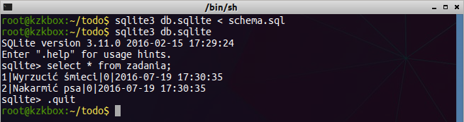
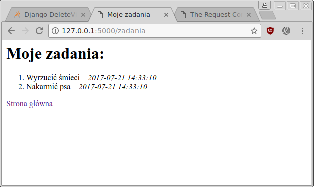
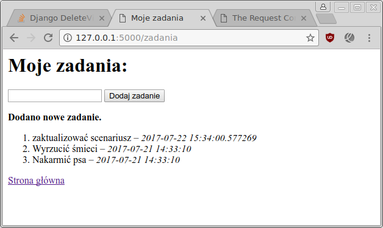
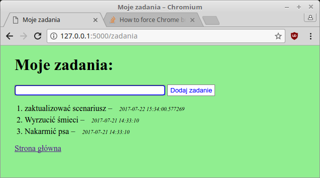

.. _todo:

ToDo
#####

.. highlight:: python

Realizacja aplikacji internetowej ToDo (lista zadań do zrobienia) w oparciu o :term:`framework` Flask 0.12.x.
Aplikacja umożliwia dodawanie z określoną datą, przeglądanie i oznaczanie
jako wykonane różnych zadań, które zapisywane będą w bazie danych `SQLite <http://pl.wikipedia.org/wiki/SQLite>`_.

.. contents::
    :depth: 1
    :local:

Początek pracy jest taki sam, jak w przypadku aplikacji :ref:`Quiz <quiz-app>`.
Wykonujemy dwa pierwsze punkty "Projekt i aplikacja" oraz "Strona główna",
tylko katalog aplikacji nazywamy :file:`todo`, a kod zapisujemy w pliku :file:`todo.py`.

Po wykonaniu wszystkich kroków i uruchomieniu serwera testowego powinniśmy w przeglądarce
zobaczyć stronę główną:

.. figure:: img/todo_01.png

Model danych i baza
===================

Jako źródło danych aplikacji wykorzystamy tym razem bazę SQLite3 obsługiwaną za pomocą
Pythonowego modułu `sqlite3 <https://docs.python.org/3.6/library/sqlite3.html>`_.

**Model danych**: w katalogu aplikacji tworzymy plik :file:`schema.sql`,
który zawiera instrukcje języka `SQL <https://pl.wikipedia.org/wiki/SQL>`_
tworzące tabelę z zadaniami i dodające przykładowe dane.

.. raw:: html

    
plik <i>schema.pl</i> Kod nr 

.. highlight:: sql
.. literalinclude:: schema.sql
    :linenos:

W terminalu wydajemy teraz następujące polecenia:

.. raw:: html

    
Terminal nr 

.. code-block:: bash

    ~/todo$ sqlite3 db.sqlite < schema.sql
    ~/todo$ sqlite3 db.sqlite
    sqlite> select * from zadania;
    sqlite> .quit

Pierwsze polecenie tworzy bazę danych w pliku :file:`db.sqlite`.
Drugie otwiera ją w interpreterze. Trzecie to zapytanie SQL, które pobiera
wszystkie dane z tabeli *zadania*. Interpreter zamykamy poleceniem ``.quit``.

Połączenie z bazą
=================

Bazę danych już mamy, teraz pora napisać funkcje umożiwiające łączenie się
z nią z poziomu naszej aplikacji. W pliku :file:`todo.py` dodajemy importy:

.. raw:: html

    
Plik <i>todo.py</i> Kod nr 

.. highlight:: python
.. literalinclude:: todo_z2.py
    :linenos:
    :lineno-start: 4
    :lines: 4-7
    :emphasize-lines: 1, 3-4

– następnie wstawiamy kod:

.. raw:: html

    
Plik <i>todo.py</i> Kod nr 

.. highlight:: python
.. literalinclude:: todo_z2.py
    :linenos:
    :lineno-start: 11
    :lines: 11-31

Konfiguracja aplikacji przechowywana jest w obiekcie ``config``, który
jest podklasą słownika i w naszym przypadku zawiera:

* ``SECRET_KEY`` – sekretna wartość wykorzystywana do obsługi sesji;
* ``DATABSE`` – ścieżka do pliku bazy;
* ``SITE_NAME`` – nazwa aplikacji.

Funkcja ``get_db()``:

* ``if not g.get('db'):`` – sprawdzamy, czy obiekt ``g`` aplikacji, służący
  do przechowywania danych kontekstowych, nie zawiera właściwości ``db``,
  czyli połączenia z bazą;
* dalsza część kodu tworzy połączenie w zmiennej ``con`` i zapisuje
  w kontekście (obiekcie ``g``) aplikacji.

Funkcja ``close_db()``:

* ``@app.teardown_appcontext`` – dekorator, który rejestruje funkcję
  zamykającą połączenie z bazą do wykonania po zakończeniu obsługi żądania;
* ``g.db.close()`` – zamknięcie połączenia z bazą.

Lista zadań
===========

Dodajemy widok, czyli funkcję ``zadania()`` powiązaną z adresem URL ``/zadania``:

.. raw:: html

    
Plik <i>todo.py</i> Kod nr 

.. highlight:: python
.. literalinclude:: todo_z3.py
    :linenos:
    :lineno-start: 40
    :lines: 40-45

* ``db = get_db()`` – utworzenie obiektu bazy danych ();
* ``db.execute('select...')`` – wykonanie podanego zapytania SQL,
  czyli pobranie wszystkich zadań z bazy;
* ``fetchall()`` – metoda zwraca pobrane dane w formie listy;

Szablon tworzymy w pliku :file:`todo/templates/zadania_lista.html`:

.. raw:: html

    
Plik <i>zadania_lista.html</i>. Kod nr 

.. highlight:: html
.. literalinclude:: templates/zadania_lista_z3.html
    :linenos:

* ```` – tagi używane w szablonach do instrukcji sterujących;
* ``{{ }}`` – tagi używane do wstawiania wartości zmiennych;
* ``{{ config.SITE_NAME }}`` – w szablonie mamy dostęp do obiektu ustawień ``config``;
* ```` – pętla odczytująca zadania z listy przekazanej
  do szablonu w zmiennej ``zadania``;

Odnośniki
---------

W szablonie :file:`index.html` warto wstawić link do strony z listą zadań,
czyli kod:

.. raw:: html

    
Kod nr 

.. code-block:: html

    
<a href="{{ url_for('zadania') }}">Lista zadań</a>

* ``url_for('zadania')`` – funkcja dostępna w szablonach, generuje adres
  powiązany z podaną nazwą funkcji.

**Ćwiczenie**

Wstaw link do strony głównej w szablonie listy zadań.
Po odwiedzeniu strony *127.0.0.1:5000/zadania* powinniśmy zobaczyć listę zadań.

Dodawanie zadań
===============

Wpisując adres w polu adresu przeglądarki, wysyłamy do serwera żądanie typu :term:`GET`,
które obsługujemy zwracając klientowi odpowiednie dane (listę zadań).
Dodawanie zadań wymaga przesłania danych z formularza na serwer – są to
żądania typu :term:`POST`, które modyfikują dane aplikacji.

Na początku pliku :file:`todo.py` trzeba, jak zwykle, zaimportować wymagane funkcje:

.. raw:: html

    
Kod nr 

.. highlight:: python
.. literalinclude:: todo_z4.py
    :linenos:
    :lineno-start: 8
    :lines: 8-9

Następnie rozbudujemy widok listy zadań:

.. raw:: html

    
Kod nr 

.. highlight:: python
.. literalinclude:: todo_z4.py
    :linenos:
    :lineno-start: 43
    :lines: 43-63
    :emphasize-lines: 1, 3-16, 21

* ``methods=['GET', 'POST']`` – w liście wymieniamy typy obsługiwanych żądań;
* ``request.form['zadanie']`` – dane przesyłane w żądaniach POST odczytujemy ze
  słownika ``form``;
* ``db.execute(...)`` – wykonujemy zapytanie, które dodaje nowe zadanie,
  w miejsce symboli zastępczych ``(?, ?, ?, ?)`` wstawione zostaną dane
  z listy podanej jako drugi parametr;
* ``flash()`` – funkcja pozwala przygotować komunikaty dla użytkownika,
  które można będzie wstawić w szablonie;
* ``redirect(url_for('zadanie'))`` – przekierowanie użytkownika na adres związany
  z podanym widokiem – żądanie typu GET.

Warto zauważyć, że do szablonu przekazujemy dodatkową zmienną ``error``.

W szablonie :file:`zadania_lista.html` po znaczniku ``<h1>`` umieszczamy kod:

.. raw:: html

    
Plik <i>zadania_lista.html</i>. Kod nr 

.. highlight:: html
.. literalinclude:: templates/zadania_lista_z4.html
    :linenos:
    :lineno-start: 10
    :lines: 10-25

* ```` – sprawdzamy, czy zmienna ``error`` cokolwiek zawiera;
* ```` – pętla odczytująca komunikaty;

Style CSS
=========

O wyglądzie aplikacji decydują arkusze stylów CSS. Umieszczamy je w podkatalogu ``static``
folderu aplikacji. Tworzymy więc plik :file:`~/todo/static/style.css`
z przykładowymi definicjami:

.. raw:: html

    
Plik <i>style.css</i>. Kod nr 

.. highlight:: css
.. literalinclude:: static/style.css
    :linenos:

Arkusz CSS dołączamy do pliku :file:`zadania_lista.html` w sekcji ``head``:

.. raw:: html

    
Plik <i>zadania_lista.html</i>. Kod nr 

.. highlight:: html
.. literalinclude:: templates/zadania_lista_z5.html
    :linenos:
    :lineno-start: 3
    :lines: 3-8
    :emphasize-lines: 4-5

**Ćwiczenie**

Dołącz arkusz stylów CSS również do szablonu :file:`index.html`. Odśwież aplikację w przeglądarce.

Zadania wykonane
================

Do każdego zadania dodamy formularz, którego wysłanie będzie oznaczało,
że wykonaliśmy dane zadanie, czyli zmienimy atrybut ``zrobione`` wpisu
z *0* (niewykonane) na *1* (wykonane). Odpowiednie żądanie typu POST
obsłuży nowy widok w pliku :file:`todo.py`, który wstawiamy
przed kodem uruchamiającym aplikację (``if __name__ == '__main__':``):

.. raw:: html

    
Plik <i>todo.py</i> Kod nr 

.. highlight:: python
.. literalinclude:: todo_z6.py
    :linenos:
    :lineno-start: 65
    :lines: 65-73

* ``zadanie_id = request.form['id']`` – odczytujemy przesłany identyfikator zadania;
* ``db.execute('UPDATE zadania SET zrobione=1 WHERE id=?', [zadanie_id])`` – wykonujemy
  zapytanie aktualizujące staus zadania.

W szablonie :file:`zadania_lista.html` modyfikujemy fragment wyświetlający
listę zadań i dodajemy formularz:

.. raw:: html

    
Plik <i>zadania_lista.html</i>. Kod nr 

.. highlight:: html
.. literalinclude:: templates/zadania_lista_z6.html
    :linenos:
    :lineno-start: 29
    :lines: 29-50

Możemy dodawać zadania oraz zmieniać ich status.

.. figure:: img/todo_06_zrobione.png

Zadania dodatkowe
=================

* Dodaj możliwość usuwania zadań.
* Dodaj mechanizm logowania użytkownika tak, aby użytkownik mógł dodawać i edytować tylko swoją listę zadań.

Materiały
=========

**Źródła:**

* :download:`todo.zip <todo.zip>`
