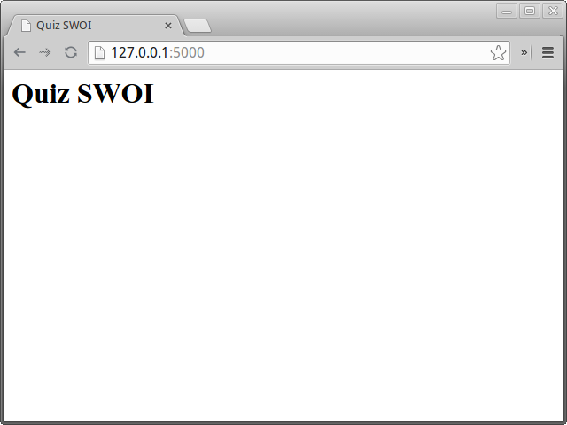
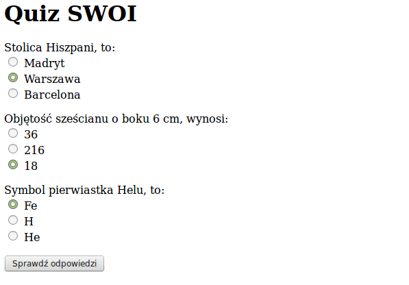

Quiz – Aplikacja internetowa
============================

* Opis implementacji:  
  Realizacja aplikacji internetowej Quiz w oparciu o Python i framework Flask (wersja 0.10.1).
* Autorzy: 
  Tomasz Nowacki, Robert Bednarz  
* Proponowany czas realizacji implementacji:   
  90 min
* Poziom trudności: Poziom 1

## Katalog, plik i przeznaczenie aplikacji

Zaczynamy od utworzenia katalogu projektu Quiz, w którym zamieścimy wszystkie 
pliki niezbędne do realizacji tej implementacji. W katalogu użytkownika tworzymy 
nowy katalog quiz, a w nim plik quiz.py:

    ~$ mkdir quiz; cd quiz; touch quiz.py

Aplikacja na przykładzie quizu – użytkownik zaznacza w formularzu poprawne 
odpowiedzi na pytania i otrzymuje ocenę – ma pokazać podstawową strukturę frameworka Flask.

## Szkielet aplikacji

Utworzenie minimalnej aplikacji Flask pozwoli na uruchomienie serwera 
deweloperskiego, umożliwiającego wygodne rozwijanie kodu. W pliku quiz.py wpisujemy:

``` python

# -*- coding: utf-8 -*-
# todo/todo.py

from flask import Flask

app = Flask(__name__)

if __name__ == '__main__':
    app.run(debug=True)

```

Serwer uruchamiamy komendą: 

    ~/python101/modul3/zadanie1$ python todo.py


Domyślnie serwer uruchamia się pod adresem http://127.0.0.1:5000. Po wpisaniu 
adresu do przeglądarki internetowej otrzymamy stronę z błędem HTTP 404, 
co wynika z faktu, że nasza aplikacja nie ma jeszcze zdefiniowanego żadnego 
zachowania (widoku) dla tego adresu. W uproszczeniu możemy widok utożsamiać 
z pojedynczą stroną w ramach aplikacji internetowej.

## Definiowanie widoków – strona główna

Widoki to funkcje Pythona powiązane z określonymi adresami URL za pomocą 
tzw. dekoratorów. Widoki pozwalają nam obsługiwać żądania GET i POST, 
a także, przy wykorzystaniu szablonów, generować i zwracać żądane 
przez klienta strony WWW.  W szablonach oprócz znaczników HTML możemy 
umieszczać różne dane. Flask renderuje (łączy) kod HTML z danymi i odsyła 
do przeglądarki.

W pliku todo.py umieścimy funkcję index(), widok naszej strony głównej:

``` python

# -*- coding: utf-8 -*-
# todo/todo.py

from flask import Flask
from flask import render_template

app = Flask(__name__)

# dekorator laczacy adres glowny z widokiem index
@app.route('/')
def index():
    # gdybyśmy chcieli wyświetlić prosty tekst, użyjemy funkcji poniżej
    #return 'Hello, SWOI'
    # zwracamy wyrenderowany szablon index.html:
    return render_templpate('index.html')

if __name__ == '__main__':
    app.run(debug=True)
    
```    

Zauważmy, że widok index() za pomocą dekoratora @app.route('/') związaliśmy 
z adresem głównym (/). Dalej w katalogu quiz tworzymy podkatalog templates, 
a w nim szablon index.html, wydajemy polecenia w terminalu:

    ~/python101/modul3/zadanie1$ mkdir templates; cd templates; touch index.html

Do pliku index.html wstawiamy przykładowy kod HTML:

``` html

<!-- quiz/templates/index.html -->
<html>
    <head>
        <title>Quiz SWOi</title>
    </head>
    <body>
        <h1>Quiz SWOI</h1>
    </body>
</html>

```

Po odwiedzeniu adresu http://127.0.0.1:5000, otrzymamy stronę HTML.



## Pokaż dane aplikacji – pytania i odpowiedzi

Dane naszej aplikacji, a więc pytania i odpowiedzi, umieścimy w liście QUESTIONS
 w postaci słowników zawierających: treść pytania, listę możliwych odpowiedzi 
 oraz poprawną odpowiedź. W pliku quiz.py wstawiamy listę pytań, aktualizujemy 
 widok index(), przekazując do szablonu listę pytań jako zmienną questions.

``` python

# -*- coding: utf-8 -*-

# quiz/quiz.py

from flask import Flask
from flask import render_template

app = Flask(__name__)

# konfiguracja aplikacji
app.config.update(dict(
    SECRET_KEY='bardzosekretnawartosc', # nieznany nikomu sekret
))

# lista pytan
QUESTIONS = [
    {
        'question': u'Stolica Hiszpani, to:',# pytanie
        'answers': [u'Madryt', u'Warszawa', u'Barcelona'], # mozliwe odpowiedzi
        'correct_answer': u'Madryt', # poprawna odpowiedz
    },
    {
        'question': u'Objętość sześcianu o boku 6 cm, wynosi:', # pytanie
        'answers': [u'36', u'216', u'18'], # mozliwe odpowiedzi
        'correct_answer': u'216', # poprawna odpowiedz
    },
    {
        'question': u'Symbol pierwiastka Helu, to:', # pytanie
        'answers': [u'Fe', u'H', u'He'], # mozlowe odpowiedzi
        'correct_answer': u'He', # poprawna odpowiedz
    }
]


@app.route('/')
def index():
    # do templatki index.html przekazujemy liste pytan jako zmienna questions
    return render_template('index.html', questions=QUESTIONS)


if __name__ == '__main__':
    app.run(debug=True)
    
```

Dodatkowo dodaliśmy konfigurację aplikacji, ustalając sekretny klucz, który przyda 
nam się w późniejszej części. Aktualizujemy szablon index.html, aby wyświetlić 
listę pytań w postaci formularza HTML.

``` html

<!-- quiz/templates/index.html -->
<html>
    <head>
        <title>Quiz SWOI</title>
    </head>
    <body>
        <h1>Quiz SWOI</h1>

        <!-- formularz z quizem -->
        <form method="POST">
            <!-- iterujemy po liscie pytan -->
            
                <p>
                    <!-- dla kazdego pytania wypisujemy pytanie (pole question) -->
                    {{ entry.question }}
                    <br>
                    <!-- zapamietujemy numer pytania liczac od zera -->
                    
                    <!-- iterujemy po mozliwych odpowiedziach dla danego pytania -->
                    
                        <label>
                            <!-- odpowiedzi zamieniamy na radio buttony -->
                            <input type="radio" value="{{ answer }}" name="{{ question_number }}">
                            {{ answer }}
                        </label>
                        <br>
                    
                </p>
            

            <!-- button wysylajacy wypelniony formularz -->
            <button type="submit">Sprawdź odpowiedzi</button>
        </form>

    </body>
</html>

```

Wewnątrz szablonu przeglądamy pytania zawarte w zmiennej questions za pomocą 
instrukcji ``, tworzymy formularz HTML składający 
się z treści pytania {{ entry.question }} i listy odpowiedzi 
(kolejna pętla ``) w postaci grupy opcji 
nazywanych dla odróżnienia kolejnymi indeksami pytań liczonymi 
od 0 (``).

W efekcie powinniśmy otrzymać następującą stronę internetową:



## Oceniamy odpowiedzi

Mechanizm sprawdzana liczby poprawnych odpowiedzi umieścimy w pliku quiz.py, modyfikując widok index():

``` python

# uzupelniamy importy
from flask import request
from flask import redirect, url_for
from flask import flash


# rozszerzamy widok
@app.route('/', methods=['GET', 'POST'])
def index():
    # jezeli zadanie jest typu POST, to znaczy, ze ktos przeslal odpowiedzi do sprawdzenia
    if request.method == 'POST':
        score = 0 # liczba poprawnych odpowiedzi
        answers = request.form # zapamietujemy slownik z odpowiedziami
        # sprawdzamy odpowiedzi:
        for question_number, user_answer in answers.items():
            # pobieramy z listy informacje o poprawnej odpowiedzi
            correct_answer = QUESTIONS[int(question_number)]['correct_answer']
            if user_answer == correct_answer: # porownujemy odpowiedzi
                score += 1 # zwiekszamy wynik
        # przygotowujemy informacje o wyniku
        flash(u'Liczba poprawnych odpowiedzi, to: {0}'.format(score))
        # po POST przekierowujemy na strone glowna
        return redirect(url_for('index'))

    # jezeli zadanie jest typu GET, renderujemy index.html
    return render_template('index.html', questions=QUESTIONS)
    
```

W szablonie index.html po znaczniku `<h1>` wstawiamy instrukcje wyświetlające wynik:

``` html
    
<!-- umieszczamy informacje ustawiona za pomoca funkcji flash -->
<p>
    
        <strong class="success">{{ message }}</strong>
    
</p>

```

JAK TO DZIAŁA: Uzupełniliśmy dekorator app.route, aby obsługiwał zarówno żądania 
GET (wejście na stronę główną po wpisaniu adresu => pokazujemy pytania), 
jak i POST (przesłanie odpowiedzi z formularza pytań => oceniamy odpowiedzi). 

W widoku index() dodaliśmy instrukcję warunkową if request.method == 'POST':, 
która wykrywa żądania POST i wykonuje blok kodu zliczający poprawne odpowiedzi. 
Zliczanie wykonywane jest w pętli `for question_number, user_answer in answers.items()`:

DOKOŃCZYĆ: W tym celu iterujemy po przesłanych odpowiedziach i sprawdzamy, 
czy nadesłana odpowiedź jest zgodna z tą, którą przechowujemy w polu 
`correct_answer` konkretnego pytania. Dzięki temu, że w templatce dodaliśmy 
do każdego pytania jego numer (zmienna `question_number`), to możemy teraz po 
tym numerze odwołać się do konkretnego pytania na naszej liście. 

Jeżeli nadesłana odpowiedź jest zgodna z tym, co mamy zapisane w pytaniu, 
to naliczamy punkt. Informacje o wyniku przekazujemy do użytkownika za pomocą 
funkcji `flash`, która korzysta z sesji HTTP (właśnie dlatego musieliśmy 
ustalić `SECRET_KEY` dla naszej aplikacji). 

W efekcie otrzymujemy aplikację Quiz.

# Film instruktażowy:

http://youtu.be/1WAeyriYymQ

# Słownik pojęć:

- Aplikacja – program komputerowy.
- Framework – zestaw komponentów i bibliotek wykorzystywany do budowy aplikacji.
- GET – typ żądania HTTP, służący do pobierania zasobów z serwera WWW.
- HTML – język znaczników wykorzystywany do formatowania dokumentów, zwłaszcza stron WWW.
- HTTP – protokół przesyłania dokumentów WWW.
- POST – typ żądania HTTP, służący do umieszczania zasobów na serwerze WWW.
- Serwer deweloperski – serwer używany w czasie prac nad oprogramowaniem.
- Serwer WWW – serwer obsługujący protokół HTTP.
- Templatka – szablon strony WWW wykorzystywany przez Flask do renderowania widoków.
- URL – ustandaryzowany format adresowania zasobów w internecie (przykład: adres strony WWW).
- Widok – fragment danych, który jest reprezentowany użytkownikowi.

Materiały pomocnicze:

1.	Strona projektu Flask http://flask.pocoo.org/
2.	Co to jest framework? http://pl.wikipedia.org/wiki/Framework
3.	Co nieco o HTTP i żądaniach GET i POST http://pl.wikipedia.org/wiki/Http

Załączniki
- quiz.tar.gz
